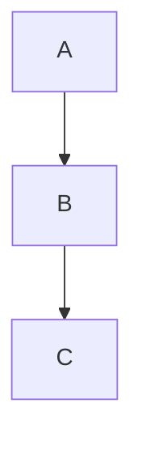

# streamdown-vue

`streamdown-vue` brings [Streamdown](https://github.com/vercel/streamdown)-style streaming Markdown to Vue 3 & Nuxt 3. It ships a `<StreamMarkdown>` component that incrementally renders Markdown as it arrives (token‑by‑token, chunk‑by‑chunk), plus helper utilities to keep partially received text valid.

---

## Table of Contents

1. Features
2. Installation
3. Quick Start (Basic SSR + CSR)
4. Deep Dive Tutorial (Streaming from an AI / SSE source)
5. Props Reference (All `<StreamMarkdown>` props)
6. Component Slots & Overrides
7. Built‑in Components & Data Attributes
8. Security Model (Link/Image hardening)
9. Syntax Highlighting (Shiki) & Copy Buttons
10. Mermaid Diagrams
11. Math & LaTeX Fixes
12. Utilities (`parseBlocks`, `parseIncompleteMarkdown`, LaTeX helpers)
13. Performance Tips
14. Nuxt 3 Usage & SSR Notes
15. Recipe Gallery
16. FAQ
17. Development & Contributing

---

## 1. Features

-   GitHub‑flavored Markdown (tables, task lists, strikethrough) via `remark-gfm`
-   KaTeX math (`remark-math` + `rehype-katex`) with extra repairs (matrices, stray `$`)
-   Shiki syntax highlighting (light + dark themes) with reactive copy buttons
-   Mermaid diagrams with caching, async render & graceful error recovery
-   Incremental rendering + repair of incomplete Markdown tokens while streaming
-   Secure allow‑list based hardening of link & image URLs (blocks `javascript:` etc.)
-   Component override layer (swap any tag / embed custom Vue components)
-   Data attributes for each semantic element (`data-streamdown="..."`) for styling/testing
-   Designed for SSR (Vue / Nuxt) & fast hydration; tree‑shakable, side‑effects minimized

---

## 2. Installation

### Bun

```bash
bun add streamdown-vue
```

### npm / pnpm / yarn

```bash
npm install streamdown-vue
# pnpm add streamdown-vue
# yarn add streamdown-vue
```

You must also install peer deps `vue` (and optionally `typescript`).

Include KaTeX stylesheet once (if you use math):

```ts
import 'katex/dist/katex.min.css';
```

---

## 3. Quick Start

`main.ts`:

```ts
import { createApp } from 'vue';
import App from './App.vue';
import 'katex/dist/katex.min.css';
createApp(App).mount('#app');
```

`App.vue`:

```vue
<template>
    <StreamMarkdown class="prose" :content="markdown" />
</template>
<script setup lang="ts">
import { StreamMarkdown } from 'streamdown-vue';
const markdown = `# Hello\n\nSome *markdown* with $e^{i\\pi}+1=0$.`;
</script>
```

SSR (server) minimal snippet:

```ts
import { renderToString } from '@vue/server-renderer';
import { createSSRApp, h } from 'vue';
import { StreamMarkdown } from 'streamdown-vue';

const app = createSSRApp({
    render: () => h(StreamMarkdown, { content: '# SSR' }),
});
const html = await renderToString(app);
```

---

## 4. Deep Dive Tutorial – Live Streaming (AI / SSE)

When receiving tokens / partial chunks you typically want to:

1. Append new text chunk into a buffer.
2. Repair the partial Markdown (`parseIncompleteMarkdown`).
3. Split into safe blocks for re-render (`parseBlocks`).
4. Feed the concatenated repaired text to `<StreamMarkdown>`.

Composable example (client side):

```ts
// useStreamedMarkdown.ts
import { ref } from 'vue';
import { parseBlocks, parseIncompleteMarkdown } from 'streamdown-vue';

export function useStreamedMarkdown() {
    const rawBuffer = ref('');
    const rendered = ref('');
    const blocks = ref<string[]>([]);

    const pushChunk = (text: string) => {
        rawBuffer.value += text;
        // repair incomplete tokens (unclosed **, `, $$, etc.)
        const repaired = parseIncompleteMarkdown(rawBuffer.value);
        blocks.value = parseBlocks(repaired);
        rendered.value = blocks.value.join('');
    };

    return { rawBuffer, rendered, blocks, pushChunk };
}
```

Using Server-Sent Events (SSE):

```ts
const { rendered, pushChunk } = useStreamedMarkdown();
const es = new EventSource('/api/chat');
es.onmessage = (e) => {
    pushChunk(e.data);
};
es.onerror = () => es.close();
```

Template:

```vue
<StreamMarkdown :content="rendered" />
```

Why repair first? Without repair, a trailing `**` or lone ``` will invalidate the final tree and cause flicker or lost highlighting. Repairing keeps intermediate renders stable.

---

## 5. Props Reference

| Prop                      | Type                       | Default                  | Description                                                                                              |
| ------------------------- | -------------------------- | ------------------------ | -------------------------------------------------------------------------------------------------------- |
| `content`                 | `string`                   | `''`                     | The full (or partially streamed) markdown source.                                                        |
| `class` / `className`     | `string`                   | `''`                     | Optional wrapper classes; both accepted (React-style alias).                                             |
| `components`              | `Record<string,Component>` | `{}`                     | Map to override built-ins (e.g. `{ p: MyP }`).                                                           |
| `remarkPlugins`           | `any[]`                    | `[]`                     | Extra remark plugins (functions or default exports).                                                     |
| `rehypePlugins`           | `any[]`                    | `[]`                     | Extra rehype plugins.                                                                                    |
| `defaultOrigin`           | `string?`                  | `undefined`              | Base URL used to resolve relative links/images before allow‑list checks.                                 |
| `allowedImagePrefixes`    | `string[]`                 | `['https://','http://']` | Allowed (lowercased) URL prefixes for ``. Blocked => image dropped.                                 |
| `allowedLinkPrefixes`     | `string[]`                 | `['https://','http://']` | Allowed prefixes for `<a href>`. Blocked => link text only.                                              |
| `parseIncompleteMarkdown` | `boolean`                  | `true`                   | (Future toggle) Auto apply repair internally. Currently you repair outside using utility; prop reserved. |

All unrecognised props are ignored (no arbitrary HTML injection for safety).

---

## 6. Component Slots & Overrides

`<StreamMarkdown>` does not expose custom slots for content fragments (the pipeline is AST-driven). To customize rendering you override tags via the `components` prop:

```ts
import type { Component } from 'vue';
import { StreamMarkdown } from 'streamdown-vue';

const FancyP: Component = {
    setup(_, { slots }) { return () => h('p', { class: 'text-pink-600 font-serif' }, slots.default?.()); }
};

<StreamMarkdown :components="{ p: FancyP }" :content="md" />
```

If a tag is missing from `components` it falls back to the built-in map.

---

## 7. Built‑in Components & Data Attributes

Each semantic node receives a `data-streamdown="name"` attribute to make styling and querying reliable, even if classes are overridden:

| Element               | Data Attribute                        | Notes                                |
| --------------------- | ------------------------------------- | ------------------------------------ |
| `p`                   | `p`                                   | paragraphs                           |
| `a`                   | `a`                                   | links hardened (target+rel enforced) |
| `code` (inline)       | `inline-code`                         | inside text flows                    |
| Code block wrapper    | `code-block`                          | includes a copy button               |
| `table`               | `table` + wrapper div `table-wrapper` | responsive overflow wrapper          |
| `blockquote`          | `blockquote`                          |                                      |
| Mermaid block wrapper | `mermaid`                             | async rendered SVG                   |
| KaTeX output          | `katex` (from library)                | math formulas                        |

Testing example (Vitest / Bun):

```ts
expect(html).toContain('data-streamdown="inline-code"');
```

---

## 8. Security Model

Only absolute URLs starting with an allowed prefix pass. Steps:

1. Resolve relative (`/x`) against `defaultOrigin` if provided.
2. Lowercase & check `javascript:` scheme (blocked).
3. Check each allowed prefix (case-insensitive).
4. If any fail, the element is dropped (link/text downgraded, image removed).

Example – allow only your CDN images & HTTPS links:

```vue
<StreamMarkdown
    :allowed-link-prefixes="['https://']"
    :allowed-image-prefixes="['https://cdn.example.com/']"
    default-origin="https://example.com"
    :content="md"
/>
```

---

## 9. Syntax Highlighting (Shiki) & Copy Buttons

Code fences are rendered by the internal `CodeBlock` component:

````md
```ts
const x: number = 1;
```
````

Override with your custom block:

```ts
import { defineComponent, h } from 'vue';
import { useShikiHighlighter } from 'streamdown-vue';

const MyCode = defineComponent({
    props: { code: { type: String, required: true }, language: { type: String, default: '' } },
    async setup(props) {
        const highlighter = await useShikiHighlighter();
        const html = highlighter.codeToHtml(props.code, { lang: props.language || 'text', themes: { light: 'github-light', dark: 'github-dark' } });
        return () => h('div', { class: 'my-code', innerHTML: html });
    }
});

<StreamMarkdown :components="{ codeblock: MyCode }" />
```

The default copy button uses the Clipboard API and toggles an icon for UX.

---

## 10. Mermaid Diagrams

Fenced block:

````md

````

The `MermaidBlock` component handles:

-   Deduplicated initialization
-   Simple hash based caching
-   Error fallback (last good diagram)
-   Copy diagram source

You can override it via `components` if you need advanced theming.

---

## 11. Math & LaTeX Helpers

By default the pipeline runs `remark-math` / `rehype-katex` for `$$...$$` and inline `$...$` with **no pre‑munging of dollar signs** (to keep streaming safe when a closing `$` may arrive later). Optional helpers you can call yourself before rendering:

| Helper              | Purpose (opt‑in)                                                       |
| ------------------- | ---------------------------------------------------------------------- |
| `fixDollarSignMath` | (Optional) Escape truly stray `$` you decide are currency, if desired. |
| `fixMatrix`         | Ensure matrix environments have proper row `\\` line breaks.           |

Example (opt‑in):

```ts
import { fixMatrix, fixDollarSignMath } from 'streamdown-vue';

const safe = fixMatrix(fixDollarSignMath(markdown));
```

In streaming scenarios prefer leaving `$` untouched until you know a delimiter is unmatched at the final flush.

---

## 12. Utilities

### `parseIncompleteMarkdown(text: string)`

Repairs incomplete constructs (unclosed `**`, `_`, `` ` ``, `~~`, `$$` blocks, links/images) so partial buffers still render.

### `parseBlocks(text: string)`

Tokenizes markdown into stable block strings; combining repaired buffer pieces reduces re‑parsing cost vs re‑feeding the whole document each keystroke.

Usage inside a stream loop (see Tutorial above). Both exported from package root.

---

## 13. Performance Tips

-   Debounce UI updates: apply repairs & re-render at ~30–60fps (e.g. `requestAnimationFrame`).
-   Reuse a single `<StreamMarkdown>` instance; change only `content` prop.
-   Avoid running large custom remark/rehype plugins on every partial—they run on full text.
-   If highlighting is heavy for enormous fences, lazy-replace code block component after final chunk.
-   Use server-side rendering for initial payload to reduce Total Blocking Time.

Benchmarks (see `docs/performance.md`) show ~56ms render of the complex fixture under Bun (subject to change).

---

## 14. Nuxt 3 Usage & SSR Notes

This section shows end‑to‑end integration in a Nuxt 3 project: installation, global registration, a streaming composable, and a server route that emits incremental Markdown.

### 14.1 Install

```bash
npm i streamdown-vue
# or: bun add streamdown-vue
```

### 14.2 Add a Client Plugin (Shiki + KaTeX)

Create `plugins/streamdown.client.ts` (client only so Shiki & Mermaid load in browser):

```ts
// plugins/streamdown.client.ts
import 'katex/dist/katex.min.css'; // once globally
// (Optional) warm the Shiki highlighter so first code block is instant
import { useShikiHighlighter } from 'streamdown-vue';
useShikiHighlighter();
```

Nuxt auto‑registers anything in `plugins/`. No manual config required unless you disabled auto import.

### 14.3 Basic Page Usage

```vue
<!-- pages/index.vue -->
<template>
    <div class="prose mx-auto p-6">
        <StreamMarkdown :content="md" />
    </div>
    <footer class="text-xs opacity-60 mt-8">
        Rendered with streamdown-vue
    </footer>
</template>
<script setup lang="ts">
import { StreamMarkdown } from 'streamdown-vue';
const md =
    '# Welcome to Nuxt\\n\\nThis **Markdown** is rendered *streamdown style*.';
</script>
```

### 14.4 Global Component (Optional)

If you prefer auto‑import without explicit import each time, add an alias export file:

```ts
// components/StreamMarkdown.client.ts
export { StreamMarkdown as default } from 'streamdown-vue';
```

Now `<StreamMarkdown />` is available automatically (Nuxt scans `components/`).

### 14.5 Secure Link / Image Allow‑Lists

In any page/component:

```vue
<StreamMarkdown
    :content="md"
    :allowed-link-prefixes="['https://', '/']"
    :allowed-image-prefixes="['https://cdn.myapp.com/']"
    default-origin="https://myapp.com"
/>
```

Relative links (e.g. `/about`) will resolve against `defaultOrigin` then be validated.

### 14.6 Streaming From a Server Route (SSE Style)

Create a route that emits partial Markdown pieces:

```ts
// server/api/chat.get.ts
export default defineEventHandler(async (event) => {
    const encoder = new TextEncoder();
    const parts = [
        '# Chat Log\n',
        '\nHello **world',
        '** from',
        ' streamed',
        ' markdown.',
    ];
    const stream = new ReadableStream({
        start(controller) {
            let i = 0;
            const tick = () => {
                if (i < parts.length) {
                    controller.enqueue(encoder.encode(parts[i++]));
                    setTimeout(tick, 300);
                } else controller.close();
            };
            tick();
        },
    });
    setHeader(event, 'Content-Type', 'text/plain; charset=utf-8');
    return stream; // Nuxt will send as a stream
});
```

### 14.7 Client Composable to Consume Streaming Markdown

```ts
// composables/useStreamedMarkdown.ts
import { ref } from 'vue';
import { parseBlocks, parseIncompleteMarkdown } from 'streamdown-vue';

export function useStreamedMarkdown(url: string) {
    const rendered = ref('');
    const raw = ref('');

    const start = async () => {
        const res = await fetch(url);
        const reader = res.body!.getReader();
        let buf = '';
        const decoder = new TextDecoder();
        while (true) {
            const { value, done } = await reader.read();
            if (done) break;
            buf += decoder.decode(value, { stream: true });
            // repair, split, join
            const repaired = parseIncompleteMarkdown(buf);
            rendered.value = parseBlocks(repaired).join('');
            raw.value = buf;
        }
    };

    return { rendered, raw, start };
}
```

### 14.8 Streaming Page Example

```vue
<!-- pages/stream.vue -->
<template>
    <button @click="start" class="border px-3 py-1 mb-4">Start Stream</button>
    <StreamMarkdown :content="rendered" class="prose" />
</template>
<script setup lang="ts">
import { StreamMarkdown } from 'streamdown-vue';
import { useStreamedMarkdown } from '@/composables/useStreamedMarkdown';
const { rendered, start } = useStreamedMarkdown('/api/chat');
</script>
```

### 14.9 SSR Caveats

-   The stream loop runs only client-side; on first SSR render you may want a placeholder skeleton.
-   Shiki highlighting of large code blocks happens client-side; if you need critical highlighted code for SEO, pre-process the markdown on the server and send the HTML (future enhancement: server highlight hook).
-   Ensure Mermaid is only executed client-side (the provided plugin pattern handles this since the component executes render logic on mount).

### 14.10 Troubleshooting

| Symptom                  | Fix                                                                                      |
| ------------------------ | ---------------------------------------------------------------------------------------- |
| Copy button not showing  | Ensure default `CodeBlock` not overridden or your custom block renders the button.       |
| Links stripped           | Adjust `allowed-link-prefixes` / set `default-origin` to resolve relative paths first.   |
| Images missing           | Add CDN prefix to `allowed-image-prefixes`.                                              |
| Flash of unstyled math   | Confirm KaTeX CSS loaded in client plugin before first render.                           |
| High CPU on huge streams | Throttle updates (wrap repair/render in `requestAnimationFrame` or batch by char count). |

That’s it—Nuxt integration is essentially drop‑in plus an optional streaming composable.

---

## 15. Recipe Gallery

| Goal                                  | Snippet                                                     |
| ------------------------------------- | ----------------------------------------------------------- |
| AI Chat                               | Combine streaming buffer + `<StreamMarkdown>` (tutorial §4) |
| Restrict to CDN images                | Set `:allowed-image-prefixes`                               |
| Override `<table>` style              | `:components="{ table: MyTable }"`                          |
| Add custom remark plugin              | `:remark-plugins="[myRemark]"`                              |
| Append footer paragraph automatically | remark plugin injecting node                                |
| Basic local Vue example               | See `examples/basic` in repo                                |

Custom remark plugin skeleton:

```ts
const remarkAppend = () => (tree: any) => {
    tree.children.push({ type: 'paragraph', children: [{ type: 'text', value: 'Tail note.' }] });
};
<StreamMarkdown :remark-plugins="[remarkAppend]" />
```

---

## 16. FAQ

**Why repair outside instead of inside the component?** Control & transparency. You can decide when to re-render; the component focuses on a deterministic AST transform.

**Can I disable KaTeX or Mermaid?** For now they are bundled if you use their fences. Future option could allow toggling; PRs welcome.

**Does it sanitize HTML?** Inline HTML is not allowed (passed through remark/rehype with `allowDangerousHtml: false`). Add a sanitizer plugin if you purposely enable raw HTML.

**Dark mode highlighting?** Shiki is initialized with both a light & dark theme; you can swap classes on a container and CSS variables from Shiki handle the rest.

---

## 17. Development & Contributing

```bash
bun install
bun test          # run tests (fast)
bun run build     # build library (types + bundles)
```

PRs for: improved matrix handling, plugin toggles, directive support, performance instrumentation are appreciated.

---

## License

[](LICENSE)

Licensed under the Apache License, Version 2.0.

---

### At a Glance – Minimal Streaming Loop

```ts
let buffer = '';
for await (const chunk of stream) {
    buffer += chunk;
    buffer = parseIncompleteMarkdown(buffer);
    const blocks = parseBlocks(buffer);
    state.markdown = blocks.join('');
}
```

Happy streaming! 🚀
