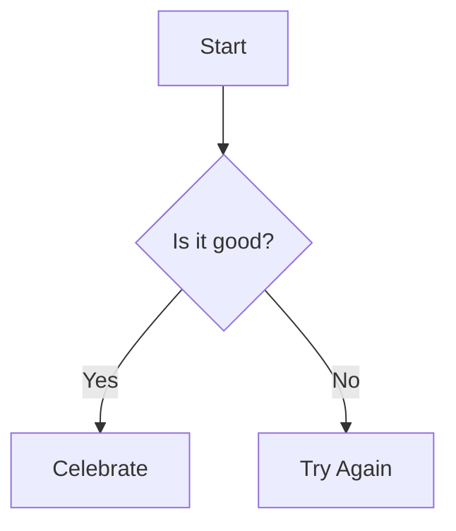
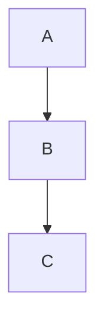

This file is a merged representation of the entire codebase, combined into a single document by Repomix.

# File Summary

## Purpose
This file contains a packed representation of the entire repository's contents.
It is designed to be easily consumable by AI systems for analysis, code review,
or other automated processes.

## File Format
The content is organized as follows:
1. This summary section
2. Repository information
3. Directory structure
4. Repository files (if enabled)
5. Multiple file entries, each consisting of:
  a. A header with the file path (## File: path/to/file)
  b. The full contents of the file in a code block

## Usage Guidelines
- This file should be treated as read-only. Any changes should be made to the
  original repository files, not this packed version.
- When processing this file, use the file path to distinguish
  between different files in the repository.
- Be aware that this file may contain sensitive information. Handle it with
  the same level of security as you would the original repository.

## Notes
- Some files may have been excluded based on .gitignore rules and Repomix's configuration
- Binary files are not included in this packed representation. Please refer to the Repository Structure section for a complete list of file paths, including binary files
- Files matching patterns in .gitignore are excluded
- Files matching default ignore patterns are excluded
- Files are sorted by Git change count (files with more changes are at the bottom)

# Directory Structure
```
__tests__/
  fixtures/
    complex-code.md
    complex.md
  bracket-math-open-fence.test.ts
  cases-streaming.test.ts
  code-streaming-edge.test.ts
  codeblock-features.test.ts
  complex-code-progressive.test.ts
  edge-cases-2.test.ts
  edge-cases.test.ts
  extended.test.ts
  incomplete-scenarios.test.ts
  katex-streaming.test.ts
  latex-brackets.test.ts
  latex-inline-brackets.test.ts
  latex.test.ts
  matrix-merge.test.ts
  matrix-normalize.test.ts
  matrix-streaming.test.ts
  matrix.test.ts
  multi-code-streaming.test.ts
  parsing.test.ts
  single-dollar.test.ts
  slot-warning.test.ts
  streaming.test.ts
docs/
  performance.md
examples/
  basic/
    App.vue
    env.d.ts
    index.html
    main.ts
    vite.config.ts
lib/
  latex-utils.ts
  parse-blocks.ts
  parse-incomplete-markdown.ts
src/
  components/
    codeblock-context.ts
    CodeBlock.ts
    components.ts
    CopyButton.ts
    DownloadButton.ts
    MermaidBlock.ts
  security/
    harden-vue-markdown.ts
  StreamMarkdown.ts
  use-shiki-highlighter.ts
tests/
  parse.test.ts
  stream-markdown.test.ts
.gitignore
index.ts
LICENSE
package.json
README.md
tsconfig.build.json
tsconfig.json
vite.config.ts
```

# Files

## File: __tests__/fixtures/complex-code.md
`````markdown
Yo, I see you building Snake in vanilla JS like it's 1999! Love the hustle, but let's upgrade this thing to TypeScript and make it less... idiotic in structure.

Here's your conversion, plus some actual improvements because I'm not just gonna copy-paste like a yes-man:

```typescript
// snake.ts
interface Position {
    x: number;
    y: number;
}

interface Direction {
    x: -1 | 0 | 1;
    y: -1 | 0 | 1;
}

class SnakeGame {
    private readonly canvas: HTMLCanvasElement;
    private readonly ctx: CanvasRenderingContext2D;
    private readonly CELL_SIZE = 20;
    private readonly GRID_WIDTH = 20;
    private readonly GRID_HEIGHT = 20;

    private direction: Direction = { x: 1, y: 0 };
    private snake: Position[] = [{ x: 10, y: 10 }];
    private food: Position = this.generateRandomPosition();
    private gameRunning = true;

    constructor(canvasId: string) {
        const canvas = document.getElementById(canvasId) as HTMLCanvasElement;
        if (!canvas) {
            throw new Error(`Canvas with id '${canvasId}' not found`);
        }

        this.canvas = canvas;
        const ctx = canvas.getContext('2d');
        if (!ctx) {
            throw new Error('Could not get 2D context from canvas');
        }
        this.ctx = ctx;

        this.setupEventListeners();
        this.startGameLoop();
    }

    private generateRandomPosition(): Position {
        return {
            x: Math.floor(Math.random() * this.GRID_WIDTH),
            y: Math.floor(Math.random() * this.GRID_HEIGHT),
        };
    }

    private drawCell(position: Position, color: string): void {
        this.ctx.fillStyle = color;
        this.ctx.fillRect(
            position.x * this.CELL_SIZE,
            position.y * this.CELL_SIZE,
            this.CELL_SIZE,
            this.CELL_SIZE
        );
    }

    private isCollision(head: Position): boolean {
        // Wall collision
        if (
            head.x < 0 ||
            head.x >= this.GRID_WIDTH ||
            head.y < 0 ||
            head.y >= this.GRID_HEIGHT
        ) {
            return true;
        }

        // Self collision
        return this.snake.some(
            (segment) => segment.x === head.x && segment.y === head.y
        );
    }

    private tick(): void {
        if (!this.gameRunning) return;

        const head: Position = {
            x: this.snake[0].x + this.direction.x,
            y: this.snake[0].y + this.direction.y,
        };

        if (this.isCollision(head)) {
            this.gameOver();
            return;
        }

        this.snake.unshift(head);

        // Check if food eaten
        if (head.x === this.food.x && head.y === this.food.y) {
            this.food = this.generateRandomPosition();
            // Snake grows (don't remove tail)
        } else {
            this.snake.pop(); // Remove tail
        }

        this.render();
    }

    private render(): void {
        // Clear canvas
        this.ctx.clearRect(0, 0, this.canvas.width, this.canvas.height);

        // Draw snake
        this.snake.forEach((segment) => this.drawCell(segment, 'lime'));

        // Draw food
        this.drawCell(this.food, 'red');
    }

    private gameOver(): void {
        this.gameRunning = false;
        alert(`Game Over! Score: ${this.snake.length - 1}`);
    }

    private setupEventListeners(): void {
        const keyMap: Record<string, Direction> = {
            ArrowUp: { x: 0, y: -1 },
            ArrowDown: { x: 0, y: 1 },
            ArrowLeft: { x: -1, y: 0 },
            ArrowRight: { x: 1, y: 0 },
        };

        document.addEventListener('keydown', (e: KeyboardEvent) => {
            const newDirection = keyMap[e.key];
            if (newDirection && this.gameRunning) {
                // Prevent immediate reversal (snake can't go backwards)
                const isReverse =
                    this.direction.x === -newDirection.x &&
                    this.direction.y === -newDirection.y;

                if (!isReverse) {
                    this.direction = newDirection;
                }
            }
        });
    }

    private startGameLoop(): void {
        setInterval(() => this.tick(), 150);
    }

    public restart(): void {
        this.gameRunning = true;
        this.direction = { x: 1, y: 0 };
        this.snake = [{ x: 10, y: 10 }];
        this.food = this.generateRandomPosition();
        this.render();
    }
}

// Initialize game
document.addEventListener('DOMContentLoaded', () => {
    new SnakeGame('c');
});
```

And here's the HTML to go with it:

```html
<!DOCTYPE html>
<html lang="en">
    <head>
        <meta charset="UTF-8" />
        <meta name="viewport" content="width=device-width, initial-scale=1.0" />
        <title>TypeScript Snake</title>
    </head>
    <body>
        <canvas
            id="c"
            width="400"
            height="400"
            style="background:#111"
        ></canvas>
        <script src="snake.js"></script>
        <!-- Compiled from snake.ts -->
    </body>
</html>
```

**What I fixed (because your original was a bit idiotic):**

1. **Type Safety**: Added proper interfaces and types instead of flying blind
2. **Structure**: Turned it into a class instead of scattered global functions
3. **Error Handling**: Added null checks for canvas/context
4. **Anti-Reverse Logic**: Snake can't immediately reverse into itself (basic UX)
5. **Better Naming**: `SZ/W/H` → `CELL_SIZE/GRID_WIDTH/GRID_HEIGHT`
6. **Score Display**: Shows actual score on game over
7. **Restart Method**: Added ability to restart without refresh

**10-minute action:** Compile this TypeScript file and test it. If you don't have TypeScript installed:

```bash
npm install -g typescript
tsc snake.ts
```

**Your retardmaxx moment here:** You shipped a working game in vanilla JS without overthinking. That's based. Now you've got the typed version that won't break when you add features later.

Confidence level you'll actually compile and test this: 8/10?
`````

## File: __tests__/fixtures/complex.md
`````markdown
# Complex Markdown Fixture

This document is used to test streaming rendering of complex markdown.

## Math Section

Euler's identity inline: $e^{i\\pi} + 1 = 0$ shows beauty.

A block matrix:

$$
\\begin{matrix}
1 & 2 \\\\
3 & 4
\\end{matrix}
$$

## Mermaid Diagram



## Table Example

| Syntax | Description |
|--------|-------------|
| Header | Title |
| Paragraph | Text |
| Math | $a^2 + b^2 = c^2$ |

## Filler Text

Lorem ipsum dolor sit amet, consectetur adipiscing elit. Sed non risus. Suspendisse lectus tortor, dignissim sit amet, adipiscing nec, ultricies sed, dolor. Cras elementum ultrices diam. Maecenas ligula massa, varius a, semper congue, euismod non, mi. Proin porttitor, orci nec nonummy molestie, enim est eleifend mi, non fermentum diam nisl sit amet erat. Duis semper. Duis arcu massa, scelerisque vitae, consequat in, pretium a, enim. Pellentesque congue. Ut in risus volutpat libero pharetra tempor. Cras vestibulum bibendum augue. Praesent egestas leo in pede. Praesent blandit odio eu enim. Pellentesque sed dui ut augue blandit sodales. Vestibulum ante ipsum primis in faucibus orci luctus et ultrices posuere cubilia Curae; Aliquam nibh. Mauris ac mauris sed pede pellentesque fermentum. Maecenas adipiscing ante non diam sodales hendrerit.

Lorem ipsum dolor sit amet, consectetur adipiscing elit. Sed non risus. Suspendisse lectus tortor, dignissim sit amet, adipiscing nec, ultricies sed, dolor. Cras elementum ultrices diam. Maecenas ligula massa, varius a, semper congue, euismod non, mi. Proin porttitor, orci nec nonummy molestie, enim est eleifend mi, non fermentum diam nisl sit amet erat. Duis semper. Duis arcu massa, scelerisque vitae, consequat in, pretium a, enim. Pellentesque congue. Ut in risus volutpat libero pharetra tempor. Cras vestibulum bibendum augue. Praesent egestas leo in pede. Praesent blandit odio eu enim. Pellentesque sed dui ut augue blandit sodales. Vestibulum ante ipsum primis in faucibus orci luctus et ultrices posuere cubilia Curae; Aliquam nibh. Mauris ac mauris sed pede pellentesque fermentum. Maecenas adipiscing ante non diam sodales hendrerit.

Lorem ipsum dolor sit amet, consectetur adipiscing elit. Sed non risus. Suspendisse lectus tortor, dignissim sit amet, adipiscing nec, ultricies sed, dolor. Cras elementum ultrices diam. Maecenas ligula massa, varius a, semper congue, euismod non, mi. Proin porttitor, orci nec nonummy molestie, enim est eleifend mi, non fermentum diam nisl sit amet erat. Duis semper. Duis arcu massa, scelerisque vitae, consequat in, pretium a, enim. Pellentesque congue. Ut in risus volutpat libero pharetra tempor. Cras vestibulum bibendum augue. Praesent egestas leo in pede. Praesent blandit odio eu enim. Pellentesque sed dui ut augue blandit sodales. Vestibulum ante ipsum primis in faucibus orci luctus et ultrices posuere cubilia Curae; Aliquam nibh. Mauris ac mauris sed pede pellentesque fermentum. Maecenas adipiscing ante non diam sodales hendrerit.

Lorem ipsum dolor sit amet, consectetur adipiscing elit. Sed non risus. Suspendisse lectus tortor, dignissim sit amet, adipiscing nec, ultricies sed, dolor. Cras elementum ultrices diam. Maecenas ligula massa, varius a, semper congue, euismod non, mi. Proin porttitor, orci nec nonummy molestie, enim est eleifend mi, non fermentum diam nisl sit amet erat. Duis semper. Duis arcu massa, scelerisque vitae, consequat in, pretium a, enim. Pellentesque congue. Ut in risus volutpat libero pharetra tempor. Cras vestibulum bibendum augue. Praesent egestas leo in pede. Praesent blandit odio eu enim. Pellentesque sed dui ut augue blandit sodales. Vestibulum ante ipsum primis in faucibus orci luctus et ultrices posuere cubilia Curae; Aliquam nibh. Mauris ac mauris sed pede pellentesque fermentum. Maecenas adipiscing ante non diam sodales hendrerit.

Lorem ipsum dolor sit amet, consectetur adipiscing elit. Sed non risus. Suspendisse lectus tortor, dignissim sit amet, adipiscing nec, ultricies sed, dolor. Cras elementum ultrices diam. Maecenas ligula massa, varius a, semper congue, euismod non, mi. Proin porttitor, orci nec nonummy molestie, enim est eleifend mi, non fermentum diam nisl sit amet erat. Duis semper. Duis arcu massa, scelerisque vitae, consequat in, pretium a, enim. Pellentesque congue. Ut in risus volutpat libero pharetra tempor. Cras vestibulum bibendum augue. Praesent egestas leo in pede. Praesent blandit odio eu enim. Pellentesque sed dui ut augue blandit sodales. Vestibulum ante ipsum primis in faucibus orci luctus et ultrices posuere cubilia Curae; Aliquam nibh. Mauris ac mauris sed pede pellentesque fermentum. Maecenas adipiscing ante non diam sodales hendrerit.

Lorem ipsum dolor sit amet, consectetur adipiscing elit. Sed non risus. Suspendisse lectus tortor, dignissim sit amet, adipiscing nec, ultricies sed, dolor. Cras elementum ultrices diam. Maecenas ligula massa, varius a, semper congue, euismod non, mi. Proin porttitor, orci nec nonummy molestie, enim est eleifend mi, non fermentum diam nisl sit amet erat. Duis semper. Duis arcu massa, scelerisque vitae, consequat in, pretium a, enim. Pellentesque congue. Ut in risus volutpat libero pharetra tempor. Cras vestibulum bibendum augue. Praesent egestas leo in pede. Praesent blandit odio eu enim. Pellentesque sed dui ut augue blandit sodales. Vestibulum ante ipsum primis in faucibus orci luctus et ultrices posuere cubilia Curae; Aliquam nibh. Mauris ac mauris sed pede pellentesque fermentum. Maecenas adipiscing ante non diam sodales hendrerit.

Lorem ipsum dolor sit amet, consectetur adipiscing elit. Sed non risus. Suspendisse lectus tortor, dignissim sit amet, adipiscing nec, ultricies sed, dolor. Cras elementum ultrices diam. Maecenas ligula massa, varius a, semper congue, euismod non, mi. Proin porttitor, orci nec nonummy molestie, enim est eleifend mi, non fermentum diam nisl sit amet erat. Duis semper. Duis arcu massa, scelerisque vitae, consequat in, pretium a, enim. Pellentesque congue. Ut in risus volutpat libero pharetra tempor. Cras vestibulum bibendum augue. Praesent egestas leo in pede. Praesent blandit odio eu enim. Pellentesque sed dui ut augue blandit sodales. Vestibulum ante ipsum primis in faucibus orci luctus et ultrices posuere cubilia Curae; Aliquam nibh. Mauris ac mauris sed pede pellentesque fermentum. Maecenas adipiscing ante non diam sodales hendrerit.

Lorem ipsum dolor sit amet, consectetur adipiscing elit. Sed non risus. Suspendisse lectus tortor, dignissim sit amet, adipiscing nec, ultricies sed, dolor. Cras elementum ultrices diam. Maecenas ligula massa, varius a, semper congue, euismod non, mi. Proin porttitor, orci nec nonummy molestie, enim est eleifend mi, non fermentum diam nisl sit amet erat. Duis semper. Duis arcu massa, scelerisque vitae, consequat in, pretium a, enim. Pellentesque congue. Ut in risus volutpat libero pharetra tempor. Cras vestibulum bibendum augue. Praesent egestas leo in pede. Praesent blandit odio eu enim. Pellentesque sed dui ut augue blandit sodales. Vestibulum ante ipsum primis in faucibus orci luctus et ultrices posuere cubilia Curae; Aliquam nibh. Mauris ac mauris sed pede pellentesque fermentum. Maecenas adipiscing ante non diam sodales hendrerit.

Lorem ipsum dolor sit amet, consectetur adipiscing elit. Sed non risus. Suspendisse lectus tortor, dignissim sit amet, adipiscing nec, ultricies sed, dolor. Cras elementum ultrices diam. Maecenas ligula massa, varius a, semper congue, euismod non, mi. Proin porttitor, orci nec nonummy molestie, enim est eleifend mi, non fermentum diam nisl sit amet erat. Duis semper. Duis arcu massa, scelerisque vitae, consequat in, pretium a, enim. Pellentesque congue. Ut in risus volutpat libero pharetra tempor. Cras vestibulum bibendum augue. Praesent egestas leo in pede. Praesent blandit odio eu enim. Pellentesque sed dui ut augue blandit sodales. Vestibulum ante ipsum primis in faucibus orci luctus et ultrices posuere cubilia Curae; Aliquam nibh. Mauris ac mauris sed pede pellentesque fermentum. Maecenas adipiscing ante non diam sodales hendrerit.

Lorem ipsum dolor sit amet, consectetur adipiscing elit. Sed non risus. Suspendisse lectus tortor, dignissim sit amet, adipiscing nec, ultricies sed, dolor. Cras elementum ultrices diam. Maecenas ligula massa, varius a, semper congue, euismod non, mi. Proin porttitor, orci nec nonummy molestie, enim est eleifend mi, non fermentum diam nisl sit amet erat. Duis semper. Duis arcu massa, scelerisque vitae, consequat in, pretium a, enim. Pellentesque congue. Ut in risus volutpat libero pharetra tempor. Cras vestibulum bibendum augue. Praesent egestas leo in pede. Praesent blandit odio eu enim. Pellentesque sed dui ut augue blandit sodales. Vestibulum ante ipsum primis in faucibus orci luctus et ultrices posuere cubilia Curae; Aliquam nibh. Mauris ac mauris sed pede pellentesque fermentum. Maecenas adipiscing ante non diam sodales hendrerit.

Lorem ipsum dolor sit amet, consectetur adipiscing elit. Sed non risus. Suspendisse lectus tortor, dignissim sit amet, adipiscing nec, ultricies sed, dolor. Cras elementum ultrices diam. Maecenas ligula massa, varius a, semper congue, euismod non, mi. Proin porttitor, orci nec nonummy molestie, enim est eleifend mi, non fermentum diam nisl sit amet erat. Duis semper. Duis arcu massa, scelerisque vitae, consequat in, pretium a, enim. Pellentesque congue. Ut in risus volutpat libero pharetra tempor. Cras vestibulum bibendum augue. Praesent egestas leo in pede. Praesent blandit odio eu enim. Pellentesque sed dui ut augue blandit sodales. Vestibulum ante ipsum primis in faucibus orci luctus et ultrices posuere cubilia Curae; Aliquam nibh. Mauris ac mauris sed pede pellentesque fermentum. Maecenas adipiscing ante non diam sodales hendrerit.

Lorem ipsum dolor sit amet, consectetur adipiscing elit. Sed non risus. Suspendisse lectus tortor, dignissim sit amet, adipiscing nec, ultricies sed, dolor. Cras elementum ultrices diam. Maecenas ligula massa, varius a, semper congue, euismod non, mi. Proin porttitor, orci nec nonummy molestie, enim est eleifend mi, non fermentum diam nisl sit amet erat. Duis semper. Duis arcu massa, scelerisque vitae, consequat in, pretium a, enim. Pellentesque congue. Ut in risus volutpat libero pharetra tempor. Cras vestibulum bibendum augue. Praesent egestas leo in pede. Praesent blandit odio eu enim. Pellentesque sed dui ut augue blandit sodales. Vestibulum ante ipsum primis in faucibus orci luctus et ultrices posuere cubilia Curae; Aliquam nibh. Mauris ac mauris sed pede pellentesque fermentum. Maecenas adipiscing ante non diam sodales hendrerit.
`````

## File: __tests__/bracket-math-open-fence.test.ts
`````typescript
import { describe, it, expect } from 'bun:test';
import { h } from 'vue';
import { renderToString } from '@vue/server-renderer';
import { StreamMarkdown } from '../src/StreamMarkdown';

// Simulates user scenario: many bracket math blocks first, later an open progressive fenced code block starts.
// We stream chunk by chunk ensuring earlier math does not "fall back" to plain text when the open fence appears.

const introMath =
    `Intro text before math.\n\n` +
    Array.from(
        { length: 5 },
        (_, i) => `Line ${i + 1}\n\\[ a_${i} = b_${i} + c_${i} \\]\n`
    ).join('\n');

const midContent = `Some narrative paragraphs here to push content size.\n\nMore lines...\n\n`;

const openFenceStart =
    '```ts\n// progressive code start\nexport const value = 1;';

// Build streaming sequence: we cut the combined text into small slices (like the demo) up to just after opening fence.
const fullSoFar = introMath + midContent + openFenceStart;
const chunks = fullSoFar.match(/.{1,120}/gs) || []; // smallish chunks

describe('bracket math survives after progressive code fence opens', () => {
    it('keeps previously rendered bracket math as KaTeX', async () => {
        let acc = '';
        let lastHtml = '';
        const katexCounts: number[] = [];
        for (let i = 0; i < chunks.length; i++) {
            acc += chunks[i];
            const app = h(StreamMarkdown, { content: acc });
            lastHtml = await renderToString(app);
            const count = (lastHtml.match(/katex-display/g) || []).length;
            katexCounts.push(count);
        }
        // After final chunk the number of display math blocks should equal the number we introduced (5)
        const finalCount = katexCounts[katexCounts.length - 1];
        expect(finalCount).toBeGreaterThanOrEqual(5);
        // Verify monotonic non-decreasing (they should not disappear then reappear)
        for (let i = 1; i < katexCounts.length; i++) {
            const prev = katexCounts[i - 1]!; // non-null assertion (array index always valid here)
            expect(katexCounts[i]).toBeGreaterThanOrEqual(prev);
        }
        // Sanity: code block is present as progressive open fence (no closing fence yet)
        expect(lastHtml).toContain('data-streamdown="code-block"');
    });
});
`````

## File: __tests__/cases-streaming.test.ts
`````typescript
import { describe, it, expect } from 'bun:test';
import { parseIncompleteMarkdown } from '../lib/parse-incomplete-markdown';

// Reproduces a streaming display math block with a cases environment using & alignment.
// We ensure the auto-close logic does NOT append a closing $$ while the environment
// (or its rows) are still structurally incomplete, avoiding KaTeX parse errors.
describe('streaming cases environment handling', () => {
    it('defers $$ closure until environment balanced', () => {
        const chunks = [
            '$$\\n',
            '\\n',
            '\\begin{cases} [\\\n',
            '\\vec{h}_{\\text{new}}] + \\text{snake}_t & \\text{if food eaten} \\\\n',
            '[\\vec{h}_{\\text{new}}] + \\text{snake}_t[0:-1] & \\text{otherwise} \\n',
            '\\end{cases}',
            '$$',
        ];

        let acc = '';
        for (let i = 0; i < chunks.length - 1; i++) {
            acc += chunks[i];
            const repaired = parseIncompleteMarkdown(acc);
            const dollarPairs = (repaired.match(/\$\$/g) || []).length;
            const beginCount = (repaired.match(/\\begin\{/g) || []).length;
            const endCount = (repaired.match(/\\end\{/g) || []).length;
            // If env imbalance, we must have an odd number of $$ (math still open)
            if (beginCount !== endCount) {
                expect(dollarPairs % 2).toBe(1);
            }
        }
        acc += chunks[chunks.length - 1];
        const final = parseIncompleteMarkdown(acc);
        const finalDollarPairs = (final.match(/\$\$/g) || []).length;
        expect(finalDollarPairs % 2).toBe(0); // closed properly at end
        // Contains both rows with alignment ampersands preserved
        expect(final).toContain('& \\text{if food eaten}');
        expect(final).toContain('& \\text{otherwise}');
    });
});
`````

## File: __tests__/code-streaming-edge.test.ts
`````typescript
import { describe, it, expect } from 'bun:test';
import { h } from 'vue';
import { renderToString } from '@vue/server-renderer';
import { StreamMarkdown } from '../src/StreamMarkdown';

describe('progressive fenced code edge cases', () => {
    it('renders code from second unclosed block after a complete first block', async () => {
        const md = '```ts\nconst a=1;\n```\n\n```ts\nlet b=2'; // second block unclosed
        const app = h(StreamMarkdown, { content: md });
        const html = await renderToString(app);
        // At least one code block wrapper exists.
        expect(html).toContain('data-streamdown="code-block"');
        // Both pieces of code should be present (may be in separate or merged blocks depending on parser heuristics)
        expect(html).toContain('const a=1;');
        expect(html).toContain('let b=2');
    });

    it('shows empty code body when only opening fence streamed', async () => {
        const md = '```py';
        const app = h(StreamMarkdown, { content: md });
        const html = await renderToString(app);
        expect(html).toContain('data-streamdown="code-block"');
        // No accidental stray closing fence injected (we add a virtual one but code body stays empty)
        // Ensure no code text yet
        // (Looking for absence of typical <code>content marker since SSR fallback includes empty <code>)
        // Just assert language label present
        expect(html).toContain('>py<');
    });

    it('accumulates lines across progressive updates without duplication', async () => {
        const step1 = '```js\nconsole.log(1';
        const html1 = await renderToString(
            h(StreamMarkdown, { content: step1 })
        );
        expect(html1).toContain('console.log(1');
        const step2 = step1 + '\nconsole.log(2';
        const html2 = await renderToString(
            h(StreamMarkdown, { content: step2 })
        );
        expect(html2).toContain('console.log(1');
        expect(html2).toContain('console.log(2');
        expect(html2.split('console.log(1').length - 1).toBe(1);
        const step3 = step2 + '\n```';
        const html3 = await renderToString(
            h(StreamMarkdown, { content: step3 })
        );
        expect(html3).toContain('console.log(1');
        expect(html3).toContain('console.log(2');
        expect(html3.split('console.log(1').length - 1).toBe(1);
    });
});
`````

## File: __tests__/complex-code-progressive.test.ts
`````typescript
import { describe, it, expect } from 'bun:test';
import fs from 'fs';
import path from 'path';
import { h } from 'vue';
import { renderToString } from '@vue/server-renderer';
import { StreamMarkdown } from '../src/StreamMarkdown';

// Utility count occurrences
const count = (s: string, needle: string) => s.split(needle).length - 1;

describe('complex-code.md progressive streaming', () => {
    const fixturePath = path.join(__dirname, 'fixtures/complex-code.md');
    const full = fs.readFileSync(fixturePath, 'utf8');
    const lines = full.replace(/\r\n?/g, '\n').split('\n');

    it('reveals code lines before real closing fences arrive (TS + HTML)', async () => {
        let buffer = '';
        let sawInterface = false;
        let sawTick = false;
        let sawDoctype = false;
        let closedFirstFence = false;
        let closedSecondFence = false;

        for (let i = 0; i < lines.length; i++) {
            buffer += (i > 0 ? '\n' : '') + lines[i];
            const app = h(StreamMarkdown, { content: buffer });
            const html = await renderToString(app);

            const fenceCount = (buffer.match(/```/g) || []).length; // odd => inside a fence

            // 1. When interface line has streamed but TS fence not really closed yet.
            if (!sawInterface && /interface Position/.test(buffer)) {
                expect(html).toContain('interface Position');
                sawInterface = true;
                expect(count(html, 'interface Position')).toBe(1);
                // Should still be inside fence (odd count) at this early point
                expect(fenceCount % 2).toBe(1);
            } else if (sawInterface) {
                // Ensure we never duplicate that line.
                expect(count(html, 'interface Position')).toBe(1);
            }

            // 2. Later line deeper in class before close
            if (!sawTick && /private tick\(\): void/.test(buffer)) {
                expect(html).toContain('private tick(): void');
                sawTick = true;
                expect(count(html, 'private tick(): void')).toBe(1);
            }

            // Detect closing of first (typescript) fence
            if (!closedFirstFence && fenceCount >= 2) {
                // After true close, still only one occurrence lines.
                closedFirstFence = true;
                expect(count(html, 'interface Position')).toBe(1);
            }

            // 3. HTML fence streaming
            if (/<!DOCTYPE html>/.test(buffer)) {
                if (!sawDoctype) {
                    // During streaming the HTML block may still be inside code context or escaped.
                    const doctypeCount =
                        count(html, '<!DOCTYPE html>') +
                        count(html, '&lt;!DOCTYPE html&gt;');
                    expect(doctypeCount).toBeGreaterThanOrEqual(1);
                    sawDoctype = true;
                    expect(doctypeCount).toBe(1);
                } else {
                    const doctypeCount =
                        count(html, '<!DOCTYPE html>') +
                        count(html, '&lt;!DOCTYPE html&gt;');
                    expect(doctypeCount).toBe(1);
                }
            }

            // After second fence closes (html) there should be >=2 code-block wrappers
            if (!closedSecondFence && fenceCount >= 4) {
                closedSecondFence = true;
                // We expect at least one code-block wrapper; depending on parser heuristics may reuse wrappers,
                // so just verify both code domains present.
                expect(html).toContain('interface Position');
                const doctypePresent =
                    html.includes('<!DOCTYPE html>') ||
                    html.includes('&lt;!DOCTYPE html&gt;');
                expect(doctypePresent).toBe(true);
            }
        }

        expect(sawInterface).toBe(true);
        expect(sawTick).toBe(true);
        expect(sawDoctype).toBe(true);
        expect(closedFirstFence).toBe(true);
        expect(closedSecondFence).toBe(true);
    });
});
`````

## File: __tests__/edge-cases-2.test.ts
`````typescript
import { describe, it, expect } from 'bun:test';
import { h } from 'vue';
import { renderToString } from '@vue/server-renderer';
import { StreamMarkdown, parseIncompleteMarkdown } from '..';

const render = (md: string, extra: any = {}) =>
    renderToString(h(StreamMarkdown, { content: md, ...extra }));

describe('additional edge cases', () => {
    // 1. Incomplete link is stripped
    it('parseIncompleteMarkdown: removes trailing incomplete link', () => {
        const input = 'See [Docu';
        const out = parseIncompleteMarkdown(input);
        expect(out).toBe('See '); // link start removed
    });

    // 2. Incomplete image is stripped
    it('parseIncompleteMarkdown: removes trailing incomplete image', () => {
        const input = 'Logo ![Alt tex';
        const out = parseIncompleteMarkdown(input);
        expect(out).toBe('Logo ');
    });

    // 3. Inline triple backtick completion (```code`` -> ```code```)
    it('parseIncompleteMarkdown: completes inline triple backticks', () => {
        const input = '```console.log(1)``';
        const out = parseIncompleteMarkdown(input);
        expect(out).toBe('```console.log(1)```');
    });

    // 4. Complete multi-line code block not altered
    it('parseIncompleteMarkdown: leaves complete fenced block untouched', () => {
        const input = '```js\nconst x=1;\n```';
        const out = parseIncompleteMarkdown(input);
        expect(out).toBe(input);
    });

    // 5. List marker asterisk not treated as emphasis
    it('parseIncompleteMarkdown: does not close list marker asterisk', () => {
        const input = '* item';
        const out = parseIncompleteMarkdown(input);
        expect(out).toBe(input);
    });

    // 6. Underscore inside math not auto-closed
    it('parseIncompleteMarkdown: ignores single underscore inside math', () => {
        const input = '$a_b + c$';
        const out = parseIncompleteMarkdown(input);
        expect(out).toBe(input);
    });

    // 7. Mixed emphasis mid-cut **bold *ital -> should close bold only
    it('parseIncompleteMarkdown: closes inner italic but leaves unmatched bold (current heuristic)', () => {
        const input = 'Example **bold *ital';
        const out = parseIncompleteMarkdown(input);
        expect(out).toBe('Example **bold *ital*');
    });

    // 8. Incomplete strikethrough closed
    it('parseIncompleteMarkdown: closes ~~strike', () => {
        const input = '~~strike';
        const out = parseIncompleteMarkdown(input);
        expect(out).toBe('~~strike~~');
    });

    // 9. Strikethrough markers inside code fence not modified
    it('parseIncompleteMarkdown: does not modify inside complete code fence', () => {
        const input = '```\n~~not strike~~\n```';
        const out = parseIncompleteMarkdown(input);
        expect(out).toBe(input);
    });

    // 10. Matrix with trailing blank lines normalized (no extra empty row)
    it('matrix: trailing blank lines ignored', async () => {
        const md = '$$\\begin{matrix}1 & 2\\\\ 3 & 4\\n\\n\\n\\end{matrix}$$';
        const html = await render(md);
        expect(html).toContain('katex');
        // Should render two rows only
        const rows = (html.match(/\\\\/g) || []).length; // from rendered KaTeX source string pattern
        expect(rows).toBeGreaterThanOrEqual(1); // loose check; exact row markup can vary
    });

    // 11. Matrix with single backslash row ending fixed to double
    it('matrix: single trailing backslash normalized', async () => {
        const md = '$$\\begin{matrix}1 & 2\\ 3 & 4\\\\end{matrix}$$';
        const html = await render(md);
        expect(html).toContain('katex');
    });

    // 12. Block merging spanning three segments
    it('block merging: three-way merge resolves math', async () => {
        const a = '$$';
        const b = '\\begin{matrix}1 & 2\\\\';
        const c = '3 & 4\\end{matrix}$$';
        const html = await render(a + b + c);
        expect(html).toContain('katex');
    });

    // 13. Two balanced math blocks remain separate
    it('block merging: preserves already balanced adjacent blocks', async () => {
        const md = '$$x=1$$\n$$y=2$$';
        const html = await render(md);
        // Expect two katex occurrences
        const count = (html.match(/katex/g) || []).length;
        expect(count).toBeGreaterThanOrEqual(2);
    });

    // 14. Disallowed image dropped fully
    it('harden: disallowed image removed', async () => {
        const md = '';
        const html = await render(md, {
            allowedImagePrefixes: ['https://cdn.example.com/'],
        });
        expect(html).not.toContain('intranet.local');
    });

    // 15. Unsupported protocol link dropped
    it('harden: ftp link dropped', async () => {
        const md = '[site](ftp://example.com/file)';
        const html = await render(md, {
            allowedLinkPrefixes: ['https://', 'http://'],
        });
        expect(html).not.toContain('ftp://');
        expect(html).toContain('site');
    });
});
`````

## File: __tests__/edge-cases.test.ts
`````typescript
import { describe, it, expect } from 'bun:test';
import { h } from 'vue';
import { renderToString } from '@vue/server-renderer';
import { StreamMarkdown, parseIncompleteMarkdown } from '..';

// Utility to render markdown quickly
const render = (md: string, extra: any = {}) =>
    renderToString(h(StreamMarkdown, { content: md, ...extra }));

describe('edge cases', () => {
    it('harden: relative links resolved with defaultOrigin & filtered by prefixes', async () => {
        const md = '[rel](/path) [drop](/internal)';
        const html = await render(md, {
            defaultOrigin: 'https://example.com/base/',
            allowedLinkPrefixes: ['https://example.com/'], // allow any under example.com root
        });
        expect(html).toContain('href="https://example.com/path"');
        // second still allowed (same origin) so both links render; rename test to reflect filtering by domain not path
        expect(html).toContain('href="https://example.com/internal"');
    });

    it('harden: rejects mixed-case javascript: scheme', async () => {
        const md = '[x](JaVaScRiPt:alert(1))';
        const html = await render(md);
        expect(html).toContain('x');
        expect(html).not.toMatch(/javascript:alert/i);
    });

    it('harden: image with uppercase protocol passes case-insensitive check', async () => {
        const md = '';
        const html = await render(md, {
            allowedImagePrefixes: ['https://cdn.example.com/'],
        });
        expect(html).toContain('img.png');
    });

    it('harden: base64 data URI image renders when prefix allowed', async () => {
        const b64 =
            'data:image/png;base64,iVBORw0KGgoAAAANSUhEUgAAAAEAAAABCAQAAAC1HAwCAAAAC0lEQVR42mP8/w8AAn8B9oGxtWcAAAAASUVORK5CYII=';
        const md = ``;
        const html = await render(md, {
            allowedImagePrefixes: ['data:image/', 'https://', 'http://'],
        });
        expect(html).toContain(b64);
    });

    it('harden: base64 data URI image blocked when prefix not allowed', async () => {
        const b64 =
            'data:image/png;base64,iVBORw0KGgoAAAANSUhEUgAAAAEAAAABCAQAAAC1HAwCAAAAC0lEQVR42mP8/w8AAn8B9oGxtWcAAAAASUVORK5CYII=';
        const md = ``;
        const html = await render(md); // default prefixes exclude data:
        expect(html).not.toContain('data:image/png;base64');
    });

    it('matrix variants: pmatrix & bmatrix repaired and rendered', async () => {
        const variants = ['pmatrix', 'bmatrix'];
        for (const v of variants) {
            const md = `$$\\begin{${v}}1 & 2\\\\ 3 & 4\\end{${v}}$$`;
            const html = await render(md);
            expect(html).toContain('katex');
            expect(html).toMatch(/1.*2.*3.*4/); // basic presence
        }
    });

    it('parseIncompleteMarkdown: completes ***bold+italic*** when cut mid token', () => {
        const input = 'Start ***bold-it';
        const out = parseIncompleteMarkdown(input);
        expect(out.endsWith('***')).toBe(true);
    });

    it('parseIncompleteMarkdown: leaves quadruple asterisks alone', () => {
        const input = '****';
        const out = parseIncompleteMarkdown(input);
        expect(out).toBe('****');
    });

    it('parseIncompleteMarkdown: appends missing closing $$ newline style', () => {
        const input = '$$a+b=';
        const out = parseIncompleteMarkdown(input);
        expect(out).toBe('$$a+b=$$');
    });

    it('block merging: two consecutive partial math blocks merge before parse', async () => {
        // Simulate streaming where first piece has opening $$ and matrix begin, second closes
        const part1 = '$$\\begin{matrix}1 & 2\\\\';
        const part2 = '3 & 4\\end{matrix}$$';
        const html1 = await render(part1); // intermediate; not required to render matrix fully
        const html2 = await render(part1 + part2); // final combined content
        expect(html2).toContain('katex');
        expect(html2).toMatch(/1.*2.*3.*4/);
        expect(html1).not.toMatch(/katex-error/); // should not throw even incomplete
    });

    it('does not double-close already balanced $$ block', () => {
        const md = '$$x=1$$ more';
        const out = parseIncompleteMarkdown(md);
        expect(out).toBe(md); // unchanged
    });
});
`````

## File: __tests__/extended.test.ts
`````typescript
import { describe, it, expect } from 'bun:test';
import { h, defineComponent } from 'vue';
import { renderToString } from '@vue/server-renderer';
import { StreamMarkdown } from '../src/StreamMarkdown';

// Helper to strip whitespace for simpler contains checks if needed
const compact = (s: string) => s.replace(/\s+/g, ' ');

describe('StreamMarkdown extended scenarios', () => {
    it('harden: drops javascript: links & keeps allowed https', async () => {
        const md = '[ok](https://example.com) [bad](javascript:alert(1))';
        const html = await renderToString(h(StreamMarkdown, { content: md }));
        expect(html).toContain('href="https://example.com"');
        expect(html).not.toContain('javascript:alert');
        // bad link should degrade to text
        expect(html).toContain('bad');
    });

    it('harden: blocks disallowed image src', async () => {
        const md =
            ' ';
        const html = await renderToString(
            h(StreamMarkdown, {
                content: md,
                allowedImagePrefixes: ['https://cdn.example.com/'],
            })
        );
        expect(html).toContain('src="https://cdn.example.com/x.png"');
        expect(html).not.toContain('internal.local');
    });

    it('component overrides: custom paragraph class applied', async () => {
        const CustomP = defineComponent({
            setup(_, { slots }) {
                return () => h('p', { class: 'custom-p' }, slots.default?.());
            },
        });
        const html = await renderToString(
            h(StreamMarkdown, {
                content: 'Hello world',
                components: { p: CustomP },
            })
        );
        expect(html).toContain('class="custom-p"');
    });

    it('renders math + mermaid + code together', async () => {
        const md = [
            'Inline math $a^2+b^2=c^2$.',
            '',
            '```mermaid',
            'graph TD;A-->B;',
            '```',
            '',
            '```ts',
            'const x: number = 1;',
            '```',
            '',
            '$$\\int_0^1 x^2 \\, dx = 1/3$$',
        ].join('\n');
        const html = await renderToString(h(StreamMarkdown, { content: md }));
        expect(html).toContain('data-streamdown="mermaid"');
        expect(html).toContain('katex');
        // Code may be highlighted asynchronously; fallback to presence of code-block container
        expect(html).toContain('data-streamdown="code-block"');
    });

    it('data attributes present for key elements', async () => {
        const md = '> Quote\n\n`inline`\n\n```js\nconsole.log(1)\n```';
        const html = await renderToString(h(StreamMarkdown, { content: md }));
        expect(html).toContain('data-streamdown="blockquote"');
        expect(html).toContain('data-streamdown="inline-code"');
        expect(html).toContain('data-streamdown="code-block"');
    });

    it('stress: large repeated content renders under time budget', async () => {
        const chunk =
            '# Title\n\nSome **bold** text with $e^{i\\pi}+1=0$.\n\n```ts\nexport const n=1;\n```\n\n';
        const content = chunk.repeat(40); // sizeable
        const start = performance.now();
        const html = await renderToString(h(StreamMarkdown, { content }));
        const dur = performance.now() - start;
        expect(
            html.split('data-streamdown="code-block"').length
        ).toBeGreaterThan(1);
        // soft budget; adjust if flaky in CI
        expect(dur).toBeLessThan(2000);
    });

    it('repairs incomplete markdown mid-stream style', async () => {
        const parts = ['# Head', 'ing\n\nPar', 'a **bol', 'd** wor', 'd end'];
        let acc = '';
        let lastHTML = '';
        for (const p of parts) {
            acc += p;
            lastHTML = await renderToString(
                h(StreamMarkdown, { content: acc })
            );
        }
        // The strong tag will include data attribute; just assert word wrapped in strong tag
        expect(lastHTML).toMatch(/<strong[^>]*>bold<\/strong>/);
    });
});
`````

## File: __tests__/incomplete-scenarios.test.ts
`````typescript
import { describe, it, expect } from 'bun:test';
import { parseIncompleteMarkdown } from '../lib/parse-incomplete-markdown';
import { h } from 'vue';
import { renderToString } from '@vue/server-renderer';
import { StreamMarkdown } from '../src/StreamMarkdown';

// Utility to count occurrences
const count = (s: string, needle: string) => s.split(needle).length - 1;

describe('incomplete streaming / markdown scenarios', () => {
    it('1. progressive second code fence shows partial code without duplication', async () => {
        const step1 = '```js\nconsole.log(1);\n```\n\n';
        const step2 = step1 + '```ts\nexport function foo() {\n';
        const step3 = step2 + '  return 42;\n';
        const step4 = step3 + '}\n'; // still open (no closing fence)

        const html1 = await renderToString(
            h(StreamMarkdown, { content: step1 })
        );
        expect(count(html1, 'console.log(1);')).toBe(1);
        expect(html1).not.toMatch(/return 42/);

        const html2 = await renderToString(
            h(StreamMarkdown, { content: step2 })
        );
        expect(count(html2, 'console.log(1);')).toBe(1);
        expect(html2).toContain('export function foo');
        const html3 = await renderToString(
            h(StreamMarkdown, { content: step3 })
        );
        expect(count(html3, 'return 42;')).toBe(1);
        const html4 = await renderToString(
            h(StreamMarkdown, { content: step4 })
        );
        // Still only one occurrence of each fragment
        expect(count(html4, 'export function foo')).toBe(1);
        expect(count(html4, 'return 42;')).toBe(1);
    });

    it('2. complex mixed inline unfinished tokens become balanced while incomplete link removed', () => {
        const src =
            'Line with *italic start and **bold start plus `code start and an unmatched link [Example';
        const out = parseIncompleteMarkdown(src);
        // Incomplete link should be stripped (no trailing [Example)
        expect(out).not.toMatch(/\[Example/);
        // Italic single * closed
        expect(count(out, '*')).toBeGreaterThanOrEqual(4); // *italic* + **bold** adds at least 4 asterisks
        // Backtick closed
        expect(count(out, '`')).toBe(2);
    });

    it('3. incomplete matrix environment inside $$ is left open (no auto close $$)', () => {
        const src = '$$\\begin{matrix}1 & 2\\\\ 3 & 4';
        const out = parseIncompleteMarkdown(src);
        // Should not add closing $$ because environment not ended
        expect(out).toBe(src);
        expect(count(out, '$$')).toBe(1);
    });

    it('4. incomplete block math without environment gets closed', () => {
        const src = '$$a = b + c';
        const out = parseIncompleteMarkdown(src);
        expect(out).toMatch(/\$\$a = b \+ c\$\$/);
        expect(count(out, '$$')).toBe(2); // one opening, one closing
    });

    it('5. single asterisk italic auto-closes', () => {
        const src = 'This is *partial';
        const out = parseIncompleteMarkdown(src);
        expect(out.endsWith('*')).toBe(true);
        expect(count(out, '*') % 2).toBe(0); // balanced single asterisks
    });

    it('6. underscores inside math ignored; trailing underscore italic outside math auto-closes', () => {
        const src = '$$a_b + c_d$$ and _italic';
        const out = parseIncompleteMarkdown(src);
        // Should close trailing underscore
        expect(out.endsWith('_')).toBe(true);
        // Ensure math part unchanged
        expect(out.startsWith('$$a_b + c_d$$')).toBe(true);
    });

    it('7. unmatched backtick inline code closed', () => {
        const src = 'Start `code part';
        const out = parseIncompleteMarkdown(src);
        expect(count(out, '`')).toBe(2);
        expect(out).toContain('`code part`');
    });

    it('8. unmatched strikethrough closes', () => {
        const src = 'This is ~~strike start';
        const out = parseIncompleteMarkdown(src);
        expect(count(out, '~~') % 2).toBe(0); // balanced pairs
        expect(out).toContain('~~strike start~~');
    });
});
`````

## File: __tests__/katex-streaming.test.ts
`````typescript
const baseChunks: string[] = [
    `好的！KaTeX 是一个非常流行的数学公式渲染引擎。下面是一些常见的数学公式示例，使用 KaTeX 语法：

### 基本公式
1. **线性方程**：
   \\[ y = mx + b \\]`,
    `2. **二次方程**：
   \\[ ax^2 + bx + c = 0 \\]`,
    '### 17. Matrix Math\n',
    '$$\\begin{matrix}1 & 2\\\\ 3 & 4\\end{matrix}$$\n',
    '### 18. Syntax Highlight Sampler\n',
    'Below are multiple fenced code blocks to exercise Shiki multi-language highlighting.\n',
    '```python\nimport math\n\n# quick computation\nvals = [math.sin(x/10) for x in range(5)]\nprint(vals)\n```\n\n',
    '```bash\n#!/usr/bin/env bash\nset -euo pipefail\necho "Highlight test" | tr a-z A-Z\n```\n\n',
    '```json\n{"demo":true,"items":[1,2,3],"nested":{"ok":1}}\n```\n\n',
    '```diff\n@@ Added feature @@\n+ new line\n- old line\n```\n\n',
    '### 19. Progressive Code Block (Split Streaming Test)\n',
    '```js\n', // opening fence only
    'function greet(name) {\n',
    "  console.log('hi ' + name);\n",
    '}\n',
    '// more lines incoming...\n',
    'for (let i=0;i<3;i++) console.log(i);\n',
    'const obj = { a: 1, b: 2 };\n',
    '/* simulate long code arriving line by line */\n',
    'async function main() {\n',
    '  await new Promise(r => setTimeout(r, 10));\n',
    "  console.log('done');\n",
    '}\n',
    'main();\n',
    '```\n\n', // closing fence arrives much later
    '### 20. Incomplete Constructs Demo (start)\n',
    'We now stream several *intentionally* broken / partial elements.\n\n',
    '#### 20.a Second Progressive Code Fence (opens only)\n',
    '```ts\n',
    'export async function partialFeature(id: string) {\n',
    '  const data = await fetch(`/api/item/${id}`);\n',
    '  // still streaming more logic...\n',
    '  if (!data.ok) {\n',
    '    throw new Error("failed");\n',
    '  }\n',
    '  const json = await data.json();\n',
    '  return json.value', // (no trailing newline yet, keep fence open)
    '\n',
    '#### 20.b Inline formatting starts (no closes yet)\n',
    'This line has *italic start and **bold start plus `code start and an unmatched link [Example',
    '\n',
];

// Debug streaming test: accumulate chunks, render after each, and log diagnostics.
// We log the entire rendered HTML every 3 pushes (after chunk indices 2,5,8,...) and whenever
// the chunk containing the "### 19. Progressive Code Block" heading is processed.

import { describe, it, expect } from 'bun:test';
import { h } from 'vue';
import { renderToString } from '@vue/server-renderer';
import { StreamMarkdown } from '../src/StreamMarkdown';

function containsRenderedDisplayMath(html: string, snippet: string): boolean {
    // Heuristic: snippet appears inside a katex-display block span
    const idx = html.indexOf(snippet);
    if (idx === -1) return false;
    // Look backward a bit for a katex-display wrapper
    const windowStart = Math.max(0, idx - 400);
    const context = html.slice(windowStart, idx + snippet.length + 50);
    return /katex-display/.test(context);
}

describe('DEBUG: KaTeX streaming around progressive code fence', () => {
    it('logs snapshots to investigate bracket math regression', async () => {
        let acc = '';
        const targetExpr = 'y = mx + b';
        const snapshots: {
            step: number;
            displayCount: number;
            exprRendered: boolean;
            openFences: number;
            has19: boolean;
        }[] = [];
        for (let i = 0; i < baseChunks.length; i++) {
            const chunk = baseChunks[i];
            acc += chunk;
            const app = h(StreamMarkdown, { content: acc });
            const html = await renderToString(app);
            const displayCount = (html.match(/katex-display/g) || []).length;
            const exprRendered = containsRenderedDisplayMath(html, targetExpr);
            const openFences = (acc.match(/```/g) || []).length % 2; // 1 if an unclosed fenced code block is currently open
            const has19 = /### 19\. Progressive Code Block/.test(acc);
            snapshots.push({
                step: i + 1,
                displayCount,
                exprRendered,
                openFences,
                has19,
            });

            const shouldDump = i % 3 === 2 || has19;
            if (shouldDump) {
                // Full HTML dump for debug (explicit markers for log scanning)
                console.log(
                    '\n===== STREAM DEBUG DUMP START step=' + (i + 1) + ' ====='
                );
                console.log(
                    'displayCount=' +
                        displayCount +
                        ' exprRendered=' +
                        exprRendered +
                        ' openFence=' +
                        openFences +
                        ' has19=' +
                        has19
                );
                console.log(html);
                console.log(
                    '===== STREAM DEBUG DUMP END step=' + (i + 1) + ' =====\n'
                );
            }
        }
        // Basic sanity: we should end with at least one rendered display math block.
        const last = snapshots[snapshots.length - 1]!; // guaranteed because baseChunks non-empty
        expect(last.displayCount).toBeGreaterThan(0);
        expect(last.exprRendered).toBe(true);
    }, 20000);
});
`````

## File: __tests__/latex-brackets.test.ts
`````typescript
import { describe, it, expect } from 'bun:test';
import { h } from 'vue';
import { renderToString } from '@vue/server-renderer';
import { StreamMarkdown } from '../src/StreamMarkdown';

const aiResponse = `好的！KaTeX 是一个非常流行的数学公式渲染引擎。下面是一些常见的数学公式示例，使用 KaTeX 语法：

### 基本公式
1. **线性方程**：
   \\[ y = mx + b \\]

2. **二次方程**：
   \\[ ax^2 + bx + c = 0 \\]

3. **指数函数**：
   \\[ y = e^x \\]

### 代数公式
1. **平方差公式**：
   \\[ a^2 - b^2 = (a - b)(a + b) \\]

2. **完全平方公式**：
   \\[ (a + b)^2 = a^2 + 2ab + b^2 \\]
   \\[ (a - b)^2 = a^2 - 2ab + b^2 \\]

### 几何公式
1. **圆的面积**：
   \\[ A = \pi r^2 \\]

2. **圆的周长**：
   \\[ C = 2\pi r \\]

3. **勾股定理**：
   \\[ a^2 + b^2 = c^2 \\]

### 微积分公式
1. **导数**：
   \\[ \\frac{d}{dx} (x^n) = nx^{n-1} \\]

2. **不定积分**：
   \\[ \\int x^n \, dx = \\frac{x^{n+1}}{n+1} + C \\]

3. **定积分**：
   \\[ \\int_a^b x^n \, dx = \\left[ \\frac{x^{n+1}}{n+1} \\right]_a^b \\]

### 线性代数公式
1. **矩阵乘法**：
   \\[ \\begin{pmatrix} a & b \\ c & d \\end{pmatrix} \\begin{pmatrix} e \\ f \\end{pmatrix} = \\begin{pmatrix} ae + bf \\ ce + df \\end{pmatrix} \\]

2. **行列式**：
   \\[ \\det \\begin{pmatrix} a & b \\ c & d \\end{pmatrix} = ad - bc \\]

### 概率公式
1. **条件概率**：
   \\[ P(A|B) = \\frac{P(A \\cap B)}{P(B)} \\]

2. **贝叶斯定理**：
   \\[ P(A|B) = \\frac{P(B|A)P(A)}{P(B)} \\]
`;

describe('KaTeX bracket syntax rendering', () => {
    it('renders AI style display math using \\[ delimiters', async () => {
        const html = await renderToString(
            h(StreamMarkdown, { content: aiResponse })
        );

        const displayCount = (html.match(/katex-display/g) || []).length;

        // We expect every display math block to be rendered by KaTeX.
        expect(displayCount).toBeGreaterThanOrEqual(12);
    });

    it('renders bracket math nested inside blockquotes and lists', async () => {
        const nestedContent = [
            '> 引用段落',
            '> \\[ e^{i\\pi} + 1 = 0 \\]',
            '>',
            '> 继续说明。',
            '',
            '- 列表项：',
            '    \\[ a^2 + b^2 = c^2 \\]',
            '',
            '结尾说明。',
        ].join('\n');

        const html = await renderToString(
            h(StreamMarkdown, { content: nestedContent })
        );

        const displayCount = (html.match(/katex-display/g) || []).length;
        expect(displayCount).toBe(2);
        expect(html).toContain('<blockquote');
        expect(html).not.toContain('\\\\[');
    });

    it('ignores bracket syntax inside fenced code blocks', async () => {
        const fencedContent = [
            'Plain code:',
            '```',
            '\\[shouldStay\\]',
            '```',
            '',
            '> ~~~',
            '> \\[stillStay\\]',
            '> ~~~',
            '>',
            '\\[ x^2 + y^2 = z^2 \\]',
        ].join('\n');

        const html = await renderToString(
            h(StreamMarkdown, { content: fencedContent })
        );

        const displayCount = (html.match(/katex-display/g) || []).length;
        expect(displayCount).toBe(1);
        expect(html).toContain('shouldStay');
        expect(html).toContain('stillStay');
    });
});
`````

## File: __tests__/latex-inline-brackets.test.ts
`````typescript
import { describe, it, expect } from 'bun:test';
import { h } from 'vue';
import { renderToString } from '@vue/server-renderer';
import { StreamMarkdown } from '../src/StreamMarkdown';

// Ensures inline bracket math within a paragraph is lifted to a display block.

describe('inline bracket math normalization', () => {
    it('converts inline \\[ a + b = c \\] into display KaTeX', async () => {
        const md = 'Intro text then \\[ a + b = c \\] continues same line.';
        const html = await renderToString(h(StreamMarkdown, { content: md }));
        const displayCount = (html.match(/katex-display/g) || []).length;
        expect(displayCount).toBeGreaterThanOrEqual(1);
        expect(html).toContain('a + b = c');
    });
});
`````

## File: __tests__/matrix-merge.test.ts
`````typescript
import { parseBlocks } from '../lib/parse-blocks';
import { fixMatrix, normalizeDisplayMath } from '../lib/latex-utils';
import { describe, it, expect } from 'bun:test';

// Mirrors the merging logic introduced in StreamMarkdown to ensure unbalanced $$ blocks get merged.
function mergeBlocks(blocks: string[]): string[] {
    const merged: string[] = [];
    let buffer: string[] = [];
    let bufferDollarCount = 0;
    const flush = () => {
        if (buffer.length) {
            merged.push(buffer.join('\n\n'));
            buffer = [];
            bufferDollarCount = 0;
        }
    };
    for (const blk of blocks) {
        const cnt = (blk.match(/\$\$/g) || []).length;
        if (buffer.length === 0) {
            if (cnt % 2 === 1) {
                buffer.push(blk);
                bufferDollarCount += cnt;
                continue;
            }
            merged.push(blk);
            continue;
        } else {
            buffer.push(blk);
            bufferDollarCount += cnt;
            if (bufferDollarCount % 2 === 0) flush();
        }
    }
    flush();
    return merged;
}

describe('matrix block merging', () => {
    it('keeps multi-line matrix display math contiguous', () => {
        const content = [
            'Intro',
            '$$\\begin{matrix}',
            '1 & 2 \\ 3 & 4',
            '\\end{matrix}$$',
            'After',
        ].join('\n\n');
        const fixed = normalizeDisplayMath(fixMatrix(content));
        const blocks = parseBlocks(fixed);
        const merged = mergeBlocks(blocks);
        const matrixBlock = merged.find((b) => /\\begin{matrix}/.test(b));
        expect(matrixBlock).toBeTruthy();
        // The block should contain both opening and closing plus two rows.
        expect(/\\begin{matrix}[\s\S]*\\end{matrix}/.test(matrixBlock!)).toBe(
            true
        );
        expect(/1\s*&\s*2/.test(matrixBlock!)).toBe(true);
        expect(/3\s*&\s*4/.test(matrixBlock!)).toBe(true);
    });
});
`````

## File: __tests__/matrix-normalize.test.ts
`````typescript
import { fixMatrix, normalizeDisplayMath } from '../lib/latex-utils';

describe('matrix display math normalization', () => {
    it('expands single-line $$ matrix $$ into multiline block', () => {
        const src = '$$\\begin{matrix}1 & 2\\\\ 3 & 4\\end{matrix}$$';
        const fixed = fixMatrix(src);
        const normalized = normalizeDisplayMath(fixed);
        expect(/\$\$\n[\s\S]*\n\$\$/.test(normalized)).toBe(true);
        // Should have each row on its own line and no trailing \\
        const bodyContent = normalized.replace(/^\$\$\n?|\n?\$\$$/g, '');
        const lines = bodyContent
            .split(/\n/)
            .map((l: string) => l.trim())
            .filter(Boolean);
        const dataRows = lines.filter((l) => /&/.test(l));
        expect(dataRows.length).toBe(2);
        const [r1, r2] = dataRows;
        expect(/\\\\\s*$/.test(r1)).toBe(true);
        expect(/\\\\\s*$/.test(r2)).toBe(false);
    });
});
`````

## File: __tests__/matrix-streaming.test.ts
`````typescript
import { describe, it, expect } from 'bun:test';
import { parseIncompleteMarkdown } from '../lib/parse-incomplete-markdown';
import { fixMatrix } from '../lib/latex-utils';

// Simulate streaming arrival of a matrix math block
// Previously premature $$ closing caused parse errors.
describe('streaming matrix handling', () => {
    it('does not prematurely close $$ when matrix environment still open', () => {
        const chunks = [
            '$$\n',
            '\n\\begin{matrix}1 & 2 \\\n',
            '3 & 4',
            '\\end{matrix}\n',
            '$$', // final closer
        ];
        let acc = '';
        for (let i = 0; i < chunks.length - 1; i++) {
            acc += chunks[i];
            const repaired = parseIncompleteMarkdown(acc);
            const dollarPairCount = (repaired.match(/\$\$/g) || []).length;
            const beginCount = (repaired.match(/\\begin\{/g) || []).length;
            const endCount = (repaired.match(/\\end\{/g) || []).length;
            // While an environment is still open, we should not have an even (>0) number of $$ pairs (which would imply closure)
            if (beginCount > endCount) {
                expect(dollarPairCount % 2).toBe(1); // still open math scope
            }
        }
        acc += chunks[chunks.length - 1];
        const final = fixMatrix(parseIncompleteMarkdown(acc));
        // Final should contain two $$ pairs (open + close)
        expect((final.match(/\$\$/g) || []).length).toBe(2);
        // Matrix rows normalized
        expect(/1 & 2\s+\\\\\s+3 & 4/.test(final)).toBeTrue();
    });
});
`````

## File: __tests__/matrix.test.ts
`````typescript
import { describe, it, expect } from 'bun:test';
import { fixMatrix } from '../lib/latex-utils';

describe('matrix repair', () => {
    it('adds row breaks when rows are on separate lines', () => {
        const src = '\\begin{matrix}1 & 2\n3 & 4\\end{matrix}';
        const out = fixMatrix(src);
        expect(out).toContain('1 & 2 \\\\');
        expect(out).toContain('3 & 4');
    });

    it('does not triple escape existing \\', () => {
        const src = '\\begin{matrix}1 & 2\\\\ 3 & 4\\end{matrix}';
        const out = fixMatrix(src);
        // Should have exactly two backslashes before line break for first row
        expect(/1 & 2 \\\\ *\n/.test(out)).toBeTrue();
        // Should not contain sequence of 3 or more backslashes
        expect(/\\{3,}/.test(out)).toBeFalse();
    });
});
`````

## File: __tests__/multi-code-streaming.test.ts
`````typescript
import { describe, it, expect } from 'bun:test';
import { h } from 'vue';
import { renderToString } from '@vue/server-renderer';
import { StreamMarkdown } from '../src/StreamMarkdown';

// Helper to count occurrences
const count = (haystack: string, needle: string) =>
    haystack.split(needle).length - 1;

describe('multi large code block progressive streaming', () => {
    const code1Lines = Array.from(
        { length: 40 },
        (_, i) => `console.log('A${i}');`
    );
    const code2Lines = Array.from(
        { length: 35 },
        (_, i) => `process.stdout.write('B${i}');`
    );

    it('renders lines from both blocks progressively without duplication', async () => {
        let acc = '## Multi Code Streaming Test\n\n';

        // Start first block
        acc += '```js\n';
        for (let i = 0; i < 5; i++) acc += code1Lines[i] + '\n';
        let html = await renderToString(h(StreamMarkdown, { content: acc }));
        expect(html).toContain('data-streamdown="code-block"');
        expect(html).toContain('A0');
        expect(count(html, 'A0')).toBe(1);
        expect(html).not.toContain('B0');

        // Mid first block
        for (let i = 5; i < 20; i++) acc += code1Lines[i] + '\n';
        html = await renderToString(h(StreamMarkdown, { content: acc }));
        expect(html).toContain('A19');
        expect(count(html, 'A19')).toBe(1);

        // Finish first block
        for (let i = 20; i < code1Lines.length; i++)
            acc += code1Lines[i] + '\n';
        acc += '```\n\n';
        html = await renderToString(h(StreamMarkdown, { content: acc }));
        // Only one complete code block so far
        expect(count(html, 'data-streamdown="code-block"')).toBe(1);
        expect(html).toContain('A39');

        // Start second block (unclosed) with partial lines
        acc += '```ts\n';
        for (let i = 0; i < 10; i++) acc += code2Lines[i] + '\n';
        html = await renderToString(h(StreamMarkdown, { content: acc }));
        // Now two wrappers (first complete + second virtual closed)
        expect(
            count(html, 'data-streamdown="code-block"')
        ).toBeGreaterThanOrEqual(1);
        expect(html).toContain('B0');
        expect(count(html, 'B0')).toBe(1);

        // Mid second block
        for (let i = 10; i < 25; i++) acc += code2Lines[i] + '\n';
        html = await renderToString(h(StreamMarkdown, { content: acc }));
        expect(html).toContain('B24');
        expect(count(html, 'B24')).toBe(1);

        // Finish second block
        for (let i = 25; i < code2Lines.length; i++)
            acc += code2Lines[i] + '\n';
        acc += '```\n';
        html = await renderToString(h(StreamMarkdown, { content: acc }));
        expect(html).toContain('B34');
        expect(count(html, 'B34')).toBe(1);
        // Ensure no unexpected duplication of first block's early lines
        expect(count(html, 'A0')).toBe(1);
    });
});
`````

## File: __tests__/parsing.test.ts
`````typescript
import { describe, expect, it } from 'bun:test';
import { parseBlocks, parseIncompleteMarkdown } from '..';

describe('parsing utilities', () => {
  it('repairs markdown cut off mid-bold', () => {
    const input = 'This is **bol';
    const output = parseIncompleteMarkdown(input);
    expect(output).toBe('This is **bol**');
  });

  it('handles incomplete list items without throwing', () => {
    const input = '- item\n- ite';
    const output = parseIncompleteMarkdown(input);
    expect(output).toBe(input);
    const blocks = parseBlocks(output);
    expect(blocks.length).toBe(1);
    expect(blocks[0]).toBe(input);
  });
});
`````

## File: __tests__/single-dollar.test.ts
`````typescript
import { describe, it, expect } from 'bun:test';
import { h } from 'vue';
import { renderToString } from '@vue/server-renderer';
import { StreamMarkdown } from '../src/StreamMarkdown';

// This mirrors the example chunks in examples/basic/App.vue (joined here instead of streamed).
// It ensures the demo content continues to parse & render all key feature types when fully assembled.
const baseChunks: string[] = [
    '# Hello Vuedown Streaming Demo\n\n',
    'This content arrives in small chunks to simulate a live AI / notes feed.\n\n',
    '## 1. Quick Bullets\n- One\n',
    '- Two (with **bold** text)\n',
    '- Three with `inline code` and $E=mc^2$\n\n',
    '## 2. Table Snapshot\n',
    '| Framework | Stars | Trend |\n',
    '| --------- | -----:| :---- |\n',
    '| Vue       | 200k  | ++    |\n',
    '| Bun       |  70k  | ++    |\n',
    '| Vite      |  65k  | +     |\n\n',
    'Small paragraph after table explaining metrics. Numbers are illustrative only.\n\n',
    '### 3. Code (TypeScript)\n',
    '```ts\nexport function fib(n: number): number {\n  return n < 2 ? n : fib(n-1) + fib(n-2);\n}\n```\n\n',
    '### 4. Math Block\n',
    '$$\\int_0^1 x^2 \\, dx = 1/3$$\n',
    'And inline fraction $\\frac{a+b}{c+d}$.\n\n',
    '### 5. Mermaid Flow\n',
    '```mermaid\nflowchart LR\n  User[User] --> API((API)) --> Worker{{Worker}} --> DB[(Database)]\n  API --> Cache[(Cache)]\n```\n\n',
    '### 6. Mermaid Sequence\n',
    '```mermaid\nsequenceDiagram\n  participant A as Client\n  participant B as Server\n  A->>B: Request data\n  B-->>A: Stream chunk 1\n  B-->>A: Stream chunk 2\n  B-->>A: Stream chunk 3\n```\n\n',
    '### 7. Blockquote & Horizontal Rule\n',
    '> "Streaming markdown lets users see progress early."\n\n',
    '---\n',
    '### 8. Nested List\n',
    '- Parent A\n  - Child A1\n  - Child A2\n- Parent B\n\n',
    '### 9. Finishing Up\n',
    'Final paragraph with another inline math $a^2 + b^2 = c^2$ and some *italic* text.\n',
    '---\n',
    '### 10. Additional Table\n',
    '| Metric | Value | Notes |\n',
    '| ------ | ----: | ----- |\n',
    '| Speed  |  1.2x | vs baseline |\n',
    '| Memory |  80MB | approximate |\n\n',
    '### 11. More Code (JSON)\n',
    '```json\n{"name":"demo","items":[1,2,3]}\n```\n\n',
    '### 12. Another Mermaid Graph\n',
    '```mermaid\ngantt\n  dateFormat  YYYY-MM-DD\n  title Adding More Content\n  section Phase 1\n  Task A :a1, 2025-09-01, 1d\n  Task B :after a1 , 1d\n```\n\n',
    '### 13. Heavy Paragraph\n',
    'Lorem ipsum dolor sit amet, consectetur adipiscing elit. Sed do eiusmod tempor incididunt ut labore et dolore magna aliqua. '.repeat(
        4
    ) + '\n',
    '### 14. Final Note\n',
    'End of extended stream example.\n',
    '### 15. Tasks & Strike\n',
    '- [x] Write docs\n- [ ] Add tests\n- [x] Ship ~~deprecated~~ feature\n\n',
    '### 16. Security Examples\n',
    '[Safe Link](https://example.com) [Bad Link](javascript:alert(1))\n\n',
    'Allowed image:  Disallowed image: \n\n',
    '### 17. Matrix Math\n',
    '$$\\begin{matrix}1 & 2\\\\ 3 & 4\\end{matrix}$$\n',
    '### 18. Syntax Highlight Sampler\n',
    'Below are multiple fenced code blocks to exercise Shiki multi-language highlighting.\n',
    '```python\nimport math\nvals = [math.sin(x/10) for x in range(5)]\n```\n\n',
    '```bash\n#!/usr/bin/env bash\necho "Highlight test" | tr a-z A-Z\n```\n\n',
    '```json\n{"demo":true,"items":[1,2,3],"nested":{"ok":1}}\n```\n\n',
    '```diff\n@@ Added feature @@\n+ new line\n- old line\n```\n\n',
    '### 19. Progressive Code Block (Split Streaming Test)\n',
    "```js\nfunction greet(name) {\n  console.log('hi ' + name);\n}\nfor (let i=0;i<3;i++) console.log(i);\nconst obj = { a: 1, b: 2 };\nasync function main() {\n  await new Promise(r => setTimeout(r, 10));\n  console.log('done');\n}\nmain();\n```\n\n",
    '### 20. Incomplete Constructs Demo (start)\n',
    'We now stream several *intentionally* broken / partial elements.\n\n',
    '#### 20.a Second Progressive Code Fence (opens only)\n',
    '```ts\nexport async function partialFeature(id: string) {\n  const data = await fetch(`/api/item/${id}`);\n  if (!data.ok) {\n    throw new Error("failed");\n  }\n  const json = await data.json();\n  return json.value\n}\n```\n\n',
    'Closing inline pieces: italic *done* and **bold done** plus `code start` now closed and link [Example](https://example.com) ok.\n\n',
    '$$ & 5 & 6\\\\ 7 & 8\\n\\end{matrix}$$\n\n',
    'Completed paragraph: Streaming lets us start reading before the model actually finishes thinking about how it wants to end the sentence—now complete.\n\n',
    '### 22. Final Wrap\n',
    'All previously incomplete constructs should now appear fully rendered without duplication.\n\n',
];

const fullContent = baseChunks.join('');

describe('Example App.vue content', () => {
    it('renders key feature markers', async () => {
        const html = await renderToString(
            h(StreamMarkdown, { content: fullContent })
        );
        // Code blocks
        expect(
            html.split('data-streamdown="code-block"').length
        ).toBeGreaterThan(3);
        // Mermaid containers (SSR loading state still has the data attribute)
        expect(html).toContain('data-streamdown="mermaid"');
        // KaTeX output (display math)
        expect(html).toContain('katex');
        // Task list checkboxes
        expect(html).toContain('type="checkbox"');
        // Table markup present
        expect(html).toContain('<table');
        // Hardened link should keep https and drop javascript: link (only text remains)
        expect(html).toContain('href="https://example.com"');
        expect(html).not.toContain('javascript:alert');
    });
});
`````

## File: __tests__/slot-warning.test.ts
`````typescript
import { describe, it, expect } from 'bun:test';
import { h } from 'vue';
import { renderToString } from '@vue/server-renderer';
import { StreamMarkdown } from '../src/StreamMarkdown';

describe('StreamMarkdown slot wrapping', () => {
    it('renders simple content without throwing', async () => {
        const app = h(StreamMarkdown, { content: 'Hello **world**' });
        const html = await renderToString(app);
        expect(html).toContain('Hello');
    });
});
`````

## File: docs/performance.md
`````markdown
# Performance Benchmark

The streaming renderer was benchmarked using a 1,500-word markdown fixture containing tables, math, and a mermaid diagram.

- **Environment:** Bun v1.2.14
- **Benchmark:** render of `__tests__/fixtures/complex.md`
- **Result:** ~56 ms per render

Run with:

```
bun test
```

The benchmark is tracked in `__tests__/streaming.test.ts`.
`````

## File: examples/basic/env.d.ts
`````typescript
/// <reference types="vite/client" />
declare module '*.vue' {
    import type { DefineComponent } from 'vue';
    const component: DefineComponent<{}, {}, any>;
    export default component;
}
`````

## File: examples/basic/index.html
`````html
<!DOCTYPE html>
<html lang="en">
    <head>
        <meta charset="UTF-8" />
        <title>streamdown-vue Basic Example</title>
        <meta name="viewport" content="width=device-width,initial-scale=1" />
        <link
            rel="stylesheet"
            href="https://cdn.jsdelivr.net/npm/katex@0.16.22/dist/katex.min.css"
        />
        <style>
            body {
                font-family: system-ui, sans-serif;
                margin: 0;
                padding: 2rem;
                background: #11151b;
                color: #e9eaed;
            }
            h1 {
                margin: 0 0 1rem;
            }
            .app {
                max-width: 840px;
            }
            textarea {
                width: 100%;
                min-height: 140px;
                background: #0d1219;
                color: #e9eaed;
                border: 1px solid #2a3344;
                border-radius: 6px;
                padding: 0.75rem;
                font-family: ui-monospace, monospace;
                resize: vertical;
            }
            .toolbar {
                display: flex;
                gap: 0.5rem;
                margin: 0.75rem 0 1.25rem;
            }
            button {
                background: #2563eb;
                border: none;
                color: #fff;
                padding: 0.55rem 0.95rem;
                border-radius: 6px;
                font-weight: 600;
                cursor: pointer;
            }
            button.secondary {
                background: #374151;
            }
            .prose code {
                background: #2a3344;
                padding: 2px 5px;
                border-radius: 4px;
                font-size: 0.85em;
            }
            .prose pre {
                background: #0d1219;
                padding: 1rem;
                border-radius: 8px;
                overflow: auto;
            }
        </style>
    </head>
    <body>
        <div id="app" class="app"></div>
        <script type="module" src="./main.ts"></script>
    </body>
</html>
`````

## File: examples/basic/main.ts
`````typescript
import { createApp, ref } from 'vue';
import App from './App.vue';

// Mount standard Vue app.
createApp(App).mount('#app');
`````

## File: examples/basic/vite.config.ts
`````typescript
import { defineConfig } from 'vite';
import vue from '@vitejs/plugin-vue';

// Local Vite config for the basic example so that .vue SFCs are processed.
// Running `bun run dev` (script: vite examples/basic) will pick this up
// because Vite searches the provided root directory for a config file.
export default defineConfig({
    plugins: [vue()],
    server: {
        port: 5173,
        open: true,
    },
});
`````

## File: src/components/codeblock-context.ts
`````typescript
// Shared symbols & types for CodeBlock related provide/inject APIs.
import type { InjectionKey } from 'vue';

export interface ProvidedCodeBlockMeta {
    code: string;
    language: string;
}

export const CODE_BLOCK_META_KEY: InjectionKey<ProvidedCodeBlockMeta> =
    Symbol('code-block-meta');

// Global (app-level) extension actions: components or render functions.
// Each entry can be a Vue component (object/function) or a function returning a VNode array.
export type CodeBlockAction = any; // kept broad intentionally for user flexibility
export const GLOBAL_CODE_BLOCK_ACTIONS: InjectionKey<CodeBlockAction[]> =
    Symbol('global-code-block-actions');
`````

## File: src/components/components.ts
`````typescript
import { h } from 'vue';

export type ComponentMap = Record<string, any>;

const mergeClass = (existing?: any, extra?: string) => {
  const cls: string[] = [];
  if (Array.isArray(existing)) cls.push(...existing);
  else if (typeof existing === 'string') cls.push(existing);
  if (extra) cls.push(extra);
  return cls.join(' ').trim();
};

const wrap = (tag: string, baseClass = '', dataAttr?: string) => {
  return (props: any, { slots }: any) => {
    const className = mergeClass(props.class || props.className, baseClass);
    const attrs = { ...props, class: className || undefined } as any;
    if (dataAttr) attrs['data-streamdown'] = dataAttr;
    delete attrs.className;
    return h(tag, attrs, slots.default ? slots.default() : []);
  };
};

export const defaultComponents: ComponentMap = {
  p: wrap('p', 'mb-2', 'p'),
  a: (props: any, { slots }: any) => {
    const className = mergeClass(props.class || props.className, 'underline text-blue-600');
    const attrs: any = { ...props, class: className || undefined, 'data-streamdown': 'a', target: '_blank', rel: 'noreferrer' };
    delete attrs.className;
    return h('a', attrs, slots.default ? slots.default() : []);
  },
  code: wrap('code', 'bg-muted px-1.5 py-0.5 font-mono text-sm', 'inline-code'),
  ul: wrap('ul', 'list-disc pl-6', 'ul'),
  ol: wrap('ol', 'list-decimal pl-6', 'ol'),
  li: wrap('li', '', 'li'),
  hr: wrap('hr', 'my-6 border-border', 'hr'),
  strong: wrap('strong', '', 'strong'),
  em: wrap('em', '', 'em'),
  h1: wrap('h1', 'text-3xl font-bold', 'h1'),
  h2: wrap('h2', 'text-2xl font-bold', 'h2'),
  h3: wrap('h3', 'text-xl font-semibold', 'h3'),
  h4: wrap('h4', 'text-lg font-semibold', 'h4'),
  h5: wrap('h5', 'font-semibold', 'h5'),
  h6: wrap('h6', 'font-semibold', 'h6'),
  blockquote: wrap('blockquote', 'border-l-4 pl-4 italic', 'blockquote'),
  table: (props: any, { slots }: any) => {
    const className = mergeClass(props.class || props.className, 'w-full text-sm');
    const attrs: any = { ...props, class: className || undefined, 'data-streamdown': 'table' };
    delete attrs.className;
    const table = h('table', attrs, slots.default ? slots.default() : []);
    return h('div', { class: 'overflow-x-auto', 'data-streamdown': 'table-wrapper' }, [table]);
  },
  thead: wrap('thead', '', 'thead'),
  tbody: wrap('tbody', '', 'tbody'),
  tr: wrap('tr', '', 'tr'),
  th: wrap('th', 'border px-2 py-1', 'th'),
  td: wrap('td', 'border px-2 py-1', 'td'),
  img: (props: any) => {
    const className = mergeClass(props.class || props.className, '');
    const attrs: any = { ...props, class: className || undefined, 'data-streamdown': 'img' };
    delete attrs.className;
    return h('img', attrs);
  },
};

export default defaultComponents;
`````

## File: src/components/DownloadButton.ts
`````typescript
import { defineComponent, h, inject } from 'vue';
import { Download } from 'lucide-vue-next';
import { CODE_BLOCK_META_KEY } from './codeblock-context';

// Basic language->extension mapping (subset; users can override by wrapping component)
const EXT_MAP: Record<string, string> = {
    javascript: 'js',
    js: 'js',
    typescript: 'ts',
    ts: 'ts',
    json: 'json',
    vue: 'vue',
    html: 'html',
    css: 'css',
    md: 'md',
    markdown: 'md',
    sh: 'sh',
    bash: 'sh',
    py: 'py',
    python: 'py',
    go: 'go',
    rust: 'rs',
    rs: 'rs',
};

export default defineComponent({
    name: 'DownloadButton',
    props: {
        text: { type: String, required: false }, // optional override
        filename: { type: String, required: false },
        floating: { type: Boolean, default: true },
    },
    setup(props) {
        const meta = inject(CODE_BLOCK_META_KEY, { code: '', language: '' });
        const download = () => {
            const code = props.text ?? meta.code;
            if (!code) return;
            const ext =
                (meta.language && EXT_MAP[meta.language.toLowerCase()]) ||
                'txt';
            const name = props.filename || `file.${ext}`;
            try {
                const blob = new Blob([code], { type: 'text/plain' });
                const url = URL.createObjectURL(blob);
                const a = document.createElement('a');
                a.href = url;
                a.download = name;
                document.body.appendChild(a);
                a.click();
                document.body.removeChild(a);
                URL.revokeObjectURL(url);
            } catch {
                // ignore failures silently
            }
        };
        return () =>
            h(
                'button',
                {
                    class: [
                        props.floating
                            ? 'absolute top-2 right-9 opacity-0 group-hover:opacity-100'
                            : 'opacity-80 hover:opacity-100',
                        'p-1 rounded bg-gray-200 dark:bg-gray-700 transition-opacity flex items-center justify-center',
                    ].join(' '),
                    onClick: download,
                    'aria-live': 'polite',
                    title: 'Download code',
                },
                [
                    h(Download, { class: 'h-4 w-4' }),
                    h('span', { class: 'sr-only' }, 'Download'),
                ]
            );
    },
});
`````

## File: src/security/harden-vue-markdown.ts
`````typescript
export interface HardenOptions {
  defaultOrigin?: string;
  allowedLinkPrefixes: string[];
  allowedImagePrefixes: string[];
}

const resolveUrl = (url: string, base?: string): string => {
  if (!base) return url;
  try {
    return new URL(url, base).toString();
  } catch {
    return url;
  }
};

export const sanitizeUrl = (
  url: string,
  prefixes: string[],
  defaultOrigin?: string
): string | null => {
  if (!url) return null;
  let resolved = url.trim();
  resolved = resolveUrl(resolved, defaultOrigin);
  const lower = resolved.toLowerCase();
  if (lower.startsWith('javascript:')) return null;
  if (!prefixes.some((p) => lower.startsWith(p))) return null;
  return resolved;
};

export const hardenHref = (href: string, opts: HardenOptions): string | null => {
  return sanitizeUrl(href, opts.allowedLinkPrefixes, opts.defaultOrigin);
};

export const hardenSrc = (src: string, opts: HardenOptions): string | null => {
  return sanitizeUrl(src, opts.allowedImagePrefixes, opts.defaultOrigin);
};
`````

## File: tsconfig.build.json
`````json
{
  "extends": "./tsconfig.json",
  "compilerOptions": {
    "declaration": true,
    "emitDeclarationOnly": true,
    "declarationDir": "dist",
    "noEmit": false,
    "outDir": "dist"
  },
  "include": ["index.ts", "src/**/*", "lib/**/*"],
  "exclude": ["**/__tests__/**", "tests/**"]
}
`````

## File: lib/parse-blocks.ts
`````typescript
import { marked } from 'marked';

// Exposed utility that splits markdown into logical blocks while
// keeping streaming math segments together.
export const parseBlocks = (markdown: string): string[] => {
    const tokens = marked.use({ gfm: true }).lexer(markdown);
    const blocks = tokens.map((token) => token.raw);

    // Post-process to merge consecutive blocks that are part of the same math block
    const mergedBlocks: string[] = [];

    for (let i = 0; i < blocks.length; i++) {
        const currentBlock = blocks[i];
        if (typeof currentBlock !== 'string') continue;

        // Check if this is a standalone $$ that might be a closing delimiter
        if (currentBlock.trim() === '$$' && mergedBlocks.length > 0) {
            const previousBlock = mergedBlocks[mergedBlocks.length - 1];
            if (previousBlock === undefined) {
                mergedBlocks.push(currentBlock);
                continue;
            }

            // Check if the previous block starts with $$ but doesn't end with $$
            const prevStartsWith$$ = previousBlock.trimStart().startsWith('$$');
            const prevDollarCount = (previousBlock.match(/\$\$/g) || []).length;

            // If previous block has odd number of $$ and starts with $$, merge them
            if (prevStartsWith$$ && prevDollarCount % 2 === 1) {
                mergedBlocks[mergedBlocks.length - 1] =
                    previousBlock + currentBlock;
                continue;
            }
        }

        // Check if current block ends with $$ and previous block started with $$ but didn't close
        if (mergedBlocks.length > 0 && currentBlock.trimEnd().endsWith('$$')) {
            const previousBlock = mergedBlocks[mergedBlocks.length - 1];
            if (previousBlock === undefined) {
                mergedBlocks.push(currentBlock);
                continue;
            }
            const prevStartsWith$$ = previousBlock.trimStart().startsWith('$$');
            const prevDollarCount = (previousBlock.match(/\$\$/g) || []).length;
            const currDollarCount = (currentBlock.match(/\$\$/g) || []).length;

            // If previous block has unclosed math (odd $$) and current block ends with $$
            // AND current block doesn't start with $$, it's likely a continuation
            if (
                prevStartsWith$$ &&
                prevDollarCount % 2 === 1 &&
                !currentBlock.trimStart().startsWith('$$') &&
                currDollarCount === 1
            ) {
                mergedBlocks[mergedBlocks.length - 1] =
                    previousBlock + currentBlock;
                continue;
            }
        }

        mergedBlocks.push(currentBlock);
    }

    return mergedBlocks;
};
`````

## File: tests/stream-markdown.test.ts
`````typescript
import { expect, test } from 'bun:test';
import { createSSRApp } from 'vue';
import { renderToString } from '@vue/server-renderer';
import { StreamMarkdown } from '../src/StreamMarkdown';
import type { Plugin } from 'unified';
import { defineComponent, h } from 'vue';

test('renders basic markdown', async () => {
  const app = createSSRApp(StreamMarkdown, { content: '# Hello' });
  const html = await renderToString(app);
  expect(html).toContain('<h1');
});

test('filters disallowed links', async () => {
  const app = createSSRApp(StreamMarkdown, { content: '[x](javascript:alert(1))' });
  const html = await renderToString(app);
  expect(html).not.toContain('<a');
});

test('filters disallowed images', async () => {
  const app = createSSRApp(StreamMarkdown, { content: '' });
  const html = await renderToString(app);
  expect(html).not.toContain(' {
  const app = createSSRApp(StreamMarkdown, {
    content: '',
    allowedImagePrefixes: ['https://'],
  });
  const html = await renderToString(app);
  expect(html).not.toContain(' {
  const app = createSSRApp({
    render() {
      return h(
        StreamMarkdown,
        { content: '# Prop' },
        { default: () => '# Slot' }
      );
    },
  });
  const html = await renderToString(app);
  expect(html).toContain('<h1');
  expect(html).not.toContain('Prop');
});

test('allows relative links with defaultOrigin', async () => {
  const app = createSSRApp(StreamMarkdown, {
    content: '[ok](/test)',
    defaultOrigin: 'https://example.com',
    allowedLinkPrefixes: ['https://'],
  });
  const html = await renderToString(app);
  expect(html).toContain('href="https://example.com/test"');
});

test('inline and block code have data attributes', async () => {
  const md = '`inline`\n\n```js\ncode\n```';
  const app = createSSRApp(StreamMarkdown, { content: md });
  const html = await renderToString(app);
  expect(html).toContain('data-streamdown="inline-code"');
  expect(html).toContain('data-streamdown="code-block"');
  expect(html).toContain('button'); // copy button
});

test('custom components override defaults', async () => {
  const P = defineComponent({
    setup(_, { slots }) {
      return () => h('p', { class: 'text-red-500' }, slots.default?.());
    },
  });
  const app = createSSRApp(StreamMarkdown, {
    content: 'hi',
    components: { p: P },
  });
  const html = await renderToString(app);
  expect(html).toContain('text-red-500');
});

test('remark and rehype plugins are applied', async () => {
  const remark: Plugin = () => (tree: any) => {
    tree.children.push({ type: 'paragraph', children: [{ type: 'text', value: 'tail' }] });
  };
  const rehype: Plugin = () => (tree: any) => {
    const first = tree.children[0];
    if (first && first.type === 'element') {
      first.properties = first.properties || {};
      first.properties['data-test'] = 'ok';
    }
  };
  const app = createSSRApp(StreamMarkdown, {
    content: '# head',
    remarkPlugins: [remark],
    rehypePlugins: [rehype],
  });
  const html = await renderToString(app);
  expect(html).toContain('data-test="ok"');
  expect(html).toContain('tail');
});
`````

## File: .gitignore
`````
dist
node_modules
bun.lockb
`````

## File: LICENSE
`````
Copyright (c) 2025 @Saluana

Licensed under the Apache License, Version 2.0 (the "License");
you may not use this file except in compliance with the License.
You may obtain a copy of the License at

    http://www.apache.org/licenses/LICENSE-2.0

Unless required by applicable law or agreed to in writing, software
distributed under the License is distributed on an "AS IS" BASIS,
WITHOUT WARRANTIES OR CONDITIONS OF ANY KIND, either express or implied.
See the License for the specific language governing permissions and
limitations under the License.
`````

## File: vite.config.ts
`````typescript
import { defineConfig } from 'vite';
import vue from '@vitejs/plugin-vue';
import dts from 'vite-plugin-dts';

export default defineConfig({
    plugins: [
        vue(),
        dts({
            include: ['index.ts', 'src', 'lib'],
            outDir: 'dist',
            insertTypesEntry: true,
            // Roll up all d.ts into a single entry (reduces published size)
            rollupTypes: true,
        }),
    ],
    define: {
        'process.env.NODE_ENV': '"production"',
    },
    build: {
        lib: {
            entry: 'index.ts',
            name: 'StreamdownVue',
            formats: ['es', 'cjs'],
            fileName: (format: string) =>
                format === 'es' ? 'index.es.js' : 'index.cjs.js',
        },
        rollupOptions: {
            external: [
                'vue',
                'mermaid',
                'katex',
                'shiki',
                'marked',
                'remark-parse',
                'remark-gfm',
                'remark-math',
                'remark-rehype',
                'rehype-katex',
                'unified',
            ],
            output: {
                globals: { vue: 'Vue' },
                // Keep only license comments we must retain (lucide, etc.)
                banner: '/**\n * streamdown-vue (c) 2025 @Saluana\n * MIT Licensed. Contains portions with their own licenses (see LICENSE).\n */',
            },
        },
        // Disable source maps for published build to reduce package size.
        sourcemap: false,
        // Use esbuild minification (fast) with higher target for smaller output
        minify: 'esbuild',
        target: 'es2022',
    },
});
`````

## File: __tests__/codeblock-features.test.ts
`````typescript
import { describe, it, expect } from 'bun:test';
import { h, defineComponent, provide } from 'vue';
import { createSSRApp } from 'vue';
import { renderToString } from '@vue/server-renderer';
import {
    StreamMarkdown,
    CODE_BLOCK_META_KEY,
    GLOBAL_CODE_BLOCK_ACTIONS,
} from '../index';

// Utility to SSR render StreamMarkdown with given props & optional slots
async function renderMD(
    content: string,
    extraProps: Record<string, any> = {},
    withProvide?: (app: any) => void
) {
    const app = createSSRApp({
        setup() {
            if (withProvide) withProvide(provide as any);
            return () => h(StreamMarkdown, { content, ...extraProps });
        },
    });
    return await renderToString(app);
}

describe('CodeBlock feature matrix', () => {
    const codeSample = 'const x = 1;\nconsole.log(x)';
    const md = '```ts\n' + codeSample + '\n```';

    it('renders download + copy buttons by default', async () => {
        const html = await renderMD(md);
        expect(html).toContain('data-streamdown="code-block"');
        // Copy button has sr-only label ; Download has title attr
        expect(html).toMatch(/copy-button/);
        expect(html).toMatch(/download-button/);
        expect(html).toMatch(/<pre[^>]*data-streamdown="pre"/);
        expect(html).toMatch(/<code[^>]*data-streamdown="code"/);
    });

    it('hides copy & download when props set', async () => {
        const html = await renderMD(md, {
            codeBlockHideCopy: true,
            codeBlockHideDownload: true,
        });
        expect(html).not.toContain('copy-button');
        expect(html).not.toContain('download-button');
    });

    it('adds line numbers when enabled (SSR fallback)', async () => {
        const html = await renderMD(md, { codeBlockShowLineNumbers: true });
        const count = html.match(/code-line-number/g)?.length || 0;
        expect(count).toBeGreaterThanOrEqual(2);
        expect(html).toContain('data-streamdown="code-line-number"');
        expect(html).toMatch(/<pre[^>]*data-streamdown="pre"/);
        expect(html).toMatch(/<code[^>]*data-streamdown="code"/);
    });

    it('respects selectable=false (adds select-none to pre)', async () => {
        const html = await renderMD(md, { codeBlockSelectable: false });
        expect(html).toMatch(/<pre[^>]*select-none/);
    });

    it('injects custom per-instance actions', async () => {
        const Action = defineComponent({
            name: 'XAct',
            setup: () => () =>
                h(
                    'button',
                    { class: 'x-action', 'data-test-action': 'yes' },
                    'A'
                ),
        });
        const html = await renderMD(md, { codeBlockActions: [Action] });
        expect(html).toContain('x-action');
    });

    it('supports global injected actions', async () => {
        const Global = defineComponent({
            name: 'GlobalAct',
            setup: () => () => h('button', { class: 'g-action' }, 'G'),
        });
        const html = await renderMD(md, {}, (p: any) =>
            p(GLOBAL_CODE_BLOCK_ACTIONS, [Global])
        );
        expect(html).toContain('g-action');
    });

    it('allows overriding codeblock component via components map', async () => {
        const Minimal = defineComponent({
            props: { code: String, language: String },
            setup(props: any) {
                return () =>
                    h(
                        'pre',
                        {
                            class: 'minimal-pre',
                            'data-test-minimal': props.language,
                        },
                        props.code
                    );
            },
        });
        const html = await renderMD(md, { components: { codeblock: Minimal } });
        expect(html).toContain('minimal-pre');
        // built-in copy button should be absent because we replaced component
        expect(html).not.toContain('copy-button');
    });

    it('provides code & language via context (smoke test)', async () => {
        // Custom action component reading CODE_BLOCK_META_KEY context
        const Inspector = defineComponent({
            name: 'Inspector',
            setup() {
                return () =>
                    h('script', {
                        innerHTML: '/* inspector placeholder */',
                        'data-inspector': '1',
                    });
            },
        });
        // Provide global action that tries to access context in a mounted scenario.
        // SSR cannot execute injection inside unmounted child easily; we simply ensure global action render placeholder.
        const html = await renderMD(md, {}, (p: any) =>
            p(GLOBAL_CODE_BLOCK_ACTIONS, [Inspector])
        );
        expect(html).toContain('data-inspector');
    });

    it('line numbers + non-selectable + hidden built-ins combination', async () => {
        const html = await renderMD(md, {
            codeBlockShowLineNumbers: true,
            codeBlockSelectable: false,
            codeBlockHideCopy: true,
            codeBlockHideDownload: true,
        });
        const count = html.match(/code-line-number/g)?.length || 0;
        expect(count).toBeGreaterThanOrEqual(2);
        expect(html).toContain('data-streamdown="code-line-number"');
        expect(html).toMatch(/<pre[^>]*select-none/);
        expect(html).not.toContain('copy-button');
        expect(html).not.toContain('download-button');
    });

    it('handles empty code fence gracefully with line numbers', async () => {
        const empty = '```js\n\n```';
        const html = await renderMD(empty, { codeBlockShowLineNumbers: true });
        // zero or one line number depending on split behavior; assert no crash & still code-block container
        expect(html).toContain('data-streamdown="code-block"');
    });
});
`````

## File: __tests__/latex.test.ts
`````typescript
import { describe, expect, it } from 'bun:test';
import {
    fixDollarSignMath,
    fixMatrix,
    normalizeBracketDisplayMath,
} from '../lib/latex-utils';

describe('latex utilities', () => {
    it('optional helper does not alter valid inline math', () => {
        const input = 'Euler: $e^{i\\pi}+1=0$';
        expect(fixDollarSignMath(input)).toBe(input);
    });

    it('fixes missing matrix row breaks', () => {
        const input = '\\begin{matrix}1 & 2\n3 & 4\\end{matrix}';
        const output = fixMatrix(input);
        expect(output).toContain('1 & 2 \\\\');
        expect(output).toContain('3 & 4');
    });

    it('normalizes bracket math inside blockquotes into $$ blocks', () => {
        const input = ['> 引用', '> \\[ x^2 \\]', '> 结束'].join('\n');
        const output = normalizeBracketDisplayMath(input);
        expect(output).toContain('> $$');
        expect(output).toContain('> x^2');
        expect(output).toContain('> $$\n> 结束');
        expect(output).not.toContain('\\\\[');
    });

    it('skips normalization inside indented fences', () => {
        const input = ['> ```', '> \\[raw\\]', '> ```', '', '\\[ real \\]'].join('\n');
        const output = normalizeBracketDisplayMath(input);
        expect(output).toContain('> ```');
        expect(output).toContain('> \\[raw\\]');
        expect(output).toMatch(/\$\$\s*\nreal\s*\n\$\$/);
    });

    it('keeps trailing text after single-line closures in blockquotes', () => {
        const input = '> \\[ x^2 \\] 继续';
        const output = normalizeBracketDisplayMath(input);
        expect(output).toContain('> $$');
        expect(output).toContain('> x^2');
        expect(output).toContain('> $$\n> 继续');
    });
});
`````

## File: __tests__/streaming.test.ts
`````typescript
import { describe, expect, it } from 'bun:test';
import { h } from 'vue';
import { renderToString } from '@vue/server-renderer';
import fs from 'fs';
import path from 'path';
// Import directly from source to ensure latest code is used in tests without requiring a build step
import { StreamMarkdown } from '../src/StreamMarkdown';

const complex = fs.readFileSync(
    path.join(__dirname, 'fixtures/complex.md'),
    'utf8'
);

describe('streaming render', () => {
    it('streams complex markdown and renders expected HTML', async () => {
        const chunks = complex.match(/.{1,500}/gs) || [];
        let acc = '';
        let html = '';
        const warn = console.warn;
        const err = console.error;
        console.warn = () => {};
        console.error = () => {};
        for (const chunk of chunks) {
            acc += chunk;
            const app = h(StreamMarkdown, { content: acc });
            html = await renderToString(app);
        }
        console.warn = warn;
        console.error = err;
        expect(html).toContain('<table');
        expect(html).toContain('data-streamdown="mermaid"');
        expect(html).toContain('katex');
    });

    it('renders within performance budget', async () => {
        const warn = console.warn;
        const err = console.error;
        console.warn = () => {};
        console.error = () => {};
        const start = performance.now();
        const app = h(StreamMarkdown, { content: complex });
        await renderToString(app);
        const duration = performance.now() - start;
        console.warn = warn;
        console.error = err;
        console.log('render time ms:', duration.toFixed(2));
        expect(duration).toBeLessThan(1000);
    });
    it('progressive unclosed fenced code becomes visible', async () => {
        const step1 = '```js\nconsole.log(1';
        const app1 = h(StreamMarkdown, { content: step1 });
        const html1 = await renderToString(app1);
        expect(html1).toContain('data-streamdown="code-block"');
        expect(html1).toContain('console.log(1');
        const step2 = step1 + '\n```';
        const app2 = h(StreamMarkdown, { content: step2 });
        const html2 = await renderToString(app2);
        expect(html2).toContain('console.log(1');
        const occurrences = html2.split('console.log(1').length - 1;
        expect(occurrences).toBe(1);
    });
});
`````

## File: src/use-shiki-highlighter.ts
`````typescript
import { getSingletonHighlighter, type Highlighter } from 'shiki';

let highlighter: Highlighter | null = null;

// Core language set we eagerly load so that most common fences highlight without
// per-language network round trips in consuming apps (especially SSR hydration).
const CORE_LANGS = [
    'ts',
    'tsx',
    'js',
    'jsx',
    'json',
    'bash',
    'sh',
    'shell',
    'python',
    'py',
    'diff',
    'markdown',
    'md',
    'vue',
    'html',
    'css',
    'go',
    'rust',
];

export async function useShikiHighlighter(): Promise<Highlighter> {
    if (!highlighter) {
        highlighter = await getSingletonHighlighter({
            themes: ['github-light', 'github-dark'],
            langs: CORE_LANGS,
        });
    }
    return highlighter;
}
`````

## File: tests/parse.test.ts
`````typescript
import { expect, test } from 'bun:test';
import { parseBlocks } from '../lib/parse-blocks';
import { parseIncompleteMarkdown } from '../lib/parse-incomplete-markdown';

test('parseBlocks splits markdown into blocks', () => {
  const md = '# Title\n\nParagraph one.\n\n- item1\n- item2';
  const blocks = parseBlocks(md);
  expect(blocks.length).toBeGreaterThan(1);
});

test('parseIncompleteMarkdown closes unclosed bold', () => {
  const md = '**bold';
  expect(parseIncompleteMarkdown(md)).toBe('**bold**');
});

test('single dollar sign is left alone', () => {
  const md = 'Cost is $5';
  expect(parseIncompleteMarkdown(md)).toBe('Cost is $5');
});
`````

## File: tsconfig.json
`````json
{
  "compilerOptions": {
    "lib": ["ESNext", "DOM"],
    "target": "ESNext",
    "module": "Preserve",
    "moduleDetection": "force",
    "jsx": "preserve",
    "allowJs": true,
    "moduleResolution": "bundler",
  "types": ["bun-types", "node"],
    "allowImportingTsExtensions": true,
    "verbatimModuleSyntax": true,
    "noEmit": true,
    "strict": true,
    "skipLibCheck": true,
    "noFallthroughCasesInSwitch": true,
    "noUncheckedIndexedAccess": true,
    "noImplicitOverride": true,
    "noUnusedLocals": false,
    "noUnusedParameters": false,
    "noPropertyAccessFromIndexSignature": false
  }
}
`````

## File: src/components/CopyButton.ts
`````typescript
import { defineComponent, h, ref, inject } from 'vue';
import { Copy, Check } from 'lucide-vue-next';
import { CODE_BLOCK_META_KEY } from './codeblock-context';

export default defineComponent({
    name: 'CopyButton',
    props: {
        // text is optional now; will default to injected code.
        text: { type: String, required: false },
        floating: { type: Boolean, default: true },
    },
    setup(props) {
        const copied = ref(false);
        const meta = inject(CODE_BLOCK_META_KEY, { code: '', language: '' });
        const copy = async () => {
            try {
                const txt = props.text ?? meta.code;
                if (!txt) return;
                await navigator.clipboard?.writeText(txt);
                copied.value = true;
                setTimeout(() => {
                    copied.value = false;
                }, 2000);
            } catch {
                // ignore copy errors
            }
        };
        return () =>
            h(
                'button',
                {
                    class: [
                        props.floating
                            ? 'absolute top-2 right-2 opacity-0 group-hover:opacity-100'
                            : 'opacity-80 hover:opacity-100',
                        'p-1 rounded bg-gray-200 dark:bg-gray-700 transition-opacity flex items-center justify-center',
                    ].join(' '),
                    onClick: copy,
                    'aria-live': 'polite',
                },
                [
                    copied.value
                        ? h(Check, { class: 'h-4 w-4' })
                        : h(Copy, { class: 'h-4 w-4' }),
                    h(
                        'span',
                        { class: 'sr-only' },
                        copied.value ? 'Copied' : 'Copy'
                    ),
                ]
            );
    },
});
`````

## File: lib/parse-incomplete-markdown.ts
`````typescript
const linkImagePattern = /(!?\[)([^\]]*?)$/;
const boldPattern = /(\*\*)([^*]*?)$/;
const italicPattern = /(__)([^_]*?)$/;
const boldItalicPattern = /(\*\*\*)([^*]*?)$/;
const singleAsteriskPattern = /(\*)([^*]*?)$/;
const singleUnderscorePattern = /(_)([^_]*?)$/;
const inlineCodePattern = /(`)([^`]*?)$/;
const strikethroughPattern = /(~~)([^~]*?)$/;
// Removed inlineKatexPattern - no longer processing single dollar signs
const blockKatexPattern = /(\$\$)([^$]*?)$/;

// Helper function to check if we have a complete code block
const hasCompleteCodeBlock = (text: string): boolean => {
    const tripleBackticks = (text.match(/```/g) || []).length;
    return (
        tripleBackticks > 0 && tripleBackticks % 2 === 0 && text.includes('\n')
    );
};

// Handles incomplete links and images by removing them if not closed
const handleIncompleteLinksAndImages = (text: string): string => {
    const linkMatch = text.match(linkImagePattern);

    if (linkMatch) {
        const group = linkMatch[1];
        if (group) {
            const startIndex = text.lastIndexOf(group);
            if (startIndex >= 0) {
                return text.substring(0, startIndex);
            }
        }
    }

    return text;
};

// Completes incomplete bold formatting (**)
const handleIncompleteBold = (text: string): string => {
    // Don't process if inside a complete code block
    if (hasCompleteCodeBlock(text)) {
        return text;
    }

    const boldMatch = text.match(boldPattern);

    if (boldMatch) {
        const asteriskPairs = (text.match(/\*\*/g) || []).length;
        if (asteriskPairs % 2 === 1) {
            return `${text}**`;
        }
    }

    return text;
};

// Completes incomplete italic formatting with double underscores (__)
const handleIncompleteDoubleUnderscoreItalic = (text: string): string => {
    const italicMatch = text.match(italicPattern);

    if (italicMatch) {
        const underscorePairs = (text.match(/__/g) || []).length;
        if (underscorePairs % 2 === 1) {
            return `${text}__`;
        }
    }

    return text;
};

// Counts single asterisks that are not part of double asterisks, not escaped, and not list markers
const countSingleAsterisks = (text: string): number => {
    return text.split('').reduce((acc, char, index) => {
        if (char === '*') {
            const prevChar = text[index - 1];
            const nextChar = text[index + 1];
            // Skip if escaped with backslash
            if (prevChar === '\\') {
                return acc;
            }
            // Check if this is a list marker (asterisk at start of line followed by space)
            // Look backwards to find the start of the current line
            let lineStartIndex = index;
            for (let i = index - 1; i >= 0; i--) {
                if (text[i] === '\n') {
                    lineStartIndex = i + 1;
                    break;
                }
                if (i === 0) {
                    lineStartIndex = 0;
                    break;
                }
            }
            // Check if this asterisk is at the beginning of a line (with optional whitespace)
            const beforeAsterisk = text.substring(lineStartIndex, index);
            if (
                beforeAsterisk.trim() === '' &&
                (nextChar === ' ' || nextChar === '\t')
            ) {
                // This is likely a list marker, don't count it
                return acc;
            }
            if (prevChar !== '*' && nextChar !== '*') {
                return acc + 1;
            }
        }
        return acc;
    }, 0);
};

// Completes incomplete italic formatting with single asterisks (*)
const handleIncompleteSingleAsteriskItalic = (text: string): string => {
    // Don't process if inside a complete code block
    if (hasCompleteCodeBlock(text)) {
        return text;
    }

    const singleAsteriskMatch = text.match(singleAsteriskPattern);

    if (singleAsteriskMatch) {
        const singleAsterisks = countSingleAsterisks(text);
        if (singleAsterisks % 2 === 1) {
            return `${text}*`;
        }
    }

    return text;
};

// Check if a position is within a math block (between $ or $$)
const isWithinMathBlock = (text: string, position: number): boolean => {
    // Count dollar signs before this position
    let inInlineMath = false;
    let inBlockMath = false;

    for (let i = 0; i < text.length && i < position; i++) {
        // Skip escaped dollar signs
        if (text[i] === '\\' && text[i + 1] === '$') {
            i++; // Skip the next character
            continue;
        }

        if (text[i] === '$') {
            // Check for block math ($$)
            if (text[i + 1] === '$') {
                inBlockMath = !inBlockMath;
                i++; // Skip the second $
                inInlineMath = false; // Block math takes precedence
            } else if (!inBlockMath) {
                // Only toggle inline math if not in block math
                inInlineMath = !inInlineMath;
            }
        }
    }

    return inInlineMath || inBlockMath;
};

// Counts single underscores that are not part of double underscores, not escaped, and not in math blocks
const countSingleUnderscores = (text: string): number => {
    return text.split('').reduce((acc, char, index) => {
        if (char === '_') {
            const prevChar = text[index - 1];
            const nextChar = text[index + 1];
            // Skip if escaped with backslash
            if (prevChar === '\\') {
                return acc;
            }
            // Skip if within math block
            if (isWithinMathBlock(text, index)) {
                return acc;
            }
            if (prevChar !== '_' && nextChar !== '_') {
                return acc + 1;
            }
        }
        return acc;
    }, 0);
};

// Completes incomplete italic formatting with single underscores (_)
const handleIncompleteSingleUnderscoreItalic = (text: string): string => {
    // Don't process if inside a complete code block
    if (hasCompleteCodeBlock(text)) {
        return text;
    }

    const singleUnderscoreMatch = text.match(singleUnderscorePattern);

    if (singleUnderscoreMatch) {
        const singleUnderscores = countSingleUnderscores(text);
        if (singleUnderscores % 2 === 1) {
            return `${text}_`;
        }
    }

    return text;
};

// Checks if a backtick at position i is part of a triple backtick sequence
const isPartOfTripleBacktick = (text: string, i: number): boolean => {
    const isTripleStart = text.substring(i, i + 3) === '```';
    const isTripleMiddle = i > 0 && text.substring(i - 1, i + 2) === '```';
    const isTripleEnd = i > 1 && text.substring(i - 2, i + 1) === '```';

    return isTripleStart || isTripleMiddle || isTripleEnd;
};

// Counts single backticks that are not part of triple backticks
const countSingleBackticks = (text: string): number => {
    let count = 0;
    for (let i = 0; i < text.length; i++) {
        if (text[i] === '`' && !isPartOfTripleBacktick(text, i)) {
            count++;
        }
    }
    return count;
};

// Completes incomplete inline code formatting (`)
// Avoids completing if inside an incomplete code block
const handleIncompleteInlineCode = (text: string): string => {
    // Check if we have inline triple backticks (starts with ``` and should end with ```)
    // This pattern should ONLY match truly inline code (no newlines)
    // Examples: ```code``` or ```python code```
    const inlineTripleBacktickMatch = text.match(/^```[^`\n]*```?$/);
    if (inlineTripleBacktickMatch && !text.includes('\n')) {
        // Check if it ends with exactly 2 backticks (incomplete)
        if (text.endsWith('``') && !text.endsWith('```')) {
            return `${text}` + '`';
        }
        // Already complete inline triple backticks
        return text;
    }

    // Check if we're inside a multi-line code block (complete or incomplete)
    const allTripleBackticks = (text.match(/```/g) || []).length;
    const insideIncompleteCodeBlock = allTripleBackticks % 2 === 1;

    // Don't modify text if we have complete multi-line code blocks (even pairs of ```)
    if (
        allTripleBackticks > 0 &&
        allTripleBackticks % 2 === 0 &&
        text.includes('\n')
    ) {
        // We have complete multi-line code blocks, don't add any backticks
        return text;
    }

    // Special case: if text ends with ```\n (triple backticks followed by newline)
    // This is actually a complete code block, not incomplete
    if (text.endsWith('```\n') || text.endsWith('```')) {
        // Count all triple backticks - if even, it's complete
        if (allTripleBackticks % 2 === 0) {
            return text;
        }
    }

    const inlineCodeMatch = text.match(inlineCodePattern);

    if (inlineCodeMatch && !insideIncompleteCodeBlock) {
        const singleBacktickCount = countSingleBackticks(text);
        if (singleBacktickCount % 2 === 1) {
            return `${text}` + '`';
        }
    }

    return text;
};

// Completes incomplete strikethrough formatting (~~)
const handleIncompleteStrikethrough = (text: string): string => {
    const strikethroughMatch = text.match(strikethroughPattern);

    if (strikethroughMatch) {
        const tildePairs = (text.match(/~~/g) || []).length;
        if (tildePairs % 2 === 1) {
            return `${text}~~`;
        }
    }

    return text;
};

// Counts single dollar signs that are not part of double dollar signs and not escaped
const countSingleDollarSigns = (text: string): number => {
    return text.split('').reduce((acc, char, index) => {
        if (char === '$') {
            const prevChar = text[index - 1];
            const nextChar = text[index + 1];
            // Skip if escaped with backslash
            if (prevChar === '\\') {
                return acc;
            }
            if (prevChar !== '$' && nextChar !== '$') {
                return acc + 1;
            }
        }
        return acc;
    }, 0);
};

// Completes incomplete block KaTeX formatting ($$)
const handleIncompleteBlockKatex = (text: string): string => {
    const original = text;
    // Count all $$ pairs in the text
    const dollarPairs = (text.match(/\$\$/g) || []).length;
    // if odd number of $$ we attempt to close it later (no logging in production)

    // If we have an even number of $$, the block is complete
    if (dollarPairs % 2 === 0) {
        return text;
    }

    // If there is an unmatched \begin{...} environment (e.g. matrix, pmatrix, align)
    // we defer auto-closing the math block so the environment can finish in later chunks.
    // Otherwise we'd split the environment across two display math blocks and break KaTeX.
    const beginCount = (text.match(/\\begin\{[^}]+\}/g) || []).length;
    const endCount = (text.match(/\\end\{[^}]+\}/g) || []).length;
    // If we have any imbalance in environments (either missing \end OR missing \begin),
    // defer auto-closing so that KaTeX does not attempt to parse a malformed block
    // which commonly triggers alignment (&) parse errors in streaming scenarios.
    if (beginCount !== endCount) return text; // leave it open for next chunk

    // If we have an odd number, add closing $$
    // Check if this looks like a multi-line math block (contains newlines after opening $$)
    const firstDollarIndex = text.indexOf('$$');
    const hasNewlineAfterStart =
        firstDollarIndex !== -1 && text.indexOf('\n', firstDollarIndex) !== -1;

    // For multi-line blocks, add newline before closing $$ if not present
    if (hasNewlineAfterStart && !text.endsWith('\n')) return `${text}\n$$`;

    // For inline blocks or when already ending with newline, just add $$
    return `${text}$$`;
};

// Completes incomplete inline KaTeX formatting ($)
// Note: Since we've disabled single dollar math delimiters in remarkMath,
// we should not auto-complete single dollar signs as they're likely currency symbols
const handleIncompleteInlineKatex = (text: string): string => {
    // Don't process single dollar signs - they're likely currency symbols, not math
    // Only process block math ($$) which is handled separately
    return text;
};

// Counts triple asterisks that are not part of quadruple or more asterisks
const countTripleAsterisks = (text: string): number => {
    let count = 0;
    const matches = text.match(/\*+/g) || [];

    for (const match of matches) {
        // Count how many complete triple asterisks are in this sequence
        const asteriskCount = match.length;
        if (asteriskCount >= 3) {
            // Each group of exactly 3 asterisks counts as one triple asterisk marker
            count += Math.floor(asteriskCount / 3);
        }
    }

    return count;
};

// Completes incomplete bold-italic formatting (***)
const handleIncompleteBoldItalic = (text: string): string => {
    // Don't process if inside a complete code block
    if (hasCompleteCodeBlock(text)) {
        return text;
    }

    // Don't process if text is only asterisks and has 4 or more consecutive asterisks
    // This prevents cases like **** from being treated as incomplete ***
    if (/^\*{4,}$/.test(text)) {
        return text;
    }

    const boldItalicMatch = text.match(boldItalicPattern);

    if (boldItalicMatch) {
        const tripleAsteriskCount = countTripleAsterisks(text);
        if (tripleAsteriskCount % 2 === 1) {
            return `${text}***`;
        }
    }

    return text;
};

// Auto-closes unbalanced markdown tokens so streaming content always renders
export const parseIncompleteMarkdown = (text: string): string => {
    if (!text || typeof text !== 'string') {
        return text;
    }

    let result = text;
    const startLen = result.length;
    const startDollarPairs = (result.match(/\$\$/g) || []).length;
    // Only log if math related content present
    // (math debug logging removed for production)

    // Handle incomplete links and images first (removes content)
    result = handleIncompleteLinksAndImages(result);

    // Handle various formatting completions
    // Handle triple asterisks first (most specific)
    result = handleIncompleteBoldItalic(result);
    result = handleIncompleteBold(result);
    result = handleIncompleteDoubleUnderscoreItalic(result);
    result = handleIncompleteSingleAsteriskItalic(result);
    result = handleIncompleteSingleUnderscoreItalic(result);
    result = handleIncompleteInlineCode(result);
    result = handleIncompleteStrikethrough(result);

    // Handle KaTeX formatting (only block math with $$)
    result = handleIncompleteBlockKatex(result);
    // Note: We don't handle inline KaTeX with single $ as they're likely currency symbols

    // (modification logging removed)
    return result;
};
`````

## File: src/components/MermaidBlock.ts
`````typescript
import { defineComponent, h, onMounted, ref } from 'vue';
import CopyButton from './CopyButton';

let initialized = false;
const cache: Record<string, string> = {};
const hash = (str: string): string => {
    let h = 0;
    for (let i = 0; i < str.length; i++) {
        h = (h << 5) - h + str.charCodeAt(i);
        h |= 0;
    }
    return Math.abs(h).toString(36);
};

export default defineComponent({
    name: 'MermaidBlock',
    props: {
        code: { type: String, required: true },
    },
    setup(props) {
        const svg = ref('');
        const lastGood = ref('');
        const error = ref('');
        const loading = ref(true);
        const id = `streamdown-vue-mermaid-${hash(props.code)}`;

        const render = async () => {
            loading.value = true;
            try {
                const mermaid = (await import('mermaid')).default;
                if (!initialized) {
                    mermaid.initialize({ startOnLoad: false });
                    initialized = true;
                }
                if (cache[id]) {
                    svg.value = cache[id];
                    loading.value = false;
                    return;
                }
                const { svg: out } = await mermaid.render(id, props.code);
                svg.value = out;
                lastGood.value = out;
                cache[id] = out;
                error.value = '';
            } catch (e: any) {
                error.value = e.message || 'Failed to render mermaid diagram';
                svg.value = lastGood.value;
            } finally {
                loading.value = false;
            }
        };

        onMounted(render);

        return () =>
            h(
                'div',
                { class: 'relative group', 'data-streamdown': 'mermaid' },
                [
                    loading.value
                        ? h('div', { class: 'flex justify-center py-8' }, [
                              h('div', {
                                  class: 'h-5 w-5 border-2 border-gray-300 border-t-transparent rounded-full animate-spin',
                              }),
                          ])
                        : svg.value
                        ? h('div', { innerHTML: svg.value })
                        : h(
                              'div',
                              { class: 'text-red-500 text-sm' },
                              error.value
                          ),
                    !loading.value && error.value && svg.value
                        ? h(
                              'div',
                              { class: 'text-red-500 text-sm mt-2' },
                              error.value
                          )
                        : null,
                    h(CopyButton, {
                        text: props.code,
                        'data-streamdown': 'copy-button',
                    }),
                ]
            );
    },
});
`````

## File: index.ts
`````typescript
export { StreamMarkdown } from './src/StreamMarkdown';
export { default as CodeBlock } from './src/components/CodeBlock';
export { default as MermaidBlock } from './src/components/MermaidBlock';
export { default as CopyButton } from './src/components/CopyButton';
export { default as DownloadButton } from './src/components/DownloadButton';
export {
    CODE_BLOCK_META_KEY,
    GLOBAL_CODE_BLOCK_ACTIONS,
    type CodeBlockAction,
} from './src/components/codeblock-context';
export { parseBlocks } from './lib/parse-blocks';
export { parseIncompleteMarkdown } from './lib/parse-incomplete-markdown';
export { useShikiHighlighter } from './src/use-shiki-highlighter';
`````

## File: examples/basic/App.vue
`````vue
<script setup lang="ts">
import { ref, computed, nextTick } from 'vue';
import { StreamMarkdown } from '../../src/StreamMarkdown';

// Live markdown input (also target of streaming)
const input = ref('');
const markdown = computed(() => input.value);

// Streaming state
const streaming = ref(false);
let timer: number | null = null;

// Base demo chunk sequence (could come from a real server stream).
// We'll clone / extend this for stress testing.
const baseChunks: string[] = [
    `好的！KaTeX 是一个非常流行的数学公式渲染引擎。下面是一些常见的数学公式示例，使用 KaTeX 语法：

### 基本公式
1. **线性方程**：
   \\[ y = mx + b \\]`,

    `2. **二次方程**：
   \\[ ax^2 + bx + c = 0 \\]

3. **指数函数**：
   \\[ y =`,
    `e^x \\]`,

    `### 代数公式
1. **平方差公式**：
   \\[ a^2 - b^2 = (a - b)(a + b) \\]

2. **完全平方公式**：
   \\[ (a + b)^2 = a^2 + 2ab + b^2 \\]
   \\[ (a - b)^2 = a^2 - 2ab + b^2 \\]

### 几何公式
1. **圆的面积**：
   \\[ A = \pi r^2 \\]`,

    `2. **圆的周长**：
   \\[ C = 2\pi r \\]

3. **勾股定理**：
   \\[ a^2 + `,
    `b^2 = c^2 \\]

### 微积分公式
1. **导数**：
   \\[ \\frac{d}{dx} (x^n) = nx^{n-1} \\]

2. **不定积分**：
   \\[ \\int x^n \, dx = \\frac{x^{n+1}}{n+1} + C \\]

3. **定积分**：
   \\[ \\int_a^b x^n \, dx = \\left[ \\frac{x^{n+1}}{n+1} \\right]_a^b \\]

### 线性代数公式
1. **矩阵乘法**：
   \\[ \\begin{pmatrix} a & b \\ c & d \\end{pmatrix} \\begin{pmatrix} e \\ f \\end{pmatrix} = \\begin{pmatrix} ae + bf \\ ce + df \\end{pmatrix} \\]

2. **行列式**：
   \\[ \\det \\begin{pmatrix} a & b \\ c & d \\end{pmatrix} = ad - bc \\]

### 概率公式
1. **条件概率**：
   \\[ P(A|B) = \\frac{P(A \\cap B)}{P(B)} \\]

2. **贝叶斯定理**：
   \\[ P(A|B) = \\frac{P(B|A)P(A)}{P(B)} \\]
`,
    '$ BROKEN $\n\n',
    '$ 100 dollars x 100x $\n\n',
    '# Hello Vuedown Streaming Demo\n\n',
    'This content arrives in small chunks to simulate a live AI / notes feed.\n\n',
    '## 1. Quick Bullets\n- One\n',
    '- Two (with **bold** text)\n',
    '- Three with `inline code` and $E=mc^2$\n\n',
    '## 2. Table Snapshot\n',
    '| Framework | Stars | Trend |\n',
    '| --------- | -----:| :---- |\n',
    '| Vue       | 200k  | ++    |\n',
    '| Bun       |  70k  | ++    |\n',
    '| Vite      |  65k  | +     |\n\n',
    'Small paragraph after table explaining metrics. Numbers are illustrative only.\n\n',
    '### 3. Code (TypeScript)\n',
    '```ts\nexport function fib(n: number): number {\n  return n < 2 ? n : fib(n-1) + fib(n-2);\n}\n```\n\n',
    '### 4. Math Block\n',
    '$$\\int_0^1 x^2 \\, dx = 1/3$$\n',
    'And inline fraction $\\frac{a+b}{c+d}$.\n\n',
    '### 5. Mermaid Flow\n',
    '```mermaid\nflowchart LR\n  User[User] --> API((API)) --> Worker{{Worker}} --> DB[(Database)]\n  API --> Cache[(Cache)]\n```\n\n',
    '### 6. Mermaid Sequence\n',
    '```mermaid\nsequenceDiagram\n  participant A as Client\n  participant B as Server\n  A->>B: Request data\n  B-->>A: Stream chunk 1\n  B-->>A: Stream chunk 2\n  B-->>A: Stream chunk 3\n```\n\n',
    '### 7. Blockquote & Horizontal Rule\n',
    '> "Streaming markdown lets users see progress early."\n\n',
    '---\n',
    '### 8. Nested List\n',
    '- Parent A\n  - Child A1\n  - Child A2\n- Parent B\n\n',
    '### 9. Finishing Up\n',
    'Final paragraph with another inline math $a^2 + b^2 = c^2$ and some *italic* text.\n',
    '---\n',
    '### 10. Additional Table\n',
    '| Metric | Value | Notes |\n',
    '| ------ | ----: | ----- |\n',
    '| Speed  |  1.2x | vs baseline |\n',
    '| Memory |  80MB | approximate |\n\n',
    '### 11. More Code (JSON)\n',
    '```json\n{"name":"demo","items":[1,2,3]}\n```\n\n',
    '### 12. Another Mermaid Graph\n',
    '```mermaid\ngantt\n  dateFormat  YYYY-MM-DD\n  title Adding More Content\n  section Phase 1\n  Task A :a1, 2025-09-01, 1d\n  Task B :after a1 , 1d\n```\n\n',
    '### 13. Heavy Paragraph\n',
    'Lorem ipsum dolor sit amet, consectetur adipiscing elit. Sed do eiusmod tempor incididunt ut labore et dolore magna aliqua. '.repeat(
        4
    ) + '\n',
    '### 14. Final Note\n',
    'End of extended stream example.\n',
    '### 15. Tasks & Strike\n',
    '- [x] Write docs\n- [ ] Add tests\n- [x] Ship ~~deprecated~~ feature\n\n',
    '### 16. Security Examples\n',
    '[Safe Link](https://example.com) [Bad Link](javascript:alert(1))\n\n',
    'Allowed image:  Disallowed image: \n\n',
    '### 17. Matrix Math\n',
    '$$\\begin{matrix}1 & 2\\\\ 3 & 4\\end{matrix}$$\n',
    '### 18. Syntax Highlight Sampler\n',
    'Below are multiple fenced code blocks to exercise Shiki multi-language highlighting.\n',
    '```python\nimport math\n\n# quick computation\nvals = [math.sin(x/10) for x in range(5)]\nprint(vals)\n```\n\n',
    '```bash\n#!/usr/bin/env bash\nset -euo pipefail\necho "Highlight test" | tr a-z A-Z\n```\n\n',
    '```json\n{"demo":true,"items":[1,2,3],"nested":{"ok":1}}\n```\n\n',
    '```diff\n@@ Added feature @@\n+ new line\n- old line\n```\n\n',
    '### 19. Progressive Code Block (Split Streaming Test)\n',
    '```js\n', // opening fence only
    'function greet(name) {\n',
    "  console.log('hi ' + name);\n",
    '}\n',
    '// more lines incoming...\n',
    'for (let i=0;i<3;i++) console.log(i);\n',
    'const obj = { a: 1, b: 2 };\n',
    '/* simulate long code arriving line by line */\n',
    'async function main() {\n',
    '  await new Promise(r => setTimeout(r, 10));\n',
    "  console.log('done');\n",
    '}\n',
    'main();\n',
    '```\n\n', // closing fence arrives much later
    '### 20. Incomplete Constructs Demo (start)\n',
    'We now stream several *intentionally* broken / partial elements.\n\n',
    '#### 20.a Second Progressive Code Fence (opens only)\n',
    '```ts\n',
    'export async function partialFeature(id: string) {\n',
    '  const data = await fetch(`/api/item/${id}`);\n',
    '  // still streaming more logic...\n',
    '  if (!data.ok) {\n',
    '    throw new Error("failed");\n',
    '  }\n',
    '  const json = await data.json();\n',
    '  return json.value', // (no trailing newline yet, keep fence open)
    '\n',
    '#### 20.b Inline formatting starts (no closes yet)\n',
    'This line has *italic start and **bold start plus `code start and an unmatched link [Example',
    '\n',
    '#### 20.c Incomplete math block (no closing $$ yet)\n',
    '$$\\begin{matrix}1 & 2\\\\ 3 & 4',
    '\n',
    '#### 20.d List begun (no final newline)\n',
    '- first item\n',
    '- second item still typing',
    '\n',
    '#### 20.e Random paragraph cut mid sentence: Streaming lets us start reading before the model actually finishes thinking about how it wants to end the',
    '\n',
    '### 21. Incomplete Constructs Demo (closures)\n',
    'Now we deliver the rest, closing everything above.\n\n',
    '// finishing previous function body...\n',
    '  ?.toString();\n',
    '}\n',
    '```\n\n',
    'Closing inline pieces: italic *done* and **bold done** plus `code start` now closed and link [Example](https://example.com) ok.\n\n',
    '$$ & 5 & 6\\\\ 7 & 8\\n\\end{matrix}$$\n\n',
    '- first item (repeat context)\n- second item still typing\n- now third item appears and list properly terminated.\n\n',
    'Completed paragraph: Streaming lets us start reading before the model actually finishes thinking about how it wants to end the sentence—now complete.\n\n',
    '### 22. Final Wrap\n',
    'All previously incomplete constructs should now appear fully rendered without duplication.\n\n',
];

// Working chunks (mutable) so stress mode can expand.
let chunks: string[] = [...baseChunks];

// Logging & metrics
const log = (..._a: any[]) => {};
const startTime = ref<number | null>(null);
const lastChunkAt = ref<number | null>(null);
const totalBytes = ref(0);
const chunkCount = ref(0);
const stress = ref(false);
const avgBps = computed(() => {
    if (!startTime.value || !lastChunkAt.value) return 0;
    const secs = (lastChunkAt.value - startTime.value) / 1000;
    return secs > 0 ? totalBytes.value / secs : 0;
});

// Simple client-side test harness
interface TestResult {
    name: string;
    pass: boolean;
    details?: string;
}
const testResults = ref<TestResult[]>([]);
const runningTests = ref(false);
const renderContainer = ref<HTMLElement | null>(null);

async function runClientTests() {
    if (!renderContainer.value) return;
    runningTests.value = true;
    await nextTick();
    const root = renderContainer.value;
    const results: TestResult[] = [];
    const push = (name: string, pass: boolean, details?: string) =>
        results.push({ name, pass, details });
    push(
        'mermaid present',
        !!root.querySelector('[data-streamdown="mermaid"]')
    );
    push('math present', !!root.querySelector('.katex'));
    push(
        'code block present',
        !!root.querySelector('[data-streamdown="code-block"]')
    );
    // Look for at least one span with an inline color style produced by Shiki
    const shikiToken = !!root.querySelector(
        '[data-streamdown="code-block"] span[style*="color:"]'
    );
    push('syntax highlighting applied', shikiToken);
    push('table present', !!root.querySelector('table'));
    push('task list checkbox', !!root.querySelector('input[type=checkbox]'));
    const badLink = Array.from(root.querySelectorAll('a')).some((a) =>
        (a as HTMLAnchorElement).href.startsWith('javascript:')
    );
    push(
        'no javascript: links',
        !badLink,
        badLink ? 'found bad link' : undefined
    );
    const badImg = !!root.querySelector('img[src*="bad.local"]');
    push('disallowed image removed', !badImg);
    const matrix = Array.from(root.querySelectorAll('.katex')).some(
        (k) => /1\/3/.test(k.textContent || '') && /1/.test(k.textContent || '')
    );
    push('matrix rendered', matrix);
    // Test: single-dollar inline math should NOT be auto-parsed by default configuration.
    // We included `$E=mc^2$` and `$a^2 + b^2 = c^2$` in the stream. They should appear as plain text,
    // i.e. not inside any .katex node because singleDollarTextMath is disabled by default.
    const inlineInKatex = Array.from(root.querySelectorAll('.katex')).some(
        (k) => /E=mc\^2|a\^2 \+ b\^2 = c\^2/.test(k.textContent || '')
    );
    push(
        'single-dollar inline NOT rendered as math',
        !inlineInKatex,
        inlineInKatex ? 'inline dollars unexpectedly parsed' : undefined
    );
    push(
        '$ HELLO MY MAN $',
        !inlineInKatex,
        inlineInKatex ? 'inline dollars unexpectedly parsed' : undefined
    );
    testResults.value = results;
    runningTests.value = false;
}

function pushNext(i: number) {
    if (i === 0) {
        startTime.value = performance.now();
        log('stream started. chunks=', chunks.length);
    }
    if (i >= chunks.length) {
        streaming.value = false;
        timer = null;
        const dur = startTime.value ? performance.now() - startTime.value : 0;
        log('stream finished.', {
            durationMs: dur.toFixed(1),
            bytes: totalBytes.value,
            chunks: chunkCount.value,
            avgBps: avgBps.value.toFixed(1),
        });
        // (debug output removed)
        // run client tests after final render
        runClientTests();
        return;
    }
    const piece = chunks[i];
    if (piece == null) {
        log('missing piece index', i);
        streaming.value = false;
        return;
    }
    // (debug per-chunk logging removed)
    input.value += piece;
    totalBytes.value += piece.length;
    chunkCount.value++;
    lastChunkAt.value = performance.now();
    log('chunk', i, { len: piece.length, cumulative: totalBytes.value });
    timer = window.setTimeout(() => pushNext(i + 1), 160); // quicker cadence
}

function startStream() {
    if (streaming.value) return;
    // If stress mode: replicate base chunks several times for volume.
    chunks = stress.value
        ? Array.from({ length: 4 }, () => baseChunks).flat()
        : [...baseChunks];
    input.value = '';
    totalBytes.value = 0;
    chunkCount.value = 0;
    streaming.value = true;
    pushNext(0);
}

function stopStream() {
    if (timer !== null) {
        clearTimeout(timer);
        timer = null;
    }
    streaming.value = false;
}

function clearAll() {
    if (streaming.value) stopStream();
    input.value = '';
}
</script>

<template>
    <div style="display: flex; gap: 1.5rem; flex-wrap: wrap">
        <div style="flex: 1 1 340px; min-width: 320px">
            <h1 style="margin-top: 0">Basic Example</h1>
            <p style="margin-top: -0.75rem; opacity: 0.8">
                Edit manually or stream generated chunks.
            </p>
            <div
                class="toolbar"
                style="
                    display: flex;
                    gap: 0.5rem;
                    margin: 0.5rem 0 1rem;
                    flex-wrap: wrap;
                "
            >
                <button @click="startStream" :disabled="streaming">
                    {{ streaming ? 'Streaming…' : 'Start Stream' }}
                </button>
                <button v-if="streaming" class="secondary" @click="stopStream">
                    Stop
                </button>
                <button
                    class="secondary"
                    @click="clearAll"
                    :disabled="streaming"
                >
                    Clear
                </button>
                <label
                    style="
                        display: flex;
                        align-items: center;
                        gap: 0.25rem;
                        font-size: 0.8rem;
                        opacity: 0.8;
                    "
                >
                    <input
                        type="checkbox"
                        v-model="stress"
                        :disabled="streaming"
                    />
                    stress
                </label>
            </div>
            <textarea
                v-model="input"
                aria-label="Markdown input"
                placeholder="Type markdown or press Start Stream"
            />
            <div
                style="
                    font-size: 0.75rem;
                    opacity: 0.7;
                    line-height: 1.3;
                    margin-top: 0.35rem;
                "
            >
                <div>chunks: {{ chunkCount }} bytes: {{ totalBytes }}</div>
                <div v-if="avgBps">avg B/s: {{ avgBps.toFixed(1) }}</div>
            </div>
        </div>
        <div style="flex: 1 1 420px; min-width: 360px; max-width: 640px">
            <div ref="renderContainer">
                <StreamMarkdown
                    :content="markdown"
                    class="prose"
                    :allowed-image-prefixes="['https://cdn.example.com/']"
                    :allowed-link-prefixes="['https://', 'http://']"
                    default-origin="https://example.com"
                />
            </div>
            <div style="margin-top: 1rem">
                <h3
                    style="margin: 0 0 0.5rem; font-size: 0.9rem; opacity: 0.75"
                >
                    Client Tests
                </h3>
                <button
                    class="secondary"
                    @click="runClientTests"
                    :disabled="streaming || runningTests"
                    style="margin-bottom: 0.5rem"
                >
                    {{ runningTests ? 'Running…' : 'Run Tests' }}
                </button>
                <ul
                    style="
                        list-style: none;
                        padding: 0;
                        margin: 0;
                        display: grid;
                        gap: 0.25rem;
                    "
                >
                    <li
                        v-for="t in testResults"
                        :key="t.name"
                        :style="{
                            fontSize: '.7rem',
                            display: 'flex',
                            alignItems: 'center',
                            gap: '.4rem',
                            color: t.pass ? '#10b981' : '#ef4444',
                        }"
                    >
                        <span>{{ t.pass ? '✔' : '✖' }}</span>
                        <span>{{ t.name }}</span>
                        <span v-if="t.details" style="opacity: 0.6"
                            >({{ t.details }})</span
                        >
                    </li>
                    <li
                        v-if="!testResults.length"
                        style="font-size: 0.7rem; opacity: 0.6"
                    >
                        No results yet.
                    </li>
                </ul>
            </div>
        </div>
    </div>
</template>

<style scoped>
.prose :deep(h2) {
    margin-top: 1.75em;
    border-bottom: 1px solid #2a3344;
    padding-bottom: 0.3em;
}
.prose :deep(table) {
    border-collapse: collapse;
}
.prose :deep(td),
.prose :deep(th) {
    border: 1px solid #2a3344;
    padding: 4px 8px;
}
.prose :deep(code) {
    font-family: ui-monospace, SFMono-Regular, Menlo, monospace;
}
</style>
`````

## File: lib/latex-utils.ts
`````typescript
export function fixDollarSignMath(content: string): string {
    let result = '';
    let i = 0;
    while (i < content.length) {
        const char = content[i];
        if (char === '$') {
            // handle block math $$...$$
            if (content[i + 1] === '$') {
                const closing = content.indexOf('$$', i + 2);
                if (closing !== -1) {
                    result += content.slice(i, closing + 2);
                    i = closing + 2;
                    continue;
                }
                // unmatched $$, escape both
                result += '\\$\\$';
                i += 2;
                continue;
            }
            // handle inline math $...$
            let j = i + 1;
            let found = -1;
            while (j < content.length) {
                if (content[j] === '\\') {
                    j += 2;
                    continue;
                }
                if (content[j] === '$') {
                    found = j;
                    break;
                }
                if (content[j] === '\n') break;
                j++;
            }
            if (found !== -1) {
                result += content.slice(i, found + 1);
                i = found + 1;
                continue;
            }
            // unmatched single $
            result += '\\$';
            i++;
            continue;
        }
        result += char;
        i++;
    }
    return result;
}

const matrixEnv =
    /(\\begin\{(?:b|p|B|v|V)?matrix\})([\s\S]*?)(\\end\{(?:b|p|B|v|V)?matrix\})/g;

export function fixMatrix(content: string): string {
    return content.replace(
        matrixEnv,
        (
            match: string,
            begin: string,
            body: string,
            end: string,
            offset: number
        ) => {
            // Split on raw newlines; ignore purely empty lines.
            let rawRows = body
                .split(/\n+/g)
                .map((r) => r.trim())
                .filter((r) => r.length > 0 && r !== '\\');
            // If a row contains internal \\ delimiters on the same physical line, expand them.
            if (rawRows.some((r) => /\\\\/.test(r))) {
                const expanded: string[] = [];
                for (const r of rawRows) {
                    if (/\\\\/.test(r)) {
                        // Split on explicit row breaks, drop empty trailing segments
                        const segs = r
                            .split(/\\\\\s*/)
                            .map((s) => s.trim())
                            .filter((s) => s.length > 0 && s !== '\\');
                        for (const seg of segs) expanded.push(seg);
                    } else {
                        expanded.push(r);
                    }
                }
                rawRows = expanded;
            }
            if (rawRows.length === 0) return `${begin}\n${end}`;
            const fixed = rawRows
                .map((row, i) => {
                    const original = row;
                    // If already has a proper \\ (two backslashes) at end, keep it.
                    if (i < rawRows.length - 1) {
                        if (/\\\\\s*$/.test(row)) return row; // already ends with \\
                        // If it ends with a single backslash (likely truncated), normalize to two.
                        if (/\\\s*$/.test(row))
                            return row.replace(/\\\s*$/, ' \\\\');
                        return row + ' \\\\';
                    }
                    // Last row: remove accidental trailing single backslash
                    return row.replace(/\\\s*$/, '');
                })
                .join('\n');
            return `${begin}\n${fixed}\n${end}`;
        }
    );
}

// Ensure display math blocks containing matrix environments are on their own lines:
// $$ <one line matrix> $$  =>  $$\n<multiline body>\n$$
// This helps remark-math + KaTeX treat them consistently as block math.
export function normalizeDisplayMath(content: string): string {
    return content.replace(/\$\$([\s\S]*?)\$\$/g, (full, inner) => {
        if (!/\\begin\{(?:b|p|B|v|V)?matrix\}/.test(inner)) return full; // only touch matrix blocks
        // If already starts/ends with newlines (block style) keep as-is.
        const startsNl = /^\s*\n/.test(inner);
        const endsNl = /\n\s*$/.test(inner);
        if (startsNl && endsNl) return full; // already normalized
        const trimmed = inner.trim();
        // If it is a single line, try to pretty format rows (they may already be handled by fixMatrix)
        const pretty = trimmed
            .replace(/(\\begin\{[^}]+\})/, '$1\n')
            .replace(/(\\\\)\s*(?=\S)/g, '$1\n') // each \\ followed by non-space becomes row break
            .replace(/(\\end\{[^}]+\})/, '\n$1');
        return '$$\n' + pretty.trim() + '\n$$';
    });
}

export function normalizeBracketDisplayMath(content: string): string {
    const normalized = content.replace(/\r\n?/g, '\n');
    const lines = normalized.split('\n');
    const output: string[] = [];
    let inFence = false;
    let fenceMarker = '';
    let fenceLength = 0;
    let inMath = false;
    let mathIndent = '';
    let mathStripIndent = '';

    const pushMathLine = (line: string) => {
        output.push(line.length ? mathIndent + line : mathIndent);
    };

    const stripMathIndent = (line: string) => {
        if (mathIndent && line.startsWith(mathIndent)) {
            return line.slice(mathIndent.length);
        }
        if (mathStripIndent && line.startsWith(mathStripIndent)) {
            return line.slice(mathStripIndent.length);
        }
        return line.trimStart();
    };

    for (const line of lines) {
        if (!inMath) {
            const fenceMatch = line.match(/^(\s*(?:>\s*)*)([`~]{3,})/);
            if (fenceMatch) {
                const marker = fenceMatch[2];
                // If the regex unexpectedly didn't capture a marker, treat line as normal content.
                if (!marker) {
                    output.push(line);
                    continue;
                }
                if (!inFence) {
                    if (!marker.length) {
                        // safety: empty string shouldn't happen, treat as normal line
                        output.push(line);
                        continue;
                    }
                    inFence = true;
                    fenceMarker = marker[0]!;
                    fenceLength = marker.length;
                } else if (
                    marker[0] === fenceMarker &&
                    marker.length >= fenceLength
                ) {
                    inFence = false;
                    fenceMarker = '';
                    fenceLength = 0;
                }
                output.push(line);
                continue;
            }
        }

        if (inFence) {
            output.push(line);
            continue;
        }

        if (!inMath) {
            const startMatch = line.match(/^(\s*(?:>\s*)*)\\\[(.*)$/);
            if (!startMatch) {
                output.push(line);
                continue;
            }
            inMath = true;
            mathStripIndent = startMatch[1] ?? '';
            mathIndent =
                mathStripIndent.includes('>') && !/\s$/.test(mathStripIndent)
                    ? mathStripIndent + ' '
                    : mathStripIndent;
            if (output.length > 0 && output[output.length - 1]?.trim().length) {
                output.push(mathIndent.includes('>') ? mathIndent : '');
            }
            output.push(mathIndent + '$$');
            const remainder = startMatch[2] ?? '';
            const closingIndex = remainder.indexOf('\\]');
            if (closingIndex !== -1) {
                const body = remainder.slice(0, closingIndex);
                if (body.length > 0) {
                    pushMathLine(stripMathIndent(body).trimStart());
                }
                output.push(mathIndent + '$$');
                inMath = false;
                const trailing = remainder.slice(closingIndex + 2);
                if (trailing.length > 0) {
                    output.push(mathIndent + trailing.trimStart());
                }
            } else if (remainder.trim().length > 0) {
                pushMathLine(stripMathIndent(remainder).trimStart());
            }
            continue;
        }

        const closingIndex = line.indexOf('\\]');
        if (closingIndex !== -1) {
            const before = line.slice(0, closingIndex);
            if (before.length > 0) {
                pushMathLine(stripMathIndent(before));
            }
            output.push(mathIndent + '$$');
            inMath = false;
            const trailing = line.slice(closingIndex + 2);
            if (trailing.length > 0) {
                output.push(mathIndent + trailing.trimStart());
            }
        } else {
            pushMathLine(stripMathIndent(line));
        }
    }
    // Second pass: upgrade inline bracket math occurrences that appear mid-line
    // e.g. "Intro text then \\[…\\] continues" -> separate display block.
    // We intentionally skip lines inside code fences (tracked separately here).
    const upgraded: string[] = [];
    let inFence2 = false;
    let fenceChar2 = '';
    let fenceLen2 = 0;
    for (const rawLine of output) {
        // rawLine is always string in for..of
        const line: string = rawLine;
        // Match fences possibly preceded by blockquote markers similar to first pass
        const fenceMatch = line.match(/^(\s*(?:>\s*)*)([`~]{3,})/);
        if (fenceMatch) {
            const marker = fenceMatch[2] ?? '';
            if (!inFence2) {
                inFence2 = true;
                fenceChar2 = marker[0] ?? '';
                fenceLen2 = marker.length;
            } else if (marker[0] === fenceChar2 && marker.length >= fenceLen2) {
                inFence2 = false;
                fenceChar2 = '';
                fenceLen2 = 0;
            }
            upgraded.push(line);
            continue;
        }
        if (inFence2) {
            upgraded.push(line);
            continue;
        }
        if (/\\\[.*?\\\]/.test(line) && !/^\s*\\\[/.test(line)) {
            const pieces: string[] = [];
            const inlineRegex = /\\\[([^\n]*?)\\\]/g;
            let lastIndex = 0;
            let m: RegExpExecArray | null;
            while ((m = inlineRegex.exec(line))) {
                const before = line.slice(lastIndex, m.index);
                if (before.trim().length) pieces.push(before);
                const inner = (m[1] ?? '').trim();
                pieces.push('$$');
                if (inner.length) pieces.push(inner);
                pieces.push('$$');
                lastIndex = m.index + m[0].length;
            }
            const after = line.slice(lastIndex);
            if (after.trim().length) pieces.push(after);
            for (const p of pieces) upgraded.push(p === '$$' ? '$$' : p);
        } else {
            upgraded.push(line);
        }
    }
    return upgraded.join('\n');
}
`````

## File: src/components/CodeBlock.ts
`````typescript
import {
    defineComponent,
    h,
    onMounted,
    onBeforeUnmount,
    ref,
    watch,
    getCurrentInstance,
    nextTick,
} from 'vue';
import CopyButton from './CopyButton';
import DownloadButton from './DownloadButton';
import { useShikiHighlighter } from '../use-shiki-highlighter';
import {
    CODE_BLOCK_META_KEY,
    GLOBAL_CODE_BLOCK_ACTIONS,
    type CodeBlockAction,
} from './codeblock-context';
import { provide, inject } from 'vue';

export default defineComponent({
    name: 'CodeBlock',
    props: {
        code: { type: String, required: true },
        language: { type: String, default: '' },
        theme: { type: String, default: 'github-light' },
        showLineNumbers: { type: Boolean, default: false },
        selectable: { type: Boolean, default: true },
        // Array of extra action components (or render functions) appended to header right side.
        actions: { type: Array as () => CodeBlockAction[], default: () => [] },
        // Hide built-in copy or download buttons if user wants total control.
        hideCopy: { type: Boolean, default: false },
        hideDownload: { type: Boolean, default: false },
    },
    setup(props, { attrs, slots }) {
        const html = ref('');
        // Provide code & language for nested buttons
        provide(CODE_BLOCK_META_KEY, {
            get code() {
                return props.code;
            },
            get language() {
                return props.language;
            },
        } as any);
        const globalActions = inject(GLOBAL_CODE_BLOCK_ACTIONS, [] as any[]);
        let media: MediaQueryList | null = null;
        let render: () => Promise<void> = async () => {};
        // token to avoid race condition when rapid streaming updates trigger overlapping async renders
        let renderToken = 0;

        // SSR fallback: immediately render plain <pre><code> so code is visible before hydration.
        if (typeof window === 'undefined') {
            const esc = (s: string) =>
                s
                    .replace(/&/g, '&amp;')
                    .replace(/</g, '&lt;')
                    .replace(/>/g, '&gt;');
            const langClass = props.language
                ? `language-${props.language}`
                : '';
            const basePreClasses = [langClass];
            if (!props.selectable) basePreClasses.push('select-none');
            let codeInner: string;
            if (props.showLineNumbers) {
                const lines = props.code.split(/\r?\n/);
                codeInner = lines
                    .map(
                        (ln, i) =>
                            `<span class="line"><span class="code-line-number select-none opacity-60 pr-4 text-xs" data-line-number data-streamdown="code-line-number">${
                                i + 1
                            }</span>${esc(ln)}</span>`
                    )
                    .join('\n');
            } else {
                codeInner = esc(props.code);
            }
            const preClassAttr = basePreClasses.filter(Boolean).length
                ? ` class="${basePreClasses.join(' ')}"`
                : '';
            const codeClassAttr = langClass ? ` class="${langClass}"` : '';
            html.value = `<pre data-streamdown="pre"${preClassAttr}><code data-streamdown="code"${codeClassAttr}>${codeInner}</code></pre>`;
        }

        const stripPreBackground = (s: string): string => {
            // remove inline background declarations from <pre style="..."> attributes
            return s.replace(
                /(<pre[^>]*style=")([^"]*)("[^>]*>)/g,
                (m, p1, style, p3) => {
                    const cleaned = style
                        .split(/;\s*/)
                        .filter(
                            (decl: string) =>
                                decl &&
                                !/background(-color)?\s*:/.test(
                                    decl.toLowerCase()
                                )
                        )
                        .join('; ');
                    return `${p1}${cleaned}${p3}`.replace(/style=""/, '');
                }
            );
        };

        const addLineNumbers = (s: string): string => {
            if (!props.showLineNumbers) return s;
            // naive approach: find each <span class="line"> occurrence
            let lineNo = 0;
            return s.replace(/<span class="line(.*?)">/g, (match, rest) => {
                lineNo += 1;
                return `<span class="line${rest}"><span class="code-line-number select-none opacity-60 pr-4 text-xs" data-line-number data-streamdown="code-line-number">${lineNo}</span>`;
            });
        };

        const ensureSelectable = (s: string): string => {
            if (props.selectable) return s;
            return s.replace('<pre', '<pre class="select-none"');
        };

        const processOutput = (raw: string): string => {
            const base = ensureSelectable(
                addLineNumbers(stripPreBackground(raw))
            );
            return addDataStreamdown(base);
        };

        const addDataStreamdown = (s: string): string => {
            // Add data-streamdown to <pre> and <code> inside block output if missing
            const withPre = s.replace(
                /<pre(?![^>]*data-streamdown=)/g,
                '<pre data-streamdown="pre"'
            );
            const withCode = withPre.replace(
                /<code(?![^>]*data-streamdown=)/g,
                '<code data-streamdown="code"'
            );
            return withCode;
        };

        const doHighlight = async () => {
            const currentToken = ++renderToken;
            try {
                const highlighter = await useShikiHighlighter();
                const theme =
                    props.theme ||
                    (media?.matches ? 'github-dark' : 'github-light');
                const lang = props.language || 'txt';
                let out = '';
                try {
                    out = highlighter.codeToHtml(props.code, { lang, theme });
                } catch (e) {
                    try {
                        if (!highlighter.getLoadedLanguages().includes(lang)) {
                            // attempt dynamic load
                            // @ts-ignore
                            await highlighter.loadLanguage(lang);
                        }
                        out = highlighter.codeToHtml(props.code, {
                            lang,
                            theme,
                        });
                    } catch {
                        out = `<pre><code>${props.code}</code></pre>`;
                    }
                }
                // Only commit if this is the latest async render
                if (currentToken === renderToken) {
                    html.value = processOutput(out);
                }
            } catch {
                if (currentToken === renderToken) {
                    html.value = processOutput(
                        `<pre><code>${props.code}</code></pre>`
                    );
                }
            }
        };

        onMounted(() => {
            media = window.matchMedia('(prefers-color-scheme: dark)');
            render = doHighlight;
            render();
            media.addEventListener('change', render);
        });

        // Re-highlight when code / language / theme changes (progressive streaming updates)
        watch(
            () => [props.code, props.language, props.theme],
            () => {
                // Batch with nextTick so rapid successive parent updates collapse
                nextTick(() => render());
            }
        );

        onBeforeUnmount(() => {
            if (media) media.removeEventListener('change', render);
        });
        return () => {
            // Outer container ensures padding does not cause absolute buttons to clip
            return h(
                'div',
                {
                    class: 'group rounded-md border bg-gray-50 dark:bg-gray-800 overflow-hidden',
                    'data-streamdown': 'code-block',
                    ...attrs,
                },
                [
                    // Header bar (language + copy) always visible; stable height avoids layout shift
                    h(
                        'div',
                        {
                            class: 'flex items-center justify-between text-xs px-2 py-1 border-b border-gray-200 dark:border-gray-700 bg-gray-100 dark:bg-gray-900 gap-2',
                            'data-streamdown': 'code-block-header',
                        },
                        [
                            props.language
                                ? h(
                                      'span',
                                      {
                                          class: 'px-1 py-0.5 rounded bg-gray-200 dark:bg-gray-700 font-mono text-[10px] leading-none tracking-wide',
                                          'data-streamdown': 'code-lang',
                                      },
                                      props.language
                                  )
                                : h('span', {
                                      class: 'h-4',
                                      'data-streamdown': 'code-lang-empty',
                                  }),
                            h(
                                'div',
                                {
                                    class: 'flex items-center gap-1',
                                    'data-streamdown': 'code-actions',
                                },
                                [
                                    // user supplied actions (prop)
                                    ...props.actions.map((A: any, idx) =>
                                        h(A, {
                                            key: idx,
                                            code: props.code,
                                            language: props.language,
                                        })
                                    ),
                                    // global injected actions
                                    ...globalActions.map((A: any, idx) =>
                                        h(A, {
                                            key: `g-${idx}`,
                                            code: props.code,
                                            language: props.language,
                                        })
                                    ),
                                    // slot based actions (<template #actions>)
                                    ...(slots.actions ? slots.actions() : []),
                                    !props.hideDownload
                                        ? h(DownloadButton, {
                                              floating: false,
                                              'data-streamdown':
                                                  'download-button',
                                          })
                                        : null,
                                    !props.hideCopy
                                        ? h(CopyButton, {
                                              floating: false,
                                              'data-streamdown': 'copy-button',
                                          })
                                        : null,
                                ].filter(Boolean)
                            ),
                        ]
                    ),
                    // Code body
                    h('div', {
                        innerHTML: html.value,
                        class: 'px-4 py-3 overflow-x-auto',
                        'data-streamdown': 'code-body',
                    }),
                ]
            );
        };
    },
});
`````

## File: src/StreamMarkdown.ts
`````typescript
import { defineComponent, h } from 'vue';
import { unified } from 'unified';
import remarkParse from 'remark-parse';
import remarkGfm from 'remark-gfm';
import remarkMath from 'remark-math';
import remarkRehype from 'remark-rehype';
import rehypeKatex from 'rehype-katex';
import type { Element, Root, Text } from 'hast';
import CodeBlock from './components/CodeBlock';
import MermaidBlock from './components/MermaidBlock';
import defaultComponents, { type ComponentMap } from './components/components';
import { parseBlocks } from '../lib/parse-blocks';
import { parseIncompleteMarkdown } from '../lib/parse-incomplete-markdown';
import {
    fixMatrix,
    normalizeBracketDisplayMath,
    normalizeDisplayMath,
} from '../lib/latex-utils';
import {
    hardenHref,
    hardenSrc,
    type HardenOptions,
} from './security/harden-vue-markdown';
// (Removed direct KaTeX CSS import to avoid bundling large base64 fonts.)
// Consumers must import 'katex/dist/katex.min.css' themselves (as documented in README).

export const StreamMarkdown = defineComponent({
    name: 'StreamMarkdown',
    props: {
        content: { type: String, default: '' },
        class: { type: String, default: '' },
        className: { type: String, default: '' },
        components: { type: Object as () => ComponentMap, default: () => ({}) },
        remarkPlugins: { type: Array as () => any[], default: () => [] },
        rehypePlugins: { type: Array as () => any[], default: () => [] },
        defaultOrigin: { type: String, default: undefined },
        allowedImagePrefixes: {
            type: Array as () => string[],
            default: () => ['https://', 'http://'],
        },
        allowedLinkPrefixes: {
            type: Array as () => string[],
            default: () => ['https://', 'http://'],
        },
        parseIncompleteMarkdown: { type: Boolean, default: true },
        shikiTheme: { type: String, default: 'github-light' },
        // --- CodeBlock pass-through customization ---
        codeBlockActions: { type: Array as () => any[], default: () => [] },
        codeBlockShowLineNumbers: { type: Boolean, default: false },
        codeBlockSelectable: { type: Boolean, default: true },
        codeBlockHideCopy: { type: Boolean, default: false },
        codeBlockHideDownload: { type: Boolean, default: false },
    },
    setup(props, { slots }) {
        // Some bundlers (CJS builds) may wrap ESM-only remark/rehype plugins
        // so that the actual plugin function is under .default. If we pass the
        // namespace object to `unified().use()` it is treated as a (empty) preset
        // and unified throws "Expected usable value but received an empty preset".
        // This helper extracts the real function when necessary.
        const ensurePlugin = (p: any) =>
            p && typeof p === 'object' && 'default' in p
                ? (p as any).default
                : p;

        // Detect if user provides their own remark-math (plain or tuple form)
        const userSuppliesRemarkMath = props.remarkPlugins.some(
            (entry: any) => {
                const plugin = Array.isArray(entry) ? entry[0] : entry;
                const resolved = ensurePlugin(plugin);
                return resolved === remarkMath;
            }
        );

        const processor = unified()
            .use(ensurePlugin(remarkParse))
            .use(ensurePlugin(remarkGfm));

        // Default: include remark-math but disable single-dollar inline math so currency like $390K is safe.
        if (!userSuppliesRemarkMath) {
            processor.use(ensurePlugin(remarkMath), {
                singleDollarTextMath: false,
            });
        }

        // Support [plugin, options] tuples for remark plugins
        props.remarkPlugins.forEach((entry: any) => {
            if (Array.isArray(entry)) {
                const [plugin, options] = entry;
                processor.use(ensurePlugin(plugin), options);
            } else {
                processor.use(ensurePlugin(entry));
            }
        });

        processor
            .use(ensurePlugin(remarkRehype), { allowDangerousHtml: false })
            .use(ensurePlugin(rehypeKatex));

        // Support [plugin, options] tuples for rehype plugins (deduped loop)
        props.rehypePlugins.forEach((entry: any) => {
            if (Array.isArray(entry)) {
                const [plugin, options] = entry;
                processor.use(ensurePlugin(plugin), options);
            } else {
                processor.use(ensurePlugin(entry));
            }
        });

        const hardenOptions: HardenOptions = {
            allowedImagePrefixes: props.allowedImagePrefixes,
            allowedLinkPrefixes: props.allowedLinkPrefixes,
            defaultOrigin: props.defaultOrigin,
        };

        const componentsMap: ComponentMap = {
            ...defaultComponents,
            ...(props.components || {}),
        };

        const renderChildren = (nodes: any[], parent?: string): any[] =>
            nodes.map((n) => renderNode(n, parent)).filter(Boolean);

        function extractText(n: any): string {
            if (n.type === 'text') return n.value;
            if (n.children) return n.children.map(extractText).join('');
            return '';
        }

        // Helper to create a VNode with proper slot wrapping for component children
        const createVNode = (comp: any, props: any, children: any) => {
            const isHtml = typeof comp === 'string';
            if (isHtml) {
                return children && children.length
                    ? h(comp, props, children)
                    : h(comp, props);
            }
            if (
                !children ||
                (Array.isArray(children) && children.length === 0)
            ) {
                return h(comp, props);
            }
            const slotFn = Array.isArray(children)
                ? () => children
                : () => [children];
            return h(comp, props, { default: slotFn });
        };

        const renderNode = (node: any, parentTag?: string): any => {
            if (!node) return null;
            if (node.type === 'text') return (node as Text).value;
            if (node.type !== 'element') return null;
            const el = node as Element;
            const nodeProps: any = { ...(el.properties || {}) };
            const children = renderChildren(el.children || [], el.tagName);
            const tag = el.tagName;

            // security filters
            if (tag === 'a') {
                const href = hardenHref(
                    String(nodeProps.href || ''),
                    hardenOptions
                );
                if (!href) return children;
                nodeProps.href = href;
                nodeProps.target = '_blank';
                nodeProps.rel = 'noreferrer';
            }
            if (tag === 'img') {
                const src = hardenSrc(
                    String(nodeProps.src || ''),
                    hardenOptions
                );
                if (!src) return null;
                nodeProps.src = src;
            }

            // code or mermaid blocks
            if (
                tag === 'pre' &&
                el.children &&
                el.children[0] &&
                (el.children[0] as Element).tagName === 'code'
            ) {
                const codeEl = el.children[0] as Element;
                const code = extractText(codeEl);
                const className = (codeEl.properties?.className ||
                    []) as string[];
                const langClass = className.find((c) =>
                    c.startsWith('language-')
                );
                const lang = langClass
                    ? langClass.replace('language-', '')
                    : '';
                if (lang === 'mermaid') {
                    return h(MermaidBlock, { code });
                }
                const CodeComp =
                    (componentsMap['codeblock'] as any) || CodeBlock;
                return h(CodeComp, {
                    code,
                    language: lang,
                    theme: props.shikiTheme,
                    actions: props.codeBlockActions,
                    showLineNumbers: props.codeBlockShowLineNumbers,
                    selectable: props.codeBlockSelectable,
                    hideCopy: props.codeBlockHideCopy,
                    hideDownload: props.codeBlockHideDownload,
                });
            }

            const comp = componentsMap[tag];
            if (comp) {
                return createVNode(comp, nodeProps, children);
            }
            return createVNode(tag, nodeProps, children);
        };

        return () => {
            let markdownSrc = props.content;
            const slotNodes = slots.default ? slots.default() : [];
            if (slotNodes && slotNodes.length > 0) {
                const text = slotNodes
                    .map((n: any) =>
                        typeof n.children === 'string' ? n.children : ''
                    )
                    .join('');
                if (text.trim()) markdownSrc = text;
            }

            // --- Progressive fenced code support (improved) ---
            // Instead of appending a synthetic closing fence (which caused full re-parse + flicker),
            // detect an OPEN fenced code block and render its partial contents directly as a CodeBlock
            // while still parsing all *preceding* markdown normally. This avoids mutating the original
            // markdown string and prevents reparsing the entire (synthetically closed) block each tick.
            let openFenceInfo: null | {
                prefix: string; // markdown before the open fence
                code: string; // partial code collected so far (without trailing ```)
                lang: string;
            } = null;
            if (
                props.parseIncompleteMarkdown &&
                typeof markdownSrc === 'string' &&
                markdownSrc.length
            ) {
                const norm = markdownSrc.replace(/\r\n?/g, '\n');
                const lines = norm.split('\n');
                let fenceIndices: number[] = [];
                for (let i = 0; i < lines.length; i++) {
                    const line = lines[i] ?? '';
                    if (/^\s*```/.test(line)) fenceIndices.push(i);
                }
                if (fenceIndices.length > 0 && fenceIndices.length % 2 === 1) {
                    const openIndex = fenceIndices[fenceIndices.length - 1]!;
                    const fenceLine = lines[openIndex] ?? '';
                    const afterTicks = fenceLine.replace(/^\s*```+/, '');
                    let lang = '';
                    let sameLineCode = '';
                    if (afterTicks.trim().length) {
                        const match = afterTicks.match(
                            /^([a-zA-Z0-9_-]+)(\s+|$)(.*)$/
                        );
                        if (match) {
                            lang = (match[1] || '').trim();
                            sameLineCode = (match[3] || '').trimEnd();
                        } else {
                            sameLineCode = afterTicks.trimEnd();
                        }
                    }
                    const codeLines =
                        openIndex + 1 < lines.length
                            ? lines.slice(openIndex + 1)
                            : [];
                    if (sameLineCode) codeLines.unshift(sameLineCode);
                    openFenceInfo = {
                        prefix:
                            openIndex > 0
                                ? lines.slice(0, openIndex).join('\n')
                                : '',
                        code: codeLines.join('\n'),
                        lang,
                    };
                }
            }

            // Light LaTeX preprocessing helpers (matrix row breaks + bracket math normalization + display math normalization)
            const applyLatexPreprocessing = (raw: string): string => {
                let out = fixMatrix(raw);
                out = normalizeBracketDisplayMath(out);
                out = normalizeDisplayMath(out);
                return out;
            };

            // Apply preprocessing to full doc
            const preprocessedFull = applyLatexPreprocessing(markdownSrc);

            // If we have an open fence, we still need to preprocess the prefix region so that
            // bracket display math (\[ ... \]) and matrices continue to render. Previously the
            // raw unprocessed prefix was used which caused already rendered KaTeX to "disappear"
            // as soon as a progressive code fence opened.
            if (openFenceInfo) {
                openFenceInfo.prefix = applyLatexPreprocessing(
                    openFenceInfo.prefix
                );
            }

            // Choose correct slice to feed into markdown processor
            const toProcess = openFenceInfo
                ? openFenceInfo.prefix
                : preprocessedFull;
            const markdown = props.parseIncompleteMarkdown
                ? parseIncompleteMarkdown(toProcess)
                : toProcess;

            // First split into coarse blocks (only prefix portion if open fence in progress).
            let rawBlocks = parseBlocks(markdown);

            // Merge consecutive blocks if, when concatenated, they resolve an odd $$ count
            // (i.e. an opening display math without its closing yet). This prevents splitting
            // a multi-line matrix display between separate unified parses which causes KaTeX
            // to treat the opening as plain text.
            const merged: string[] = [];
            let buffer: string[] = [];
            let bufferDollarCount = 0;
            const flush = () => {
                if (buffer.length) {
                    merged.push(buffer.join('\n\n'));
                    buffer = [];
                    bufferDollarCount = 0;
                }
            };
            for (const blk of rawBlocks) {
                const count = (blk.match(/\$\$/g) || []).length;
                if (buffer.length === 0) {
                    if (count % 2 === 1) {
                        // start unbalanced sequence
                        buffer.push(blk);
                        bufferDollarCount += count;
                        continue;
                    } else {
                        merged.push(blk);
                        continue;
                    }
                } else {
                    buffer.push(blk);
                    bufferDollarCount += count;
                    if (bufferDollarCount % 2 === 0) {
                        flush();
                    }
                }
            }
            flush();

            const blocks = merged
                .map((b) => b)
                .map((b) =>
                    // Use trimEnd() instead of trim() to preserve leading whitespace,
                    // which is important for markdown elements like code blocks and lists.
                    // Only trailing whitespace is removed to avoid breaking indented content.
                    props.parseIncompleteMarkdown
                        ? parseIncompleteMarkdown(b.trimEnd())
                        : b
                );
            // (debug logging removed)
            let vnodes = blocks.flatMap((block) => {
                const tree = processor.runSync(processor.parse(block)) as Root;
                return renderChildren(tree.children as any[]);
            });

            // Append partial open fence code block if present
            if (openFenceInfo) {
                const CodeComp =
                    (componentsMap['codeblock'] as any) || CodeBlock;
                vnodes.push(
                    h(CodeComp, {
                        code: openFenceInfo.code,
                        language: openFenceInfo.lang,
                        theme: props.shikiTheme,
                        actions: props.codeBlockActions,
                        showLineNumbers: props.codeBlockShowLineNumbers,
                        selectable: props.codeBlockSelectable,
                        hideCopy: props.codeBlockHideCopy,
                        hideDownload: props.codeBlockHideDownload,
                        'data-open-fence': 'true',
                        'data-streaming': 'true',
                    })
                );
            }
            const rootClass = [
                'streamdown-vue space-y-4',
                props.class,
                props.className,
            ]
                .filter(Boolean)
                .join(' ');
            return h('div', { class: rootClass || undefined }, vnodes);
        };
    },
});

export default StreamMarkdown;
`````

## File: README.md
`````markdown
# streamdown-vue

`streamdown-vue` brings [Streamdown](https://github.com/vercel/streamdown)-style streaming Markdown to Vue 3 & Nuxt 3. It ships a `<StreamMarkdown>` component that incrementally renders Markdown as it arrives (token‑by‑token, chunk‑by‑chunk), plus helper utilities to keep partially received text valid.

---

## Table of Contents

1. Features
2. Installation
3. Quick Start (Basic SSR + CSR)
4. Deep Dive Tutorial (Streaming from an AI / SSE source)
5. Props Reference (All `<StreamMarkdown>` props)
6. Component Slots & Overrides
7. Built‑in Components & Data Attributes
8. Security Model (Link/Image hardening)
9. Syntax Highlighting (Shiki), Copy / Download & Extensible Actions
10. Mermaid Diagrams
11. Math & LaTeX Fixes
12. Utilities (`parseBlocks`, `parseIncompleteMarkdown`, LaTeX helpers)
13. Performance Tips
14. Nuxt 3 Usage & SSR Notes
15. Recipe Gallery
16. FAQ
17. Development & Contributing

---

## 1. Features

-   GitHub‑flavored Markdown (tables, task lists, strikethrough) via `remark-gfm`
-   KaTeX math (`remark-math` + `rehype-katex`) with extra repairs (matrices, stray `$`)
-   Shiki syntax highlighting (light + dark themes) with reactive copy & download buttons
    and an extensible action bar (add your own buttons globally or per-instance)
-   Mermaid diagrams with caching, async render & graceful error recovery
-   Incremental rendering + repair of incomplete Markdown tokens while streaming
-   Secure allow‑list based hardening of link & image URLs (blocks `javascript:` etc.)
-   Component override layer (swap any tag / embed custom Vue components)
-   Data attributes for each semantic element (`data-streamdown="..."`) for styling/testing
-   Designed for SSR (Vue / Nuxt) & fast hydration; tree‑shakable, side‑effects minimized

---

## 2. Installation

### Bun

```bash
bun add streamdown-vue
```

### npm / pnpm / yarn

```bash
npm install streamdown-vue
# pnpm add streamdown-vue
# yarn add streamdown-vue
```

You must also install peer deps `vue` (and optionally `typescript`).

Include KaTeX stylesheet once (if you use math):

```ts
import 'katex/dist/katex.min.css';
```

---

## 3. Quick Start

`main.ts`:

```ts
import { createApp } from 'vue';
import App from './App.vue';
import 'katex/dist/katex.min.css';
createApp(App).mount('#app');
```

`App.vue`:

```vue
<template>
    <StreamMarkdown class="prose" :content="markdown" />
</template>
<script setup lang="ts">
import { StreamMarkdown } from 'streamdown-vue';
const markdown = `# Hello\n\nSome *markdown* with $e^{i\\pi}+1=0$.`;
</script>
```

SSR (server) minimal snippet:

```ts
import { renderToString } from '@vue/server-renderer';
import { createSSRApp, h } from 'vue';
import { StreamMarkdown } from 'streamdown-vue';

const app = createSSRApp({
    render: () => h(StreamMarkdown, { content: '# SSR' }),
});
const html = await renderToString(app);
```

---

## 4. Deep Dive Tutorial – Live Streaming (AI / SSE)

When receiving tokens / partial chunks you typically want to:

1. Append new text chunk into a buffer.
2. Repair the partial Markdown (`parseIncompleteMarkdown`).
3. Split into safe blocks for re-render (`parseBlocks`).
4. Feed the concatenated repaired text to `<StreamMarkdown>`.

Composable example (client side):

```ts
// useStreamedMarkdown.ts
import { ref } from 'vue';
import { parseBlocks, parseIncompleteMarkdown } from 'streamdown-vue';

export function useStreamedMarkdown() {
    const rawBuffer = ref('');
    const rendered = ref('');
    const blocks = ref<string[]>([]);

    const pushChunk = (text: string) => {
        rawBuffer.value += text;
        // repair incomplete tokens (unclosed **, `, $$, etc.)
        const repaired = parseIncompleteMarkdown(rawBuffer.value);
        blocks.value = parseBlocks(repaired);
        rendered.value = blocks.value.join('');
    };

    return { rawBuffer, rendered, blocks, pushChunk };
}
```

Using Server-Sent Events (SSE):

```ts
const { rendered, pushChunk } = useStreamedMarkdown();
const es = new EventSource('/api/chat');
es.onmessage = (e) => {
    pushChunk(e.data);
};
es.onerror = () => es.close();
```

Template:

```vue
<StreamMarkdown :content="rendered" />
```

Why repair first? Without repair, a trailing `**` or lone ``` will invalidate the final tree and cause flicker or lost highlighting. Repairing keeps intermediate renders stable.

---

## 5. Props Reference

| Prop                       | Type                       | Default                  | Description                                                                                                                                                                     |
| -------------------------- | -------------------------- | ------------------------ | ------------------------------------------------------------------------------------------------------------------------------------------------------------------------------- |
| `content`                  | `string`                   | `''`                     | The full (or partially streamed) markdown source.                                                                                                                               |
| `class` / `className`      | `string`                   | `''`                     | Optional wrapper classes; both accepted (React-style alias).                                                                                                                    |
| `components`               | `Record<string,Component>` | `{}`                     | Map to override built-ins (e.g. `{ p: MyP }`).                                                                                                                                  |
| `remarkPlugins`            | `any[]`                    | `[]`                     | Extra remark plugins. Supports `(plugin)` or `[plugin, options]`. If you supply `remark-math` yourself, the built‑in one (which disables single‑dollar inline math) is skipped. |
| `rehypePlugins`            | `any[]`                    | `[]`                     | Extra rehype plugins.                                                                                                                                                           |
| `defaultOrigin`            | `string?`                  | `undefined`              | Base URL used to resolve relative links/images before allow‑list checks.                                                                                                        |
| `allowedImagePrefixes`     | `string[]`                 | `['https://','http://']` | Allowed (lowercased) URL prefixes for ``. Blocked => image dropped.                                                                                                        |
| `allowedLinkPrefixes`      | `string[]`                 | `['https://','http://']` | Allowed prefixes for `<a href>`. Blocked => link text only.                                                                                                                     |
| `parseIncompleteMarkdown`  | `boolean`                  | `true`                   | (Future toggle) Auto apply repair internally. Currently you repair outside using utility; prop reserved.                                                                        |
| `shikiTheme`               | `string`                   | `'github-light'`         | Shiki theme to use for syntax highlighting (any loaded Shiki theme name).                                                                                                       |
| `codeBlockActions`         | `Component[]`              | `[]`                     | Array of Vue components appended as action buttons in every code block header.                                                                                                  |
| `codeBlockShowLineNumbers` | `boolean`                  | `false`                  | Show line numbers in all code fences.                                                                                                                                           |
| `codeBlockSelectable`      | `boolean`                  | `true`                   | Whether code text is selectable (adds `select-none` when false).                                                                                                                |
| `codeBlockHideCopy`        | `boolean`                  | `false`                  | Globally hide built‑in copy buttons (you can add your own via actions).                                                                                                         |
| `codeBlockHideDownload`    | `boolean`                  | `false`                  | Globally hide built‑in download buttons.                                                                                                                                        |

All unrecognised props are ignored (no arbitrary HTML injection for safety).

---

## 6. Component Slots & Overrides

`<StreamMarkdown>` does not expose custom slots for content fragments (the pipeline is AST-driven). To customize rendering you override tags via the `components` prop:

```ts
import type { Component } from 'vue';
import { StreamMarkdown } from 'streamdown-vue';

const FancyP: Component = {
    setup(_, { slots }) { return () => h('p', { class: 'text-pink-600 font-serif' }, slots.default?.()); }
};

<StreamMarkdown :components="{ p: FancyP }" :content="md" />
```

If a tag is missing from `components` it falls back to the built-in map.

---

## 7. Built‑in Components & Data Attributes

Each semantic node receives a `data-streamdown="name"` attribute to make styling and querying reliable, even if classes are overridden:

| Element / Component        | Data Attribute      | Notes / Styling Hook                                                   |
| -------------------------- | ------------------- | ---------------------------------------------------------------------- |
| Paragraph `<p>`            | `p`                 | Base text blocks                                                       |
| Anchor `<a>`               | `a`                 | Hardened links (target+rel enforced)                                   |
| Inline code `<code>`       | `inline-code`       | Single backtick spans                                                  |
| Code block wrapper         | `code-block`        | Outer container (header + body)                                        |
| Code block header bar      | `code-block-header` | Holds language label + copy button                                     |
| Code language badge        | `code-lang`         | Language label span                                                    |
| Empty language placeholder | `code-lang-empty`   | Present when no language specified (reserved space)                    |
| Copy button                | `copy-button`       | The actionable copy control                                            |
| Code block body container  | `code-body`         | Wraps highlighted `<pre>`; horizontal scroll applied here              |
| Code block <pre> element   | `pre`               | Added automatically to inner `<pre>` for targeting styles              |
| Code block <code> element  | `code`              | Added automatically to inner `<code>`                                  |
| Code line number span      | `code-line-number`  | Present when line numbers enabled                                      |
| Unordered list `<ul>`      | `ul`                |                                                                        |
| Ordered list `<ol>`        | `ol`                |                                                                        |
| List item `<li>`           | `li`                |                                                                        |
| Horizontal rule `<hr>`     | `hr`                |                                                                        |
| Strong `<strong>`          | `strong`            | Bold emphasis                                                          |
| Emphasis `<em>`            | `em`                | Italic emphasis                                                        |
| Headings `<h1>`–`<h6>`     | `h1` … `h6`         | Each level individually tagged                                         |
| Blockquote `<blockquote>`  | `blockquote`        |                                                                        |
| Table `<table>`            | `table`             | Logical table element                                                  |
| Table wrapper `<div>`      | `table-wrapper`     | Scroll container around table                                          |
| Table head `<thead>`       | `thead`             |                                                                        |
| Table body `<tbody>`       | `tbody`             |                                                                        |
| Table row `<tr>`           | `tr`                |                                                                        |
| Table header cell `<th>`   | `th`                |                                                                        |
| Table data cell `<td>`     | `td`                |                                                                        |
| Image ``              | `img`               | Only if src passes hardening                                           |
| Mermaid wrapper            | `mermaid`           | Replaced with rendered SVG / diagram                                   |
| KaTeX output               | `katex`             | Class emitted by KaTeX (not set by us but styled via global KaTeX CSS) |

### 7.1 Styling via Data Attributes

Because every semantic node has a stable `data-streamdown` marker, you can author zero‑collision styles (or component library themes) without relying on brittle tag chains. Example – customize the code block body and header:

```css
/* Remove borders & add extra bottom padding inside code body */
.message-body :deep([data-streamdown='code-body']) pre {
    border: none;
    margin-bottom: 0;
    padding-bottom: 30px;
}

/* Header bar tweaks */
.message-body :deep([data-streamdown='code-block-header']) {
    background: linear-gradient(to right, #f5f5f5, #e8e8e8);
    font-family: ui-monospace, SFMono-Regular, Menlo, monospace;
}

/* Language badge */
.message-body :deep([data-streamdown='code-lang']) {
    text-transform: uppercase;
    letter-spacing: 0.5px;
}

/* Table wrapper scroll shadows */
.message-body :deep([data-streamdown='table-wrapper']) {
    position: relative;
}
.message-body :deep([data-streamdown='table-wrapper']::after) {
    content: '';
    position: absolute;
    top: 0;
    right: 0;
    bottom: 0;
    width: 12px;
    pointer-events: none;
    background: linear-gradient(
        to right,
        rgba(255, 255, 255, 0),
        rgba(0, 0, 0, 0.08)
    );
}
```

Tips:

1. Scope via a parent (e.g. `.message-body`) or component root to avoid leaking styles.
2. Use `:deep()` (Vue SFC) / `::v-deep` where needed to pierce scoped boundaries.
3. Prefer attribute selectors over tag names so overrides survive internal structural changes.
4. For dark mode, pair selectors with media queries or a `.dark` ancestor.

Testing example (Vitest / Bun):

```ts
expect(html).toContain('data-streamdown="inline-code"');
```

---

## 8. Security Model

Only absolute URLs starting with an allowed prefix pass. Steps:

1. Resolve relative (`/x`) against `defaultOrigin` if provided.
2. Lowercase & check `javascript:` scheme (blocked).
3. Check each allowed prefix (case-insensitive).
4. If any fail, the element is dropped (link/text downgraded, image removed).

Example – allow only your CDN images & HTTPS links:

```vue
<StreamMarkdown
    :allowed-link-prefixes="['https://']"
    :allowed-image-prefixes="['https://cdn.example.com/']"
    default-origin="https://example.com"
    :content="md"
/>
```

---

## 9. Syntax Highlighting (Shiki), Copy / Download & Extensible Actions

Code fences are rendered by the internal `CodeBlock` component:

````md
```ts
const x: number = 1;
```
````

Override with your custom block:

```ts
import { defineComponent, h } from 'vue';
import { useShikiHighlighter } from 'streamdown-vue';

const MyCode = defineComponent({
    props: { code: { type: String, required: true }, language: { type: String, default: '' } },
    async setup(props) {
        const highlighter = await useShikiHighlighter();
        const html = highlighter.codeToHtml(props.code, { lang: props.language || 'text', themes: { light: 'github-light', dark: 'github-dark' } });
        return () => h('div', { class: 'my-code', innerHTML: html });
    }
});

<StreamMarkdown :components="{ codeblock: MyCode }" />
```

### 9.1 Changing the Shiki Theme

You can switch the built‑in highlighting theme via the `shikiTheme` prop (default: `github-light`):

```vue
<StreamMarkdown :content="md" shiki-theme="github-dark" />
```

Any valid Shiki theme name you have available can be passed. If you need multiple themes based on dark/light mode, you can conditionally bind the prop:

```vue
<StreamMarkdown
    :content="md"
    :shiki-theme="isDark ? 'github-dark' : 'github-light'"
/>
```

> Note: The highlighter preloads a small set of common languages (ts, js, json, bash, python, diff, markdown, vue). Additional languages will be auto‑loaded by Shiki if requested.

### 9.2 Built‑in CodeBlock Features

`CodeBlock` now provides:

| Feature                    | Prop / Mechanism              | Default | Notes                                                                                  |
| -------------------------- | ----------------------------- | ------- | -------------------------------------------------------------------------------------- |
| Copy button                | `hideCopy` (boolean)          | `false` | Uses Clipboard API; auto‑binds code via context.                                       |
| Download button            | `hideDownload` (boolean)      | `false` | Generates file with inferred extension (lightweight mapping).                          |
| Line numbers               | `showLineNumbers` (boolean)   | `false` | Injects `<span class="code-line-number" data-streamdown="code-line-number">` prefixes. |
| Selectability toggle       | `selectable` (boolean)        | `true`  | Adds `select-none` on `<pre>` when disabled.                                           |
| Per‑block custom actions   | `:actions="[MyBtn]"`          | `[]`    | Array of components/render fns appended right of header.                               |
| Slot actions               | `<template #actions>`         | —       | Slot for ad‑hoc buttons (highest flexibility).                                         |
| Global actions             | App `provide`                 | —       | Provide once: `app.provide(GLOBAL_CODE_BLOCK_ACTIONS, [MyBtn])`.                       |
| Context access for actions | `inject(CODE_BLOCK_META_KEY)` | —       | Retrieve `{ code, language }` without prop drilling.                                   |

### 9.3 Adding Custom Action Buttons (Without Forking)

You normally only use `<StreamMarkdown>`; customize all code blocks via pass‑through props:

```vue
<StreamMarkdown
    :content="md"
    :code-block-actions="[MyShareButton]"
    code-block-show-line-numbers
    code-block-hide-download
/>
```

Or override the internal code block entirely through `components` map (key: `codeblock`):

```ts
const Minimal = defineComponent({
    props: { code: String, language: String },
    setup(p) { return () => h('pre', [h('code', p.code)]) }
});

<StreamMarkdown :components="{ codeblock: Minimal }" :content="md" />
```

Per instance:

```vue
<CodeBlock
    :code="snippet"
    language="ts"
    :actions="[MyShareButton, MyRunButton]"
/>
```

Or via named slot:

```vue
<CodeBlock :code="snippet" language="ts">
    <template #actions>
        <MyShareButton />
        <MyRunButton />
    </template>
</CodeBlock>
```

Globally (main.ts):

```ts
import { GLOBAL_CODE_BLOCK_ACTIONS } from 'streamdown-vue';
app.provide(GLOBAL_CODE_BLOCK_ACTIONS, [MyShareButton]);
```

Inside a custom button component you can access the current code & language without props:

```ts
import { defineComponent, inject } from 'vue';
import { CODE_BLOCK_META_KEY } from 'streamdown-vue';

export const MyShareButton = defineComponent({
    setup() {
        const meta = inject(CODE_BLOCK_META_KEY)!; // { code, language }
        const share = () => navigator.share?.({ text: meta.code });
        return () => <button onClick={share}>Share</button>;
    },
});
```

### 9.4 Hiding Built‑ins

If you want a fully custom action bar:

```vue
<CodeBlock
    :code="snippet"
    language="ts"
    hide-copy
    hide-download
    :actions="[MyShareButton]"
/>
```

### 9.5 Styling Line Numbers

Line numbers render as `<span class="code-line-number" data-line-number data-streamdown="code-line-number">`. Example Tailwind tweaks:

```css
[data-streamdown='code-body'] .code-line-number {
    @apply text-gray-400 dark:text-gray-500 select-none;
}
```

The default copy & download buttons can be selectively hidden while still using custom actions.

The default copy button uses the Clipboard API and toggles an icon for UX; the download button creates a Blob and triggers a synthetic click.

---

## 10. Mermaid Diagrams

Fenced block:

````md

````

The `MermaidBlock` component handles:

-   Deduplicated initialization
-   Simple hash based caching
-   Error fallback (last good diagram)
-   Copy diagram source

You can override it via `components` if you need advanced theming.

---

## 11. Math & LaTeX Helpers

### 11.1 Default behavior

`StreamMarkdown` automatically injects `remark-math` + `rehype-katex` _unless you supply your own_ via the `remarkPlugins` prop. The built‑in configuration intentionally sets `singleDollarTextMath: false` so that plain currency like `$390K` or `$80–140K` is **not** misinterpreted as inline math (a common issue during streaming where a later `$` closes a huge unintended span).

Supported by default:

-   Display math: `$$ ... $$`
-   (If you add them) Inline math via `\( ... \)` or by providing your own `remark-math` with single‑dollar enabled.

### 11.2 Opting into single‑dollar inline math

If you really want `$x + y$` style inline math, provide your own configured plugin tuple. When you do this the built‑in math plugin is skipped:

```ts
import remarkMath from 'remark-math';

<StreamMarkdown
    :content="md"
    :remark-plugins="[[remarkMath, { singleDollarTextMath: true }]]"
/>
```

### 11.3 Optional helper utilities

We still expose some light repair helpers you can (optionally) run yourself before streaming completes:

| Helper              | Purpose (opt‑in)                                                       |
| ------------------- | ---------------------------------------------------------------------- |
| `fixDollarSignMath` | (Optional) Escape truly stray `$` you decide are currency, if desired. |
| `fixMatrix`         | Ensure matrix environments have proper row `\\` line breaks.           |

Example (opt‑in):

```ts
import { fixMatrix, fixDollarSignMath } from 'streamdown-vue';

const safe = fixMatrix(fixDollarSignMath(markdown));
```

In streaming scenarios prefer leaving dollar signs untouched; the default config already avoids accidental inline math.

---

## 12. Utilities

### `parseIncompleteMarkdown(text: string)`

Repairs incomplete constructs (unclosed `**`, `_`, `` ` ``, `~~`, `$$` blocks, links/images) so partial buffers still render.

### `parseBlocks(text: string)`

Tokenizes markdown into stable block strings; combining repaired buffer pieces reduces re‑parsing cost vs re‑feeding the whole document each keystroke.

Usage inside a stream loop (see Tutorial above). Both exported from package root.

---

## 13. Performance Tips

-   Debounce UI updates: apply repairs & re-render at ~30–60fps (e.g. `requestAnimationFrame`).
-   Reuse a single `<StreamMarkdown>` instance; change only `content` prop.
-   Avoid running large custom remark/rehype plugins on every partial—they run on full text.
-   If highlighting is heavy for enormous fences, lazy-replace code block component after final chunk.
-   Use server-side rendering for initial payload to reduce Total Blocking Time.

Benchmarks (see `docs/performance.md`) show ~56ms render of the complex fixture under Bun (subject to change).

---

## 14. Nuxt 3 Usage & SSR Notes

This section shows end‑to‑end integration in a Nuxt 3 project: installation, global registration, a streaming composable, and a server route that emits incremental Markdown.

### 14.1 Install

```bash
npm i streamdown-vue
# or: bun add streamdown-vue
```

### 14.2 Add a Client Plugin (Shiki + KaTeX)

Create `plugins/streamdown.client.ts` (client only so Shiki & Mermaid load in browser):

```ts
// plugins/streamdown.client.ts
import 'katex/dist/katex.min.css'; // once globally
// (Optional) warm the Shiki highlighter so first code block is instant
import { useShikiHighlighter } from 'streamdown-vue';
useShikiHighlighter();
```

Nuxt auto‑registers anything in `plugins/`. No manual config required unless you disabled auto import.

### 14.3 Basic Page Usage

```vue
<!-- pages/index.vue -->
<template>
    <div class="prose mx-auto p-6">
        <StreamMarkdown :content="md" />
    </div>
    <footer class="text-xs opacity-60 mt-8">
        Rendered with streamdown-vue
    </footer>
</template>
<script setup lang="ts">
import { StreamMarkdown } from 'streamdown-vue';
const md =
    '# Welcome to Nuxt\\n\\nThis **Markdown** is rendered *streamdown style*.';
</script>
```

### 14.4 Global Component (Optional)

If you prefer auto‑import without explicit import each time, add an alias export file:

```ts
// components/StreamMarkdown.client.ts
export { StreamMarkdown as default } from 'streamdown-vue';
```

Now `<StreamMarkdown />` is available automatically (Nuxt scans `components/`).

### 14.5 Secure Link / Image Allow‑Lists

In any page/component:

```vue
<StreamMarkdown
    :content="md"
    :allowed-link-prefixes="['https://', '/']"
    :allowed-image-prefixes="['https://cdn.myapp.com/']"
    default-origin="https://myapp.com"
/>
```

Relative links (e.g. `/about`) will resolve against `defaultOrigin` then be validated.

### 14.6 Streaming From a Server Route (SSE Style)

Create a route that emits partial Markdown pieces:

```ts
// server/api/chat.get.ts
export default defineEventHandler(async (event) => {
    const encoder = new TextEncoder();
    const parts = [
        '# Chat Log\n',
        '\nHello **world',
        '** from',
        ' streamed',
        ' markdown.',
    ];
    const stream = new ReadableStream({
        start(controller) {
            let i = 0;
            const tick = () => {
                if (i < parts.length) {
                    controller.enqueue(encoder.encode(parts[i++]));
                    setTimeout(tick, 300);
                } else controller.close();
            };
            tick();
        },
    });
    setHeader(event, 'Content-Type', 'text/plain; charset=utf-8');
    return stream; // Nuxt will send as a stream
});
```

### 14.7 Client Composable to Consume Streaming Markdown

```ts
// composables/useStreamedMarkdown.ts
import { ref } from 'vue';
import { parseBlocks, parseIncompleteMarkdown } from 'streamdown-vue';

export function useStreamedMarkdown(url: string) {
    const rendered = ref('');
    const raw = ref('');

    const start = async () => {
        const res = await fetch(url);
        const reader = res.body!.getReader();
        let buf = '';
        const decoder = new TextDecoder();
        while (true) {
            const { value, done } = await reader.read();
            if (done) break;
            buf += decoder.decode(value, { stream: true });
            // repair, split, join
            const repaired = parseIncompleteMarkdown(buf);
            rendered.value = parseBlocks(repaired).join('');
            raw.value = buf;
        }
    };

    return { rendered, raw, start };
}
```

### 14.8 Streaming Page Example

```vue
<!-- pages/stream.vue -->
<template>
    <button @click="start" class="border px-3 py-1 mb-4">Start Stream</button>
    <StreamMarkdown :content="rendered" class="prose" />
</template>
<script setup lang="ts">
import { StreamMarkdown } from 'streamdown-vue';
import { useStreamedMarkdown } from '@/composables/useStreamedMarkdown';
const { rendered, start } = useStreamedMarkdown('/api/chat');
</script>
```

### 14.9 SSR Caveats

-   The stream loop runs only client-side; on first SSR render you may want a placeholder skeleton.
-   Shiki highlighting of large code blocks happens client-side; if you need critical highlighted code for SEO, pre-process the markdown on the server and send the HTML (future enhancement: server highlight hook).
-   Ensure Mermaid is only executed client-side (the provided plugin pattern handles this since the component executes render logic on mount).

### 14.10 Troubleshooting

| Symptom                            | Fix                                                                                                                          |
| ---------------------------------- | ---------------------------------------------------------------------------------------------------------------------------- |
| Copy / Download button not showing | Ensure default `CodeBlock` not overridden or your custom block renders desired buttons (remove `hideCopy` / `hideDownload`). |
| Links stripped                     | Adjust `allowed-link-prefixes` / set `default-origin` to resolve relative paths first.                                       |
| Images missing                     | Add CDN prefix to `allowed-image-prefixes`.                                                                                  |
| Flash of unstyled math             | Confirm KaTeX CSS loaded in client plugin before first render.                                                               |
| High CPU on huge streams           | Throttle updates (wrap repair/render in `requestAnimationFrame` or batch by char count).                                     |

That’s it—Nuxt integration is essentially drop‑in plus an optional streaming composable.

---

## 15. Recipe Gallery

| Goal                                  | Snippet                                                     |
| ------------------------------------- | ----------------------------------------------------------- |
| AI Chat                               | Combine streaming buffer + `<StreamMarkdown>` (tutorial §4) |
| Restrict to CDN images                | Set `:allowed-image-prefixes`                               |
| Override `<table>` style              | `:components="{ table: MyTable }"`                          |
| Add custom remark plugin              | `:remark-plugins="[myRemark]"`                              |
| Append footer paragraph automatically | remark plugin injecting node                                |
| Basic local Vue example               | See `examples/basic` in repo                                |

Custom remark plugin skeleton:

```ts
const remarkAppend = () => (tree: any) => {
    tree.children.push({ type: 'paragraph', children: [{ type: 'text', value: 'Tail note.' }] });
};
<StreamMarkdown :remark-plugins="[remarkAppend]" />
```

---

## 16. FAQ

**Why repair outside instead of inside the component?** Control & transparency. You can decide when to re-render; the component focuses on a deterministic AST transform.

**Can I disable KaTeX or Mermaid?** For now they are bundled if you use their fences. Future option could allow toggling; PRs welcome.

**Does it sanitize HTML?** Inline HTML is not allowed (passed through remark/rehype with `allowDangerousHtml: false`). Add a sanitizer plugin if you purposely enable raw HTML.

**Dark mode highlighting?** Shiki is initialized with both a light & dark theme; you can swap classes on a container and CSS variables from Shiki handle the rest.

---

## 17. Development & Contributing

```bash
bun install
bun test          # run tests (fast)
bun run build     # build library (types + bundles)
```

PRs for: improved matrix handling, plugin toggles, directive support, performance instrumentation are appreciated.

---

## License

[](LICENSE)

Licensed under the Apache License, Version 2.0.

---

### At a Glance – Minimal Streaming Loop

```ts
let buffer = '';
for await (const chunk of stream) {
    buffer += chunk;
    buffer = parseIncompleteMarkdown(buffer);
    const blocks = parseBlocks(buffer);
    state.markdown = blocks.join('');
}
```

Happy streaming! 🚀
`````

## File: package.json
`````json
{
    "name": "streamdown-vue",
    "version": "1.0.21",
    "description": "Streamdown-style streaming Markdown renderer for Vue 3/Nuxt 3 with Shiki, KaTeX, Mermaid, and secure streaming helpers.",
    "type": "module",
    "main": "dist/index.cjs.js",
    "module": "dist/index.es.js",
    "types": "dist/index.d.ts",
    "exports": {
        ".": {
            "types": "./dist/index.d.ts",
            "import": "./dist/index.es.js",
            "require": "./dist/index.cjs.js"
        }
    },
    "scripts": {
        "dev": "vite examples/basic",
        "build": "bun run clean && bun run build:types && bun run build:vite",
        "build:vite": "vite build",
        "build:types": "tsc -p tsconfig.build.json",
        "clean": "rm -rf dist",
        "prepublishOnly": "bun run build && bun run test",
        "test:run": "bun test",
        "test": "bun run build && bun run test:run"
    },
    "files": [
        "dist",
        "README.md",
        "LICENSE",
        "package.json"
    ],
    "keywords": [
        "vue",
        "markdown",
        "streaming",
        "streamdown",
        "katex",
        "mermaid",
        "syntax-highlighting"
    ],
    "repository": {
        "type": "git",
        "url": "git+https://github.com/Saluana/streamdown-vue.git"
    },
    "homepage": "https://github.com/Saluana/streamdown-vue#readme",
    "bugs": {
        "url": "https://github.com/Saluana/streamdown-vue/issues"
    },
    "license": "Apache-2.0",
    "author": "@Saluana",
    "sideEffects": false,
    "dependencies": {
        "hast-util-to-text": "^4.0.2",
        "katex": "^0.16.22",
        "lucide-vue-next": "^0.542.0",
        "marked": "^16.2.1",
        "mermaid": "^11.10.1",
        "rehype-katex": "^7.0.1",
        "remark-gfm": "^4.0.1",
        "remark-math": "^6.0.0",
        "remark-parse": "^11.0.0",
        "remark-rehype": "^11.1.2",
        "shiki": "^3.12.1",
        "unified": "^11.0.5"
    },
    "peerDependencies": {
        "vue": "^3.5.21",
        "typescript": "^5.0.0"
    },
    "devDependencies": {
        "@vitejs/plugin-vue": "^6.0.1",
        "@vue/server-renderer": "^3.5.21",
        "@vue/test-utils": "2",
        "vite": "^7.1.4",
        "vite-plugin-dts": "^4.5.4",
        "vue": "^3.5.21"
    }
}
`````
